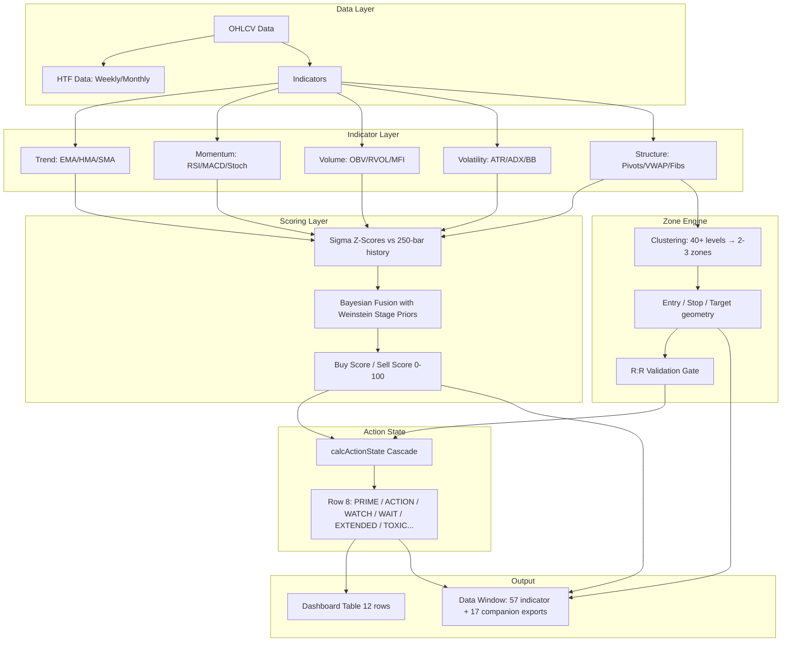

# Revanth Enhanced Strategy — Complete Technical Reference Manual

## Table of Contents
1. [System Architecture](#1-system-architecture)
2. [Indicator Reference](#2-indicator-reference)
3. [Signal Labels & Actions](#3-signal-labels--actions)
4. [Dashboard Fields](#4-dashboard-fields)
5. [Clustering Algorithm](#5-clustering-algorithm)
6. [Risk Management Logic](#6-risk-management-logic)
7. [Visual Opacity Logic](#7-visual-opacity-logic)
8. [Data Window Exports](#8-data-window-exports-complete-schema)
9. [Reversal Zones](#9-reversal-zones-deep-dive)
10. [Quick Reference Card](#10-quick-reference-card)
11. [Edge Cases & Conflict Resolution](#11-edge-cases--conflict-resolution)
12. [Timeframe Considerations](#12-timeframe-considerations)
13. [AI Decision Framework](#13-ai-decision-framework)
14. [Common Mistakes](#14-common-mistakes)
15. [Appendix: Formula Reference](#15-appendix-formula-reference)
16. [**Measured Combinations — what the fields do together**](#16-measured-combinations--what-the-fields-do-together)
17. [**Trade Structure Selection — what the state supports when direction has no edge**](#17-trade-structure-selection--what-the-state-supports-when-direction-has-no-edge)

> Sections 1–15 define the fields; §16 is what the system
> actually knows, measured on 2.4M bars. Several intuitive readings (PRIME as a buy signal, MTF 3/3 as
> confirmation, stage freshness, ignition) are contradicted there by the data.
>
> §17 is the half agents keep missing: **"no directional edge" is not "no trade."** A stop-based entry
> must be right about direction; a covered call, cash-secured put or credit spread only needs price to
> **not reach a level**. Different payoff, different question, different fields — and the corpus answers
> the level question with far more signal than the direction question. Never carry a verdict across.

---

## 1. System Architecture

The indicator combines Murphy, de Prado, Elder, Connors, O'Neil, Weinstein, and Livermore
methodologies into a unified swing/LEAP trading system for large-cap equities.

**Instruments:** Large-cap stocks (AMZN, MSFT, GOOGL, NVDA, etc.)
**Timeframes:** Daily and Weekly only. Decisions at bar close.
**Style:** Swing trades and LEAPs.

**What this system is.** It is a **state-description and trade-construction engine**, not an alpha
engine. It answers "what is true about this stock right now, and if I traded it, where exactly would
entry, stop and target sit?" — accurately, completely, and identically every time. It does **not**
answer "will this go up". Measured over 2.4M bars, its positive states are flat and its *negative*
states are significantly negative (§16): the engine is reliably good at exclusion and geometry, and
directional conviction must come from catalyst research layered on top. Design every workflow around
that division of labour.



---

## 2. Indicator Reference

### 2.1 Trend Indicators

| Indicator | Period | Purpose |
|-----------|--------|---------|
| **EMA 5** (Sprint) | 5 bars | Fast cloud line |
| **HMA 20** (Hull) | 20 bars | Slow cloud line, low-lag trend |
| **EMA 20** | 20 bars | Short-term trend (MA 20 Fast) |
| **EMA 50** | 50 bars | Medium-term trend (MA 50 Mid) |
| **EMA 200** | 200 bars | Long-term trend (MA 200 Slow) — Ext% reference |
| **HMA 150** (Weinstein) | 150 bars | Weinstein Stage Analysis MA |

### 2.2 Momentum Indicators

| Indicator | Parameters | Interpretation |
|-----------|------------|----------------|
| **RSI** | 14 | >50 Bullish, >70 Overbought |
| **Stochastic %K** | K:14, D:3 | <20 Oversold, >80 Overbought |
| **MACD** | 12/26/9 | Trend momentum |
| **Force Index** | 13 bars | Volume-weighted momentum (Elder) |
| **Z Velocity** | `z(roc10, 250)` | 10-bar rate-of-change, z-scored over 250 bars |
| **Z Elasticity** | `z(distFromMA20, 250)` | distance from EMA20, z-scored over 250 bars |

Both are exported and both gate the action cascade *before* any score branch is reached
(§3.1 codes 11/12/13/16) — which is why a high-scoring bar can still print STRETCHED or EXTENDED.

### 2.3 Volume Indicators

| Indicator | Purpose |
|-----------|---------|
| **OBV** | Institutional accumulation/distribution |
| **RVOL** (vs avg) | Volume vs 20-bar average |
| **Volume Z-Score** | Statistical significance of volume |

### 2.4 Volatility Indicators

| Indicator | Purpose |
|-----------|---------|
| **ATR(14)** | Average candle size — stop-loss basis |
| **ADX(14)** | Trend strength (not direction) |
| **HV20** | 20-day historical volatility, annualized |
| **Exp Move %** | Expected ~21-day move from HV20 |
| **Exhaustion Gradient** | Blended trend-maturity/overheat (0–1) |

### 2.5 Structural Levels (Clustering Inputs)

Weights are **not** a clean three-tier scheme. Some are fixed literals, others are computed per bar by
`calcEvidenceScore`. The exact fixed weights, and which levels carry the `isTitanium` flag (which
grants snap-to-level, decay exemption and a larger merge bonus — §5.3):

| Level | Weight | Titanium? |
|-------|--------|-----------|
| **Inst Anchor** | **6.0** | ✅ — the single heaviest level in the system |
| KEY SUP / KEY RES | 5.0 | ✅ |
| GOLDEN X / DEATH X | 5.0 | ✅ |
| Yearly Open (`Y.O`) | 5.0 | ✅ |
| Yearly Low (`Y.L`), 52W Low (`52W.L`) | 5.0 | ✅ |
| Yearly High (`Y.H`) | 4.5 | ✅ |
| Quarterly Open (`Q.O`), Monthly Open (`M.O`) | 4.0 | ✅ |
| Weekly Open (`W.O`) | 3.5 | ❌ |
| Prior-week High/Low (`PW.H`/`PW.L`) | 3.0 | ❌ |
| Weekly Expected-move band (`W.EXP`) | 2.5 | ❌ |
| Darvas box edge | 2.0 | ✅ |
| Whale AVWAP | 0.5 | ❌ |
| Sweeps, MAs, pivots, Fibs, bands | **dynamic** via `calcEvidenceScore` | varies |

Master levels are only admitted when they are on the correct side of price **and** within 70% of price
(`|level − close| < close × 0.7`), which discards stale multi-year levels on collapsed names.

---

## 3. Signal Labels & Actions

### 3.1 Action State Table (Row 8 — the primary directive)

| State | Code | Color | Meaning | What to Do |
|-------|------|-------|---------|------------|
| **✓ PRIME BUY** | 1 | **Green** | Score ≥85 + In Zone + RR Valid | Entry candidate at zone. Agent confirms direction. |
| **✓ ACTION BUY** | 2 | **Violet** | In Zone + RR Valid, reached EITHER via score 70–84 OR via score ≥85 with Z Elasticity 1.0–1.5 | Standard entry candidate |
| **✓ POWER MOVE** | 3 | **Violet** | Strong momentum breakout | Momentum entry (aggressive) |
| **✓ POWER (EXT)** | 4 | Yellow | Power move but overextended | Reduced size |
| **⚠️ LOW R:R** | 5 | Red | In zone, score high, but RR gate fails | Wait for better geometry |
| **⚡ ACCELERATION** | 6 | **Violet** | Velocity Z >2 + young trend + score confirms + RVOL ≥0.75 + room to target ≥0.25R | Momentum entry OK |
| **⚡ EARLY** | 7 | Amber | Same thrust but RVOL <0.75 | Unconfirmed thrust — wait |
| **👀 WATCH** | 8 | Yellow | Catch-all "no entry right now": most often a strong score with price NOT in the zone, but also score 50–69, or elasticity 1.5–2.0 with score <70. 63% of long bars | Stalk — limit at zone if approaching |
| **⏳ FORMING** | 9 | Orange | LTF confirm pending (last bar only) | Wait for bar close |
| **WAIT** | 10 | Gray | No setup | No action |
| **⚠️ EXTENDED** | 11 | Orange | TWO sources: Z Elasticity >2.0 inside the cascade, OR the post-pass demotion of any bullish long label when Ext Z ≥1.5 | Wait for pullback |
| **⚠️ STRETCHED** | 12 | Orange | Elasticity Z 1.5–2.0 | Caution |
| **⚠️ VOLATILE** | 13 | Orange | RAM <1.0 + high velocity | Unstable — wait |
| **⚠️ COUNTER-TREND** | 14 | Orange | Signal in wrong Weinstein stage | High risk if taken |
| **⚠️ TOP/BOT WARNING** | 15 | Red | Topping/bottoming pattern | Exit existing positions |
| **⚠️ BLOW-OFF/CAPITULATION** | 16 | Red | Velocity Z >2 on mature trend | Do not enter |
| **⚠️ PARABOLIC** | 17 | Red | >60% from MA200 + exhaustion | No fresh entry — outranks PRIME |
| **🛑 TOXIC RISK** | 18 | Red | Stop inside noise floor / global danger | Skip entirely |
| **🔒 SCREEN BLOCK** | 19 | Amber | Qualified as PRIME but Elder triple-screen vetoed | Blocked signal — not WATCH |
| **✓ REVERSAL BUY** | 20 | Green | Capitulation long: rev≥7, buy<30, below EMA200, RVOL>1.5 | Counter-trend long — agent evaluates catalyst |
| **⚠️ CHASE** | 21 | Amber | ACCELERATION with room-to-target < 0.25× at-market risk | Missed the move — wait for zone |

> **The Green/Violet split in Row 8 is the edge encoding, not decoration.** `bgLAc` awards **green only to
> PRIME (code 1, +0.035R, 4/4 eras) and REVERSAL BUY (code 20, +0.038R)** — the two long states with a
> measured, era-stable result. **ACTION BUY, POWER MOVE, POWER (EXT) and ACCELERATION render violet** =
> "informational": ACTION measures **−0.008R and is era-unstable**, POWER/ACCEL are unmeasured. A violet
> cell is not a weaker green; it is *no claim*. Counter-trend bars (`isStg4`) override to amber.
>
> **Short signal cells are MUTED (alpha 55), not full red** — see the §4.1 column-parity warning. Full red is
> reserved for the `isDanger` branch and the WARNING/BLOW/EXTENDED/CAPITULATION states, which are risk reads
> on the LONG book and are measured.

### 3.1a Chart callouts — the only annotations with a measured edge

Row 8 tells you the state; these four tell you whether anything is *tradeable*. **All long-side.**

| callout | gate | **[M]** | note |
|---|---|---|---|
| **⚖️ R:R `X`@mkt · stop `Y`ATR** (dark slate) | `Long In Zone` + `Long RR At Market ≥ 2` + fade off + no 🛑 | **+0.116R**, 4/4 eras, 12/12 sectors, 69.9% of 519 names, n=39,740 | fires on **2.29% of bars** — an event, not a state |
| same, **deep teal + LARGE** | as above but `Long RR At Market ≥ 5` | **+0.252R**, 4/4 eras, both ticker halves, 60.3% of 156 names, n=3,884 | ~10% of the above |
| **🚫 DO NOT CHASE** | fade gate (`Signal Pack` bit 2 = 0) | **−0.038R** era-stable | a measured **avoid** |
| **⚠️ CHASE · R:R `X`** | buy signal while `Long In Zone = 0` | **−0.023R** | printed ratio is the at-market one |

Suffixes, the only two terms that survived an interaction test on top of the gate (lift ≥ +0.02R, all four
eras, both disjoint ticker halves, n ≥ 2,000): **`⚡IV`** = `Energy IV Rank Pct` > 80 → +0.116 → **+0.176R** ·
**`⚓AV`** = close < `AVWAP Support` → +0.116 → **+0.167R**. Neither has an edge standalone.

⚠️ **Slate/teal, never green, and never a checkmark.** The base rule **wins 34%** and stops out 65%; the teal
tier wins **23%**. All of the edge is payoff, none is hit rate. The `stop Y ATR` figure is displayed because
the median setup puts the stop **0.69 ATR** from entry — inside one normal day's range — and on a gap-prone
name it does not hold (HOOD 2026-07-23: entry 101.58, stop 96.89, next low **93.03**). Filtering for wider
stops does not help (+0.083R at ≥1 ATR vs +0.090R, keeping 2.5% of setups), so the width is shown, not gated.

⚠️ **Squeeze-release and FVG add nothing here** — standalone +0.025R and +0.022R, but lift **−0.030** and
+0.012 on top of this gate. Squeeze/compression has no edge at all, directional or magnitude, and volatility
is **persistent, not mean-reverting**.

### 3.2 Critical Notes on Action Codes

- **Short side NEVER reports codes 1 or 2.** Every PRIME SELL / ACTION SELL is demoted to WATCH. ⚠️ **But do not rebuild short conviction from `Sell Score` / `Sell Sigma` / `Short In Zone` either** — there is no measured short edge and every tightening makes it worse (baseline −0.089R → `Short RR Valid` −0.108R era-stable negative, `Sell Score ≥ 96` −0.113R). **Read the short column for LEVELS only.**
- **Codes 20 and 21 are long-only by construction.**
- **Code 19 (SCREEN BLOCK)** is a suppressed signal — it qualified for PRIME/ACTION but the Elder triple-screen vetoed it. Distinct from WATCH (which means "no signal exists").
- **Code 9 (FORMING)** only appears on the current live last bar. In any historical export it reads 0.
- **The score bands in §3.1 do not partition the way the 50/70/85 literals suggest.** On bars that
  actually reach In Zone + RR Valid, Buy Score runs p25 90.7 / median 95.8 — only 0.08% land under 50
  and 0.04% in 50–70, so those boundaries are effectively dead. Elasticity is tested BEFORE the score
  branches, so a score-98 bar with Z Elasticity 1.0–1.5 prints ACTION, not PRIME; 72% of observed
  ACTION bars arrive that way. Read ACTION as "PRIME-grade score, elevated elasticity", not "weaker score".
- **Measured code frequency** over 1.28M corpus bars — the field is dominated by two passive states:

| Side | 1 | 2 | 8 WATCH | 10 WAIT | Everything else |
|------|---|---|---------|---------|-----------------|
| Long | 0.94% | 0.12% | 62.7% | 22.9% | each ≤3% |
| Short | 0.00% (impossible) | 0.00% (impossible) | 52.8% | 33.6% | each ≤5% |

- **Demotion order matters.** After the cascade, the post-passes run: Ext Z ≥1.5 → EXTENDED, then
  room-to-target → CHASE, then RVOL → EARLY, then capitulation → REVERSAL BUY. Because EXTENDED runs
  first and overwrites the `⚡ ACCELERATION` string, a stretched bar becomes EXTENDED and can never
  reach CHASE. REVERSAL BUY runs last and overrides everything except a 🛑 state.

### 3.3 What Each Code Already Implies (read this before writing any filter)

An action code is not just a label — several codes are only *reachable* when the geometry fields are
already true. Measured on the full corpus, share of bars with each condition set:

| Code | In Zone | RR Valid | Target | Consequence |
|------|---------|----------|--------|-------------|
| **1 PRIME** | **100%** | **100%** | **100%** | geometry is implied |
| **2 ACTION** | **100%** | **100%** | **100%** | geometry is implied |
| **19 SCREEN BLOCK** | **100%** | **100%** | **100%** | a fully-qualified signal that was vetoed |
| **5 LOW R:R** | **100%** | **0%** | 99.9% | in-zone by definition, failed the EV gate by definition |
| 6 ACCELERATION | 6.6% | 73.6% | 100% | a breakout — normally NOT in the zone |
| 20 REVERSAL BUY | 6.5% | 97.0% | 100% | fires away from the zone |
| 3 POWER MOVE | 4.2% | 39.5% | 71.4% | momentum state, geometry often absent |
| 8 WATCH | 0.9% | 76.8% | 96.4% | by construction "not at entry" |

**This makes the usual promotion rule partly redundant.** `code ∈ {1,2} AND In Zone AND RR Valid AND
Target` selects exactly 25,165 bars — the *identical* set as `code ∈ {1,2}` alone (22,355 PRIME +
2,810 ACTION). The three extra clauses filter nothing. Keep them only as assertions/regression checks,
and understand that they add no selectivity.

Conversely, **never require In Zone for codes 3, 6, 20** — you would discard 93–96% of them, and for
REVERSAL BUY the in-zone subset is the *worse* half (see §16.4).

### 3.4 Warning Labels (On-Chart)

| Label | Meaning | Action |
|-------|---------|--------|
| **🛑 TOXIC RISK** | R:R invalid or asset too volatile | Do not trade |
| **⚠️ TOP WARNING** | NOT a simple "RSI>70". It is `isToppingFull AND not PowerBreakout AND close ≥ 5-bar high − 1.5×ATR`, where `isToppingFull` is a **disjunction**: Weinstein Stage 3, OR recent RSI cascade, OR internal weakness (`bullDivWeak`), OR RSI failure swing, OR (overextended AND (bearish divergence OR bearish pattern)). The `close ≥ 5-bar high − 1.5 ATR` clause is what makes it a *top* rather than a general warning | Exit longs (it marks mean-reversion — see §16.7) |
| **📉 INTERNAL WEAKNESS** | Price rising, Buy Score declining (hidden distribution). Suppressed in healthy Stage 2 (Buy≥70). | Reduce longs |
| **📈 BEAR WEAKNESS** | Price falling, Sell Score declining (hidden accumulation). **Effectively never fires — 31 bars in 2.4M** (see §8.3) | Do not build a rule on it |
| **🌊 RSI CASCADE** | Multi-timeframe RSI extremes | Exit — exhaustion |
| **⚡ EXTREME EXTENSION** | Z-score extreme | Do not chase |
| **TRAP** | False breakout | Fade the move |
| **SWEEP** | Liquidity grab reversal (Green=Bullish, Red=Bearish) | Reversal play |
| **💎 FAILURE SWEEP** | Previous sweep broken — momentum explosion | Aggressive entry |
| **🔑 KEY REV** | Key Reversal Bar — institutional rejection | Strong reversal |
| **HIKKAKE** | Inside bar fake-out | Reversal |
| **OOPS** | Larry Williams gap reversal | Institutional absorption |
| **🧱 WEAK RES/SUP** | Key level tested **more than 2 times (i.e. 3+) within 25 bars**, counting only tests on above-average volume that did NOT successfully defend (support: `low < keySupport×1.01`, and the bar did not close back above it green) | Breakout/breakdown imminent |

### 3.5 Confirmation Patterns (Independent — appear alongside warnings)

| Label | Condition | Meaning |
|-------|-----------|---------|
| **📍** (Green) | Bullish Pin Bar near support | Rejection wick — confirmation to buy |
| **📍** (Red) | Bearish Pin Bar near resistance | Rejection wick — confirmation to short |
| **🔥** (Green) | Bullish Engulfing near support | Momentum shift — confirmation to buy |
| **🔥** (Red) | Bearish Engulfing near resistance | Momentum shift — confirmation to short |

---

## 4. Dashboard Fields

### 4.1 Row Layout (12-Row Matrix)

| Row | Label | Left Cell | Center Cell | Right Cell |
|-----|-------|-----------|-------------|------------|
| 0 | HEADER | 🟢 LONG + Net σ | Timeframe | **🔴 SHORT · levels** + Net σ |
| 1 | BIAS | `BULL` (lime) / `SIDE` (gray) | BULLISH/BEARISH/⚠️ LAG {score} | `BEAR` (**red**) / `SIDE` (gray) |
| 2 | ENTRY ZONE | Long zone range | 📍 ENTRY ZONE | Short zone range |
| 3 | STOP | Long stop price | 🛑 STOP | Short stop price |
| 4 | TARGET | Long target price | 🎯 TARGET | Short target price |
| 5 | ANCHOR | Long anchor name (§4.8) | ANCHOR | Short anchor name |
| 7 | STAGE | Weinstein Stage | DMI:+DI▲/−DI▼/— | Darvas Status |
| 8 | ACTION | Long directive | ⚡ ACTION | Short directive |
| 9 | ENERGY | IV30 (IV Rank%) | ⚡ ENERGY | State |
| 10 | DECISION | ▲/▼/▬ Score Buy | Decision/Bias | ▲/▼/▬ Score Sell |
| 11 | REV ZONE | 🎯 Zone tier or — | 🔄 REV ZONE | 🎯 Zone tier or — |
| 12 | MTF | Long MTF status | % MTF | Short MTF status |

> Row 6 does not exist (gap). Row 7 is the 7th visible row.

> ⚠️ **THE TWO COLUMNS ARE NOT PEERS.** The layout implies two symmetric books; measurement says
> otherwise (§16 short-side audit: −0.089R baseline, and **every** tightening makes it worse —
> in-zone −0.095R, short R:R≥2 −0.101R, `shortRRValid` −0.108R era-stable negative). The header
> therefore reads **`🔴 SHORT · levels`**, capped at 45 opacity even when the short side is
> "actionable", and the short **signal** cells (Row 8 SELL/POWER/BREAKDOWN, Row 10 `Sell > Buy`) render
> in a **muted** red (alpha 55) instead of the full-strength red the long side uses for a +0.035R PRIME
> BUY. Read the short column for **levels** — zone, stop, target — never as a trade recommendation.
>
> Full red is deliberately KEPT for the `isDanger` branch and Row 8's
> WARNING/BLOW/EXTENDED/CAPITULATION states: those are **risk reads on the long book** (measured,
> era-stable), not short entry signals.

> **Row 1 cells are independent, per-side gates** — left asks "does the long trend gate pass", right asks
> the same of the short one, exactly like Rows 2/3/4 showing both zones/stops/targets. `uptrend` and
> `downtrend` are **not mutually exclusive** and both read on for a measured **lower bound of 40.4% of
> bars** (price anywhere between the two AVWAPs satisfies both instrument gates:
> `isBullInst = close > AVWAP support OR fast-up`, `isBearInst = close < AVWAP resistance OR fast-down`).
> **That is normal, not a conflict — do not "fix" it.** `BEAR` previously rendered in `color.lime`
> (a copy-paste of the long cell's colour); it is now red.

### 4.2 Header Row (Row 0) — "Net σ"

`Net σ` = raw net evidence-sigma per side BEFORE the Bayesian/stage prior.
- It is NOT the 0–100 score (that's Row 10)
- It CAN be negative
- A high Buy Score with Net σ ≈ 0 means trend-prior-driven, not evidence-driven (low conviction)
- Direction comes from Row 10 score + Dir Prob, not this header number

### 4.3 Bias Row (Row 1 Center)

| Display | Meaning |
|---------|---------|
| `BULLISH {score}` | Score and stage agree on bull direction |
| `BEARISH {score}` | Score and stage agree on bear direction |
| `⚠️ LAG {score}` | Stage and score CONFLICT — see the exact test below |

```
stageExp = Stage2 +1.0 · Stage5 +0.55 · Stage3 −0.5 · Stage4 −1.0 · Stage 0/1 0.0
scorePred = bull ? +1.0 : −1.0
conflict  = |stageExp − scorePred| >= 1.5  AND  dominantScore > 50
```
Both clauses are required — a conflicting stage with a weak (<50) dominant score prints the ordinary
`BULLISH/BEARISH {score}` string instead. Stage 5's `0.55` mirrors its Bayesian prior ratio
(0.25/0.44); it was previously 0.0, which made the conflict test unreachable for Recovery bars.

**When LAG shows:** treat it as a prompt to check extension and catalyst rather than an automatic
veto — see the measured caveat in §11.5.

### 4.4 Stage/DMI/Darvas Row (Row 7)

**Left Cell (Weinstein Stage):**

| String | Stage | Meaning |
|--------|-------|---------|
| `STAGE 1: BASING ⏳` | 1 | Basing below/near MA |
| `STAGE 2: ADVANCING ✅` | 2 | Uptrend, price > rising MA |
| `STAGE 2: PULLBACK ⚠️` | 2 | Dipped below MA but above swing low |
| `STAGE 2: BOUNCE 🔄` | 2 | Recovering from pullback |
| `STAGE 3: TURNING UP ⏫` | 3 | **Not a top.** HMA150 has turned up (`wMA > wMA[10]`) with price above it, but the 2-bar confirm leg hasn't completed, so the engine can't promote to Stage 2 yet. **89.7% of all stage-3 bars.** See the warning below |
| `STAGE 3: STALLED ⚠️` | 3 | The genuine flat/falling-MA case — only **10.3%** of stage-3 bars, and its forward 21-bar excess is **+1.91%**, i.e. still not bearish |
| `STAGE 4: DECLINING ❌` | 4 | Downtrend |
| `STAGE 4: RALLY ⚠️` | 4 | Close > MA within Stage 4 (bear rally) |
| `STAGE 4: CRASH 🛑` | 4 | Extreme decline |
| `STAGE 5: RECOVERY 🌤️` | 5 | Price back above the Hull MA while that MA still falls but is decelerating. Buys allowed (same prior lane as Stage 2, weaker) |
| `STAGE: IPO/NEW (NO DATA)` | 0 | Insufficient history |

> ⚠️ **STAGE 3 IS NOT "TOPPING" — the label was renamed because the old word was wrong.** `st3Top =
> prAbove and slopeFlat`, and `slopeFlat` is a **catch-all** (`not slopeRise and not slopeFall`), so a
> rising HMA whose 2-bar confirm hasn't landed falls into it. Measured on 16,327 stage-3 episodes:
> **99% last exactly one bar**, **80.7% arrive from stage 5 (RECOVERY)**, **91.0% resolve into stage 2
> (ADVANCING)**, and only **6.5%** into stage 4. Neither branch is bearish (turning-up −0.08% fwd-21b =
> noise; stalled +1.91%). **Stage 3 is a one-bar waiting room between RECOVERY and ADVANCING.**
>
> The exported `Stage` field still returns **3** for both strings — deliberately, so priors, the screener
> and all existing scrapes stay bit-identical. **A decoder that maps 3 → "topping/bearish" is wrong.**
> The cell stays **amber, not green**: 91% resolve up, but their own forward return is noise.
>
> **Stage lag is real and asymmetric.** Turning bullish out of stage 4 happens a median **+9.9%** off the
> 60-bar low (mean +12.1%; >20% on 13% of flips, n=49,207); turning bearish out of stage 2 fires a median
> **−5.2%** off the high (n=36,058). The HMA150 keeps this smaller than an SMA would, but stage is a
> **prior, never a trigger** — all five stages measure ≈0% fwd-21b.

**Center Cell (DMI):** `DMI:+DI▲` (bullish) · `DMI:-DI▼` (bearish) · `DMI:—` (flat)

**Right Cell (Darvas):** `BREAKOUT 🚀` · `BREAKING OUT ⬆️` · `IN BOX 📦` · `ABOVE BOX ✅` · `BELOW BOX ❌` · `NO BOX`

### 4.5 Energy Row (Row 9)

| Left Cell | Center | Right Cell |
|-----------|--------|------------|
| **IV30** value (IV Rank%) | ⚡ ENERGY | State name |

> The left cell is the SYNTHETIC IV30 and its 252-bar percentile rank — **not** HV20. HV20 is a
> separate series and does not appear in this cell at all. The two cells answer different questions
> (magnitude/rank on the left, IV−HV spread on the right) and routinely disagree: a high IV Rank can
> still print SQUEEZE. Both are exported by the companion, so never OCR them.

**Energy States:**

| State | Code | Meaning |
|-------|------|---------|
| 🔵 SQUEEZE | 1 | Volatility compressing — breakout building |
| 🟠 WARMING | 2 | Volatility rising |
| 🟣 EXPANSION | 3 | High volatility — price moving fast |
| ⚪ DORMANT | 0 | Very low volatility |

> **This is NOT options IV — never use it for options pricing.** It is a synthetic proxy built from a
> VIX-Fix style range measure, annualized to HV's units so the two are comparable:
> `vFix = (highest(close,22) − lowest(low,22)) / max(1, sma(close,22))`, then
> `IV30 = stdev(vFix,20) × √252 × 100`. It never touches an options chain. Get real IV externally.

### 4.6 Decision Row (Row 10)

**Left/Right Cells — Score Momentum:** `delta = score − score[3]` (a raw 3-bar difference, sized to
match the EMA(3) smoothing on the score itself)
- **▲** (Green) = delta > +2.0
- **▼** (Red) = delta < −2.0 — this also adds a +10 structural opacity penalty (§7)
- **▬** (Gray) = in between

**Center Cell:**
- When ACTION is non-critical: Shows bias string (`BULLISH 80`)
- When ACTION is actionable: Shows the action state
- `🛑 TOXIC RISK` overrides everything

### 4.7 REV ZONE Row (Row 11)

| Display | Score | Meaning |
|---------|-------|---------|
| `🎯 Z0(n)` | ≥10 | Extreme reversal |
| `🎯 Z1(n)` | 7–9 | Strong |
| `🎯 Z2(n)` | 4–6 | Forming |
| `—` | <4 | No reversal zone |

The cell prints the tier with the rounded score in parentheses, e.g. `🎯 Z1(8)` — it is not spelled
`ZONE 1`. The numeric score is also exported directly as `Long Rev Zone` / `Short Rev Zone`.

Reversal zones are **independent** from the ACTION row. They fire their own scoring based on
Connors methodology (RSI extremes, consecutive days, patterns, structural confluence).

### 4.8 ANCHOR Row (Row 5) — what the name actually means

The cell shows `array.get(cLds, bIdx)` — the **highest-weight level inside the winning cluster**, i.e.
*which structural level this entry zone is built on*. It is chart-only; there is no Data Window export
for it.

The names map to the level table in §2.5: `KEY SUP`/`KEY RES`, `GOLDEN X`/`DEATH X`, `Inst Anchor`,
`Y.O` / `Q.O` / `M.O` / `W.O`, `Y.L` / `52W.L` / `Y.H`, `PW.L`/`PW.H`, `W.EXP`, `Darvas`,
`Whale AVWAP`, plus the technical set (`S200`, `S100`, `S50`, `E50`, `BB`, `H1.*`/`H2.*` HTF pivots).
The fallback when no level is elected is `Rec Str L` / `Rec Str H`.

**`GOLDEN X` does NOT mean a golden cross happened.** It is a *price level*: `gcPrice`, the closing
price on the day of the most recent 50/200 SMA crossover, injected with weight 5.0 and the Titanium
flag. The crossover **event** is the separate `Golden Cross` export, which is 1 only on the exact bar
of the cross and 0 on every other bar. Seeing `🎯 GOLDEN X` in Row 5 while `Golden Cross = 0` is normal
and consistent. `DEATH X` is the short-side equivalent (`dcPrice`).

> ⚠️ **The anchor name can be stale relative to the zone displayed beside it.** The name is captured at
> cluster-election time, but the zone bounds can be moved afterwards by the breakout override and by
> FINAL ZONE SYNC (~4454). On a breakout bar (`Entry At Market` = 1) the entry is re-pointed to the
> close and the box can end up far from the level the anchor names — e.g. AMZN 2026-08-03 showed
> `🎯 GOLDEN X` with a zone of 273.75–276.23 while AMZN's actual golden-cross level is **$249.70**
> (2026-04-16). Since Titanium levels *pin* the cluster center (§5.3), a genuinely GOLDEN-X-led cluster
> would sit ON 249.70 — so a large gap between the anchor's implied price and the zone is the signature
> of a post-election move, not of a cluster at that price.
>
> **To check:** hover the ENTRY ZONE cell (Row 2). Its tooltip prints `ANCHOR: … / Raw: … / Final: …`,
> showing the pre- and post-modification zone. If Raw and Final differ materially, the anchor label
> describes the Raw zone. Do not infer a price from the anchor name — read the zone bounds.

---

## 5. Clustering Algorithm

### 5.1 Purpose
Convert 40+ discrete price levels into 2–3 actionable entry zones.

### 5.2 Process

1. **Collect** all structural levels (MAs, pivots, VWAP, Fibs, sweeps, gaps, Darvas)
2. **Assign weights** — fixed literals for named levels, `calcEvidenceScore` for the rest; see the
   exact table in §2.5. Levels also carry an `isTitanium` flag that changes their behaviour downstream.
3. **Keep only levels on the correct side of price** (`level < close × 1.003` for longs)
4. **Cluster merge** on a RELATIVE tolerance, not a fixed ATR radius:
   ```
   atrP = ATR / close
   TOL  = max(0.003, 0.4 × atrP) × (strongTrend ? 0.7 : 1.0)
   merge if |level − clusterCenter| / clusterCenter <= TOL
   ```
   i.e. **max(0.3% of price, 0.4 × ATR%)**, tightened by 30% when ADX>30 in-trend. Merging adds a
   confluence bonus of **+1.5** if the cluster is Titanium, **+0.5** otherwise, and the center becomes
   the weighted average — unless the cluster is Titanium, in which case the center is PINNED (§5.3).
5. **Score clusters** with proximity decay `Score × e^(k × distance_ATR)`, where **k depends on the
   cluster**: −0.2 Titanium · −0.4 secondary · **−0.5 normal primary**. Titanium clusters decay most
   slowly, so they stay competitive from further away — that is deliberate.
6. **Elect primary** (highest electoral score, with defender hysteresis — §5.4)
7. **Elect secondary** (separated from primary by ≥0.75 ATR, ×1.35 shadow-recency bonus)
8. **Derive Entry/Stop/Target** from winning cluster

### 5.3 Titanium Snap
If a cluster contains a Titanium level, its center is **PINNED to that exact institutional number**
and never becomes the weighted average — so the entry sits on the real level (52W low, yearly open,
POC…) rather than a few cents off it.

> Titanium is an **explicit per-level flag, NOT a weight threshold.** Do not infer it from the number:
> Darvas is Titanium at weight 2.0, while Weekly Open is *not* Titanium at 3.5. See the flag column in
> §2.5. The flag also grants the slowest proximity decay (k = −0.2, §5.2 step 5) and the larger +1.5
> merge bonus.

### 5.4 Defender Hysteresis (Anti-Flicker)
The incumbent zone is defended twice, and both mechanisms must be beaten:

```
taperFactor   = e^(-0.5 × |close − prevEntry| / ATR)
defenderBonus = stabilityFactor × σ(clusterScores) × taperFactor
```
`σ` is the spread of the competing cluster scores — when clusters are tightly bunched (no clear
winner) the bonus is small, and when one cluster dominates the incumbent is protected proportionally.
`stabilityFactor` is timeframe-dependent: **0.5 daily+ · 0.8 4h · 1.0 1h · 1.5 intraday** — slower
charts need less anti-flicker.

Second, a **0.5 ATR spatial-displacement filter**: a challenger cluster that wins on score is still
rejected unless its center sits at least `0.5 × ATR` away from the defender's. This is what stops the
zone shuffling between two near-identical adjacent clusters.

### 5.5 Zone Width
```
maxWidth = max(ATR × 0.5, min(1% of price, ATR × 0.8))
minWidth = 0.2 ATR
```
The min-width rebuild extends the zone DOWNWARD from its top (`zoneLow := zoneHigh − minWidth`), so
the structural top is preserved. It used to re-anchor onto the bar's close, which is what made
"In Zone" true by construction — see §11.8.

### 5.6 Target Selection (f_pickCeiling / f_pickFloor)

**Exactly six candidates** are considered for a long ceiling — `keyResistance`, `currentBoxTop`
(Darvas), `pivotHighPrice`, `weeklyMA2` (weekly EMA50), `bbUpper`, `weeklyMA3` (weekly EMA200) — and
the mirror set for a short floor. Nothing else can ever become a target.

```
risk = |entry − stop|
near = nearest candidate strictly above entry            → exported as T1 Waypoint
step = nearest candidate >= entry + risk (>= 1R away)    → exported as Target
if no candidate is >= 1R away:  step = near              (falls back)
```
- Candidates are **not** pre-filtered by R:R. The nearest real wall is the honest target however close
  it is; whether the trade is *worth taking* is judged separately by the EV gate (§6.2). Filtering
  candidates by a fixed 1.5 R:R was a real bug — it discarded a near resistance and floated the target
  *beyond* the very wall price had to clear.
- When `near ≠ step`, `near` is the level price must trade through and a sensible partial-trim spot.

**Blue-sky synthesis** — only when there is no candidate above entry at all:
```
isBlueSky = close > pivotHighPrice AND close > 52wHigh × 0.98
ceiling   = isBlueSky ? entry + fibRange × 1.618
                      : entry + risk × 2.0
if ceiling > entry × 1.06:  ceiling = entry + ATR × 2.0     ← 6% sanity cap, replaced by 2×ATR
```
The 6% cap applies **only to this synthetic value**. A real resistance is never capped, even when far —
capping real levels used to invent targets *beyond* the wall (e.g. CAH 243→251).

**Target is blanked (∅)** when it would sit behind the entry (reward ≤ 0). A blank target is a hard
skip, not a missing value.

---

## 6. Risk Management Logic

### 6.1 Stop Loss
Three priorities, in order — the swing low is a *fallback*, not the primary source:

```
1. structuralStop = the WINNING CLUSTER's far edge      (zoneLow for a long, zoneHigh for a short)
2. if that is 0 or on the wrong side of entry:
   structuralStop = raw swing low/high                  ← fallback only
3. buffer   = max(entry × 0.005, ATR × 0.5)             ← blended %/ATR breathing room
   sL_struct = structuralStop − buffer                  (long)
4. sL_capped = max(sL_struct, entry × (1 − mRP))        ← hard cap, mRP = 5% stocks / 3% ETFs
```

The stop is therefore **anchored to the entry zone that generated the signal**, offset by at least
0.5% or half an ATR. This is why §6.3's TOXIC test compares the final stop against the *zone low*: if
the 5%/3% cap had to pull the stop back up above the very structure it was derived from, the trade's
geometry is broken.

`mRP` is 3% when `syminfo.type` is `fund` or `index`, 5% otherwise.

### 6.2 R:R Validity Gate
```
pLong = clamp(0.50 + (DirProb/100 - 0.50) × rrHaircut, 0.50, 0.95)
minRR = max(rrFloor, (1-pLong)/pLong × rrKellyBuffer)
longRRValid = longRR >= minRR
```
- `rrHaircut` = 0.5 (shrinks Dir Prob toward 50 — overfit edges decay live)
- `rrKellyBuffer` = 1.3 (fractional-Kelly cushion above break-even)
- `rrFloor` = 0.70 (hard floor — calibrated walk-forward on 17 tickers)

> **Verified exact.** Recomputing `Long RR Valid` offline from `Dir Prob` and `RR To Target` using
> these three constants reproduces the exported flag on **100.000% of 1,466,095 bars**. If you ever
> change `rrHaircut`, the Python side must change with it or this identity breaks.

### 6.3 TOXIC RISK
Two conditions, both required — it is not simply "wide stop":
```
wasClamped = the max-risk cap actually moved the stop (sL_capped > sL_struct for a long)
isToxic    = the resulting stop sits at or above the ZONE LOW (sL >= zoneLow)
if wasClamped AND isToxic → zoneScore := -100      ← the sentinel
```
So TOXIC means: *structure demanded a stop wider than 5%/3%, the cap forced it in, and the forced stop
now sits inside the entry zone itself* — you would be stopped out by noise before the trade could
work. It is flagged by the **−100 zone-score sentinel**, not by the cap alone; a clamped stop that
still sits safely below the zone is NOT toxic.

`toxicLongActive = toxicRiskLong and not (isPowerBreakout or isPowerBreakdown)` — power moves suppress
the flag, because elevated volatility is expected there.

> Downstream code must never "boost" a −100 score; doing so corrupts the sentinel check (there is an
> explicit guard for this in the .pine).

---

## 7. Visual Opacity Logic

Zone opacity is a **rendering of the zone-confidence score**. The mapping is linear, and it is
expressed in Pine's `transparency` (higher = more invisible), so it runs backwards from "opacity":

```
transparency = clamp(95 − 85 × confidence/100, 10, 95)
```

| Confidence | Transparency | Reads as | Meaning |
|---|---|---|---|
| 100 | 10 | most solid | High confidence, safe structure |
| 75 | 31 | solid | Good — slight extension |
| 50 | 53 | faded | Elevated risk |
| 25 | 74 | ghost | Extreme risk |
| 10 (floor) | 87 | ghost mist | Confidence is floored at 10 — a zone never fully disappears |

A zone is therefore **never 100% solid**: the best possible rendering is transparency 10 (≈90%
opacity). Box alpha is separately capped at 85 and line alpha at 95 after the survival penalty below.

**Additional survival penalty** (`calcOpacityPenalty`, applied on top, `max` of the two):
- **R:R survival** — `z = max(0, (1.5 − RR)/0.5)`, penalty `(1 − 2/(1+e^(1.702z))) × 42`
- **Velocity survival** — same curve with `z = max(0, |Z Velocity| − 2.0)` (the blow-off threshold)

Decay profile: RR 1.5 → 0 penalty · RR 1.25 → 7.8 · RR 1.0 → 29.1 · RR 0.5 → 39.3 · RR 0 → 41.5.
This is *visual only* — it never touches a score, an action state or an exported number.

**Zone Score Shield:** Strong zones (high confluence score) resist ghosting — but only against *noisy*
penalties. Structural penalties deliberately bypass it:
```
shield        = min(0.5, zoneScore / 30)          → caps at 50% relief
softPenalty   = rsiPen + velPen + elastPen + patternPen
totalPenalty  = softPenalty × (1 − shield) + structuralPenalty     ← structural is NOT shielded
confidence    = max(10, base − totalPenalty)      base = 40 if counter-trend, else adjusted
                (a merged cluster gets base + 15, capped at 100)
```
Component penalties: `|RSI−50| × 0.5` · `max(0, (vel−1) × 10)` · `max(0, (elast−1) × 8)`.
Structural penalties (which bypass the shield): Darvas BELOW BOX **+20**, MTF misalignment
`(50 − signalQuality) × 0.4` when signalQuality<50, and score-momentum falling **+10**.

The asymmetry is intentional: pattern events are noisy and a high-confluence zone should shrug them
off, but a broken structure invalidates the zone no matter how strong its score was.

---

## 8. Data Window Exports (Complete Schema)

> **The Data Window is the ONLY source of truth.** Never OCR numbers off the dashboard
> image. Use the chart image for pattern context only; read all values from here.

### 8.1 Main Indicator (62 fields — 12 chart plots, then 50 dedicated exports)

> **Four fields an older decoder may look for do not exist as columns.** `Long RR Valid` / `Short RR Valid` /
> `Long In Zone` / `Short In Zone` are bits of **Zone RR Flags Pack** (#41). `Darvas State` /
> `Darvas Box Quality` / `Squeeze Release Dir` / `RS Leader` are bits of **Premove Pack** (#59).
> `Darvas Box Bot` is gone — only `Darvas Box Top` remains. `Long RR` is gone but recomputable losslessly:
> `(Long Target − Long Entry) / (Long Entry − Long Stop Loss)`. **Scrapes older than 2026-08-13 still carry
> the retired columns**, so read by header name and tolerate their absence.
>
> ⚠️ **The script sits at exactly 64/64 plots (TradingView's hard cap, RE10140) — a new export requires
> deleting one.** Count the way TradingView does: `plot`/`plotshape`/`plotchar`/`plotarrow`/`bgcolor`/
> `barcolor`/`fill`/`hline` = 1 each, `plotcandle`/`plotbar` = **4** each, and a `plot()` assigned to a
> variable still counts. Grepping for `plot(` alone undercounts and will report headroom that is not there.

| # | Field | Type | Description |
|---|-------|------|-------------|
| 1 | Sprint Line EMA | price | Fast EMA(5) cloud line |
| 2 | Hull Baseline HMA | price | Hull MA(20) cloud line |
| 3 | MA 20 Fast | price | EMA(20) |
| 4 | MA 50 Mid | price | EMA(50) |
| 5 | MA 200 Slow | price | EMA(200) — the Ext% reference line |
| 6 | Weinstein MA 150 | price | HMA(150) — stage analysis |
| 7 | Golden Cross | 0/1 | EMA50 crossed above MA200 this bar |
| 8 | Death Cross | 0/1 | EMA50 crossed below MA200 this bar |
| 9 | Zone 0 Long | 0/1 | `revScoreLong >= 10`, **and `barstate.isconfirmed`** — reads 0 on the live bar |
| 10 | Zone 0 Short | 0/1 | `revScoreShort >= 10`, same confirmation gate |
| 11 | AVWAP Resistance | price | Anchored VWAP resistance |
| 12 | AVWAP Support | price | Anchored VWAP support |
| 13 | Buy Score | 0–100 | Bayesian long posterior |
| 14 | Sell Score | 0–100 | Bayesian short posterior |
| 15 | Stage 1 Base 2 Up 3 Top 4 Down | 0–5 | Weinstein stage (0=IPO, 5=Recovery) |
| 16 | Stage Age Bars | int | Bars in current stage |
| 17 | Long Entry | price | Suggested long entry level |
| 18 | Long Entry Zone Bot | price | Zone lower bound |
| 19 | Long Entry Zone Top | price | Zone upper bound |
| 20 | Long Stop Loss | price | Structure-first stop |
| 21 | Long Target | price/∅ | Target (blank if behind entry) |
| 22 | Short Entry | price | Suggested short entry |
| 23 | Short Entry Zone Bot | price | Short zone lower bound |
| 24 | Short Entry Zone Top | price | Short zone upper bound |
| 25 | Short Stop Loss | price | Short stop |
| 26 | Short Target | price/∅ | Short target (blank if behind entry) |
| 27 | Entry At Market 0No 1L 2S 3Both | 0–3 | 0=structural, 1=long at-market, 2=short, 3=both |
| 28 | Long Rev Zone | 0–26 observed | Mean-reversion score (Connors) — §9.1. p99 = 10.5; 33% of bars are 0 |
| 29 | Short Rev Zone | 0–23.5 observed | Same, short side. 38% zeros |
| 30 | Ext Pct vs MA200 | % | `(close − MA 200 Slow)/MA 200 Slow × 100`, signed. Verified exact |
| 31 | Exhaustion Gradient | 0–1 | Blended trend-maturity/overheat (§15 formula). p99 = 0.42 |
| 32 | Ext Z Self Relative | σ | Extension vs own history — **252 bars daily, 52 weekly**. Fat-tailed: observed −25.8 to +112.9, p99 only 2.4 |
| 33 | Regime 0 Hlt 1 Ext 2 Clmx 3 Dist 4 Dn 5 Ign 6 Sqz | 0–6 | Market regime — **priority enum, see §15.6** |
| 34 | Exp Move Pct 21b | % | `HV20 × √(21/252)` — already a percent, no further scaling |
| 35 | Dir Prob Pct Above 50 Bull | 0–100 | Evidence-spread direction. Single-name EV input only (§16.10) |
| 36 | Long Ignition Fresh Breakout | 0/1 | Fresh qualified breakout — descriptive tag, not a trigger (§15.7) |
| 37 | RR To Target | ratio | Reward:risk of the **dominant side** (`buyScore >= sellScore ? longRR : shortRR`) — NOT always the long. **0 = invalid (4.5% of bars).** p99 = 7.8; still worth clamping in EV math |
| 38 | Long RR At Market | ratio | **(Long Target − close) / (close − Long Stop Loss)** — the ratio you get buying at THIS price. **Prefer this over `RR To Target` for any "should I buy now" question.** The zone ratio overstates it on 53.7% of bars, median **+2.11 R**. `0 = invalid` |
| 39 | Long Target T1 Waypoint | price/∅ | First wall above entry |
| 40 | Short Target T1 Waypoint | price/∅ | First wall below entry |
| 41 | Zone RR Flags Pack | bitmask | Four booleans packed: **1 Long In Zone · 2 Short In Zone · 4 Long RR Valid · 8 Short RR Valid.** (Pre-decoded for the agent in prompt sections 1b / 2d-i — do not hand-decode) |
| 42 | Signal Pack | bitmask | **1 strongBuySignalFinal · 2 strongSellSignalFinal · 4 NOT fadeZoneLong · 8 isTopping · 16 isBottoming.** ⚠️ **Bit 2 is INVERTED** — `(v//4)%2 == 0` means the fade / 🚫 DO NOT CHASE gate **IS** active. (Pre-decoded in prompt section 2d-i) |
| 43 | Action Long Code | 0–21 | Row 8 left cell (§3.1) |
| 44 | Action Short Code | 0–21 | Row 8 right cell (§3.1) |
| 45 | MTF Long Aligned 0 To 3 | 0–3 | Monthly/Weekly/Daily uptrend count |
| 46 | Bear Warning Mask | bitmask | Bear warnings in last 30 bars (§8.3) (Pre-decoded in section 1b) |
| 47 | Reversal Pattern Mask | bitmask | Reversal patterns in last 30 bars (§8.3) (Pre-decoded in section 1b) |
| 48 | Weak Level Mask | bitmask | Weak-level events in last 30 bars (§8.3) (Pre-decoded in section 1b) |
| 49 | Bear Warning Age | 0–30/∅ | Bars since freshest bear warning |
| 50 | Reversal Pattern Age | 0–30/∅ | Bars since freshest reversal pattern |
| 51 | Weak Level Age | 0–30/∅ | Bars since freshest weak-level event |
| 52 | Z Volume | σ | Volume z-score vs 20 bars — demand urgency |
| 53 | Z RSI | σ | RSI z-score vs 14 bars, **sign-flipped** (lower RSI = higher value) |
| 54 | Z Velocity | σ | Price velocity z-score |
| 55 | Z Elasticity | σ | Price stretch z-score |
| 56 | Trend Bars Up | int | `barssince(close < EMA20)` — bars since price last closed BELOW the EMA20, not a generic "uptrend" counter. **Returns 100 as a sentinel if price has never been below it.** Observed 0–164, p99 = 56 |
| 57 | Buy Sigma Evidence | σ | Raw bullish evidence (before prior) |
| 58 | Sell Sigma Evidence | σ | Raw bearish evidence (before prior) |
| 59 | Premove Pack | bitmask | Absorbed five former standalone fields. **bits 0-2** `v%8` Darvas state (0 none · 1 in box · 2 breakout · 3 strong · 4 above · 5 below) · **bits 3-5** `((v//8)%8)×20` Darvas box quality · **bits 6-7** `(v//64)%4 − 1` Squeeze Release Dir (−1/0/+1) · **256** RS Leader · **512** isAccelerating · **1024** marketBullish · **2048** isPowerBreakout · **4096** adLineBullish · **8192** bullFlag · **16384** impulseGreen · **32768** isNear52WHigh |
| 60 | Darvas Box Top | price/∅ | Pivot level — the stalk trigger. **Blank when no box exists; read as null, not 0** |
| 61 | Buy Category Pack | bitmask | Five 0-15 sub-scores base 16: `trend + momentum×16 + volume×256 + volatility×4096 + divergence×65536`. Decode `v%16`, `(v//16)%16`, `(v//256)%16`, `(v//4096)%16`, `v//65536` |
| 62 | Sell Category Pack | bitmask | Same packing as Buy Category Pack, sell-side sub-scores |

### 8.4 Canonical Triage Reasons Reference (`data_window_filter.py`)
To prevent models from hallucinating nonexistent exclusion names (e.g. `stage_5_not_actionable`), the deterministic engine evaluates strictly against the following canonical enumeration:
- **`reversal_buy_lane`**: Code 20 Reversal in-zone with valid R:R (`triage = PASS`).
- **`rr_at_market_lane` / `rr_at_market_lane_strong`**: At-market R:R $\ge 2.0$ / $\ge 5.0$ in-zone, fade gate OFF (`triage = PASS`).
- **`structure_only_no_fresh_long`**: Fade gate active or extension reached; fresh long prohibited; context evaluated for options structure (`triage = WATCH`).
- **`constructible_watch`**: Staging setup or in-zone with open trigger gap (`triage = WATCH`).
- **`warmup_stage_0`**: Early stage 0 warmup without confirmed baseline (`triage = CUT`).
- **`chasing_without_target`**: Price above zone without valid waypoint target (`triage = CUT`).
- **`toxic_geometry`**: Inverted target/stop or stop distance $>2\times$ ATR (`triage = CUT`).
- **`no_setup`**: No actionable signal or R:R criteria met (`triage = WATCH`).


> **Field numbering vs CSV column position.** The **62** fields above occupy CSV columns **6–67**; the 17
> companion fields (§8.2) occupy **68–84**. The OHLC columns are 1–5 (`time, open, high, low, close`)
> and **`Volume` is the LAST column, not the sixth** — **parse by header name, never by position.** The
> column count moves whenever a plot is added or removed, and the script is pinned at the 64-plot ceiling,
> so positional parsing will break.
>
> ⚠️ **Schema width is no longer a recency proxy.** Widths have gone 79 → 82 → 83 → 85, then back to
> 79 after the token-cap cleanup deleted six exports, and now to 88 with the pre-move pack. A given
> width does **not** identify a version — the 85 of the old schema is a different field set from any
> later 85. `load_exports.py` resolves duplicate tickers by folder order for exactly this reason.
>
> **An entry can exist with NO zone — 18.6% of long bars and 30.3% of SHORT bars** (`close >= $20`, all 534
> tickers; see §11.1a). A valid `Entry` and `Stop Loss` export while the zone bounds are blank: the clustering
> engine found no surviving cluster and fell back to a structural entry. This is coherent — `In Zone` is 0 on
> **every** one of them, and no zone-requiring code (1, 2, 5, 19) ever fires there, nor can the ⚖️ R:R
> callout. It is also not a warm-up artifact (median bar age 2,192 vs 2,276 overall).
> **The trap:** `Long RR Valid` reads 1 on **88.8%** of these bars, because the EV gate only needs
> `RR To Target` and `Dir Prob` — it never checks that a zone exists. A filter that keys on
> `RR Valid` without also requiring an actionable code will happily promote a zoneless bar. Key on the
> action code (§3.3); it already implies the zone.
>
> **`Long/Short In Zone` is not a plain "between Bot and Top" test.** The box is strict on the side
> price would break out through and ATR-tolerant on the side it pulls back from (0.1 × ATR):
> a long can be In Zone slightly UNDER the box, never above it. In practice the tolerance never
> binds — on 68,730 long in-zone corpus bars the strict side held exactly (0 violations) and 0 bars
> sat outside the box on the tolerant side. Treat it as plain containment; the asymmetry only matters
> if zone widths ever shrink toward ATR scale.

### 8.2 Companion R-VRVP (17 fields)

| # | Field | Description |
|---|-------|-------------|
| 66 | VP POC | Volume-profile Point of Control |
| 67 | VP VAH | Value Area High |
| 68 | VP VAL | Value Area Low |
| 69 | VP HVN Above | Nearest High-Volume Node above (∅=none) |
| 70 | VP HVN Below | Nearest High-Volume Node below |
| 71 | RVOL Vs Avg | Relative volume vs 20-bar avg |
| 72 | Energy IV30 Ann Pct | Synthetic IV30 |
| 73 | Energy IV Rank Pct | IV percentile over 252 bars |
| 74 | Energy IV HV Spread | IV − HV (drives energy state) |
| 75 | Energy State | 0=Dormant, 1=Squeeze, 2=Warming, 3=Expansion |
| 76 | HV20 Ann Pct | Realized volatility, annualized |
| 77 | ADX 14 | Trend strength |
| 78 | DMI DI Plus | +DI |
| 79 | DMI DI Minus | −DI |
| 80–82 | POC, VAH, VAL | Chart-line duplicates |

> **Two different histories — verified on the corpus.** VP POC / VAH / VAL / HVN Above / HVN Below
> populate on **exactly 1 bar per ticker** (median 1, max 1 — they are `barstate.islast`-gated), while
> RVOL, the five Energy fields, HV20, ADX and DMI are full-history (median 4,928 bars per ticker).
> A blank VP column is expected, not missing data, and these must never be used as per-bar features.
>
> Also verified: `VAH ≥ POC ≥ VAL` holds on **100%** of populated bars, and `Energy State` reproduces
> from `Energy IV HV Spread` via the documented thresholds (>20 / >0 / >−20) at a **100.0000%** match
> rate across 2,407,275 bars.

### 8.3 Bitmask Legends

**Bear Warning Mask:**
| Bit | Value | Label | Polarity |
|---|---|---|---|
| 0 | 1 | TOP | Bearish |
| 1 | 2 | RSI_CASCADE | Bearish |
| 2 | 4 | INTERNAL_WEAKNESS | Bearish |
| 3 | 8 | EXTREME_EXTENSION | Bearish |
| 4 | 16 | BEAR_WEAKNESS | Bullish (hidden accumulation) |

**Reversal Pattern Mask:**
| Bit | Value | Label | Actual Polarity |
|---|---|---|---|
| 0 | 1 | KEY_REV_BULL | Bullish |
| 1 | 2 | KEY_REV_BEAR | Bearish |
| 2 | 4 | SWEEP_BULL | Bullish |
| 3 | 8 | SWEEP_BEAR | Bearish |
| 4 | 16 | FAILSWEEP_BULL | **BEARISH** (bullish sweep FAILED) |
| 5 | 32 | FAILSWEEP_BEAR | **BULLISH** (bearish sweep FAILED) |
| 6 | 64 | TRAP_BULL | **BEARISH** (failed up-break) |
| 7 | 128 | TRAP_BEAR | **BULLISH** (failed down-break) |
| 8 | 256 | HIKKAKE_BULL | Bullish |
| 9 | 512 | HIKKAKE_BEAR | Bearish |
| 10 | 1024 | OOPS_BULL | Bullish |
| 11 | 2048 | OOPS_BEAR | Bearish |

> ⚠️ FAILSWEEP and TRAP bits have INVERTED polarity vs their name suffix.

**Weak Level Mask:**
| Bit | Value | Label | Polarity |
|---|---|---|---|
| 0 | 1 | RESISTANCE_WEAKENED | Bullish (resistance breaking) |
| 1 | 2 | SUPPORT_WEAKENED | Bearish (support breaking) |

**Base rates — read these before filtering on any bit.** Measured over the full 2,412,609-bar corpus.
A bit is set when a label of that type fired within the last 30 bars, so it is a *recency window*, not
a per-bar event rate; common patterns therefore look very high.

| Mask | Bit rates |
|------|-----------|
| Bear Warning | TOP **45.1%** · RSI_CASCADE 4.5% · INTERNAL_WEAKNESS 4.7% · EXTREME_EXTENSION 1.1% · BEAR_WEAKNESS **0.001%** |
| Reversal Pattern | TRAP_BULL **60.1%** · TRAP_BEAR **59.7%** · SWEEP_BEAR 47.2% · SWEEP_BULL 35.8% · FAILSWEEP_BEAR 33.5% · OOPS_BEAR 27.1% · OOPS_BULL 25.0% · FAILSWEEP_BULL 21.7% · KEY_REV_BEAR 21.4% · KEY_REV_BULL 18.7% · HIKKAKE_BEAR 7.0% · HIKKAKE_BULL 6.9% |
| Weak Level | SUPPORT_WEAKENED 2.8% · RESISTANCE_WEAKENED 1.3% |

Two traps in those numbers:
- **BEAR_WEAKNESS (bit 16) is inert — 31 bars in 2.4M.** Its source needs price within 1.5 ATR of the
  20-bar LOW while Sell momentum has already fallen ≥6 off its 20-bar HIGH, and those rarely coincide.
  Do not build a filter on it. (The underlying variable is *not* dead — it still drives the short-side
  confidence penalty and `isBottomingFull`. Only this rising-edge bit is.)
- **TRAP_BULL/TRAP_BEAR (~60%) and TOP (45%) are so common that "bit set" carries almost no
  information.** Use the paired **Age** field to rank freshness instead of treating presence as signal.

**Mask/Age invariant** (verified, zero violations on 1.28M bars): `mask > 0` ⟺ `Age` is populated, and
Age is always 0–30. A blank Age means "nothing of that group fired in the window", not missing data.

### 8.4 Reconstructible Fields (cut for token cap)

All formulas below were re-derived from the exports and checked against ground truth. Verified exact:
`Long RR Valid` **100.000%** (1.47M bars) · `Stalk Queue` **100.0000%** (279,883 bars) ·
`Zone Touched` **100%** · `Exp Move / HV20` ratio constant to 1.3e-15 ·
`Ext Pct = (close − MA200 Slow)/MA200 × 100` to 0.000000 absolute error.

**Win Probability:**
```
side = Buy Score >= Sell Score ? long : short
d = side==long ? Dir Prob : (100 - Dir Prob)
p = clamp(0.50 + (d/100 - 0.50) × 0.5, 0.50, 0.95)
```

**Expected Value (R):**
```
EV = p × RR To Target − (1 − p)
```

**Zone Touched Today** — bar/zone OVERLAP, not "the low landed inside the zone":
```
touched_L = low <= Long Entry Zone Top AND high >= Long Entry Zone Bot
touched_S = high >= Short Entry Zone Bot AND low <= Short Entry Zone Top
```

**Stalk Queue** — verified to reproduce the real exported column **exactly (100.0000%)** on 279,883
ground-truth bars, with 8,395 long / 16,369 short true positives:
```
stalk_L = touched_L AND close > Long Entry Zone Top
          AND Action Long Code in (8, 19) AND Stage in (4, 5)
          AND Dir Prob >= 50 AND Buy Sigma Evidence >= 2.5

stalk_S = touched_S AND close < Short Entry Zone Bot
          AND Action Short Code in (8, 19) AND Stage == 4
          AND Dir Prob <= 50 AND Sell Sigma Evidence >= 2.5
```
Note the long stalk deliberately fires in Stage **4 or 5** — it is "a downtrend/recovery that is
starting to show bullish evidence", not a Stage-2 pullback. Code 19 is accepted alongside 8 so that
splitting SCREEN BLOCK out of WATCH did not silently shrink the queue.

**Chased:**
```
chased_L = Long In Zone == 0 AND close > Long Entry Zone Top
chased_S = Short In Zone == 0 AND close < Short Entry Zone Bot
```

---

## 9. Reversal Zones (Deep Dive)

### 9.1 Scoring Factors (Long — Oversold Bounce)

Long side shown; the short side is symmetric (RSI(2) >90/>85/>75, etc.). `priceSUM` is a σ-measure of
the recent move and gates several rows.

| Tier | Factor | Condition (long) | Points |
|------|--------|------------------|--------|
| T0 | In Zone | anchor name contains `KEY` / `52W` / `Y.O` — see the caveat below | **+2.5** |
| T0 | In Zone | any other anchor | +1.5 |

> **The T0 "Titanium" test is a string match, and it does NOT equal the `isTit` flag** the clustering
> engine uses (§2.5). Two of its five patterns — `"TITANIUM"` and `"POC"` — match no level in this
> indicator at all (POC exists only in the volume-profile companion). Nine genuinely Titanium level
> types miss it and score 1.5 instead of 2.5, including **`Inst Anchor` (weight 6.0, the heaviest level
> in the system)**, `GOLDEN X`, `Y.L`, `Y.H`, `Q.O`, `M.O`, `Darvas`, `S200`.
>
> **Deliberately left unaligned.** Measured: fixing it would add at most **62** new REVERSAL BUY
> signals against 6,780 existing (+0.9%), returning +0.80% [−1.93, +3.59] versus +0.85% [+0.34, +1.36]
> for the current state — same sign, interval far too wide to distinguish. The change is inert, and
> REVERSAL BUY is the only state with a measured edge, so it is not worth perturbing.
| T1 | RSI(2) | <10 / <15 / <25 | +3.0 / +2.0 / +1.0 |
| T1 | RSI(14) | <25 / <30 | +2.0 / +1.0 |
| T1 | MTF RSI Cascade | multi-timeframe RSI extreme | +3.0 |
| T1 | RSI Divergence | price lower, RSI higher | +2.5 |
| T2 | Near 52W Low | — | +2.5 |
| T2 | Near Key Level | — | +1.5 |
| T2 | Below BB Lower | — | +1.5 |
| T2 | Trap Pattern | base | +2.0 |
| T2 | Trap **+ volume spike** | institutionally-validated trap | **+1.0 extra** |
| T2 | Elasticity Extreme | z < −2.0 / z < −1.5 | +2.0 / +1.0 |
| T3 | Stoch Cross | oversold + bullish cross | +1.5 |
| T3 | MACD Bullish | — | +1.5 |
| T3 | OBV Divergence | — | +1.0 |
| T4 | Hammer | — | +1.5 |
| T4 | Engulfing | — | +1.5 |
| T4B | Oops Pattern | **only if `priceSUM < −2.0`** (σ-gated) | +2.0 |
| T4B | Key Reversal Bar | **only if `priceSUM < −2.0`** (σ-gated) | +2.5 |
| T5 | Capitulation | ≥5 consecutive down days **OR** a single `priceSUM < −3.0` day | +2.0 |
| T5 | Capitulation | ≥4 consecutive down days | +1.0 |
| T5 | Volume Climax | RVOL > 2.0 / else Volume z > 2.0 | +2.0 / +1.0 |
| **T6** | **Oscillator confluence** | **Williams %R z<−1.5 · MFI z<−2.0 · CCI z<−2.0** | **+0.5 each (max +1.5)** |
| Bonus | Connors trend filter | above SMA200 **AND** `priceSUM < 2.0` | +2.0 |
| Penalty | Low-Vol Anomaly | volatility rank in bottom 10% | **−2.0** |

**KILL FILTERS — these zero the ENTIRE score, they are not penalties.** Missing them is the most
common way to mis-predict this field:

```
long:  close < low + (high−low) × 0.25                      → score = 0   (25% close-location rule)
long:  RSI<30 AND RSI<RSI_MA AND priceSUM > −2.5 AND NOT inZone → score = 0   (falling-knife guard)
short: close > high − (high−low) × 0.25                     → score = 0
short: RSI>70 AND RSI>RSI_MA AND priceSUM < 2.5             → score = 0   (RSI power trend)
final: max(0, score)                                         → never negative
```
The 25% rule is the important one: **a bar that closes in the bottom quarter of its own range scores
zero no matter how much confluence it has.** The reversal engine requires the bar to show rejection,
not just extension.

### 9.2 REVERSAL BUY (Action Code 20)

This is the codification of the strongest reversal setup:
```
revScoreLong >= 7
AND buyScore < 30
AND close < ma3 (EMA 200)
AND volRatioRev > 1.5 (RVOL)
AND NOT already in a 🛑 risk state
```
Fires inside downtrends. Pair with agent's catalyst analysis.

---

## 10. Quick Reference Card

### When Entry Geometry is Valid
✅ Action Code 1 or 2 (PRIME / ACTION) — **this alone already implies the next three** (§3.3)
✅ Long In Zone = 1 · ✅ Long RR Valid = 1 · ✅ Long Target populated — assertions, not filters
✅ **Entry At Market = 0** — the one clause that genuinely discriminates (§16.5)

> Valid geometry ≠ positive expectancy. This set measures −0.09% ex21, i.e. zero (§16.9). It tells you
> the trade is *constructible*, not that it is *good*. Conviction comes from research.

### When to Stalk (Limit Order)
✅ Zone touched today (bar/zone overlap — see §8.4)
✅ Close above zone (chased)
✅ Action = WATCH (8) or SCREEN BLOCK (19)
→ Place limit at zone top. Stop at zone bot − buffer.

### When to Skip
The measured-negative states first — this list is where the system's real value sits (§16.1, §16.7):

❌ Action 12 STRETCHED (−0.71 SIG) · 16 BLOW-OFF (−0.66 SIG) · 11 EXTENDED (−0.54 SIG) · 19 SCREEN BLOCK (−0.30 SIG)
❌ **`Ext Pct vs MA200` between 25% and 60% (−0.71 SIG)** — the most robust exclusion in the system
❌ **PRIME (−0.52 SIG) or ACTION (−0.69 SIG) in Stage 5 Recovery** — the prior says buy, the returns say don't
❌ Fresh entries: `PASS + Stage Age ≤ 5` is −0.57 SIG. Prefer a settled Stage 2 (16–31 bars, +0.32 SIG)
❌ Action Code 18 (TOXIC RISK) — always, despite its misleading +14.8% mean (§16.1)
❌ Action Code 17 (PARABOLIC)
❌ Action Code 15 (TOP/BOT WARNING) for fresh longs
❌ Long Target = ∅
❌ Regime = 2 (Terminal Climax) for fresh entries

### Emergency Actions
| Condition | Action |
|-----------|--------|
| 🛑 TOXIC RISK | Close / do not enter |
| ⚠️ TOP WARNING | Take partial profits |
| ⚠️ PARABOLIC | No fresh entry — outranks everything |
| TRAP label | Fade the move |
| SWEEP label | Reversal play |

---

## 11. Edge Cases & Conflict Resolution

### 11.1 Entry At Market = 1 (Breakout Bar)

When `Entry At Market` is set for a side:
- The entry IS the close (breakout fill)
- `Long In Zone` = 0 (you're above the structural zone)
- ⚠️ **`RR To Target` is the ZONE ratio, NOT the at-market ratio.** This line previously claimed the
  opposite and it was wrong in the dangerous direction. `RR To Target` and the old `Long RR` are both
  measured from `finalEntryL_final` (the zone entry), so on a breakout bar they report a ratio you can no
  longer obtain. Measured on `full_v3`: the zone number **overstates** the at-market one on 53.7% of bars,
  median overstatement **2.11 R**. Use **`Long RR At Market`** (field 38) for any "should I buy now"
  question. AMZN 2026-08-13 is typical: zone ratio 4.12, at-market **0.59** — a 7× overstatement
- The zone is still exported — it's the pullback target if you miss the breakout
- Action will typically be ACCELERATION or CHASE, not PRIME

### 11.1a Zone bounds blank while Entry/Stop/Target are populated — COMMON, not an anomaly

Found on a live HOOD read (`Short Entry 99.17`, `Short Stop 103.18`, `Short Target 92.80`, but
`Short Entry Zone Bot/Top` both **∅**). Frequency on the 534-name corpus, `close >= $20`:

| case | bars | share |
|---|---|---|
| **Short** zone bounds ∅ while `Short Entry` populated | 582,611 | **30.3%** (all 534 tickers) |
| **Long** zone bounds ∅ while `Long Entry` populated | 357,898 | **18.6%** |

So this is a **normal, high-frequency state**, not an illiquid-name edge case. The suggested entry is a
single price the engine can always derive; the *zone* requires a surviving structural cluster, and often
there isn't one. Correct reading:

- **Do not infer a zone from Entry ± something.** If the bounds are ∅ there is no measured cluster.
- `In Zone` is then `0` by construction, so any rule gated on In Zone **cannot fire** — including the
  `⚖️ R:R` callout, which requires `inLongZone`. That is intended, not a missed signal.
- The engine flags the degradation independently: on the HOOD bar `shortRRValid = 0` (bit 3 of
  **Zone RR Flags Pack**) while `longRRValid = 1`.
- Entry/Stop/Target remain usable as levels; only the *zone* claim is absent.

### 11.2 Both Sides Show WATCH

Market is ranging. No trade. Wait for directional breakout.

### 11.3 Score High but Action = WATCH

Score describes trend quality. Action describes entry timing. High score + WATCH =
good stock, bad entry point (price above zone). Wait for pullback.

### 11.4 REV ZONE Conflicts with ACTION

REV ZONE is independent — it does NOT override ACTION.
- Zone 0 + ACTION=WAIT = high-risk counter-trend reversal
- Use 25–50% size, tight stop, wait for confirmation candle
- Safer: wait for ACTION to flip

### 11.5 BIAS LAG at Stage 3

Stage 3 + Bullish Score = distribution. Score hasn't caught up. Do NOT enter longs on the Stage-3 read
alone; wait for Stage 4 confirmation or score collapse.

> **Measured caveat.** The related Stage-4 case is *not* the trap the LAG framing implies:
> `Buy Score ≥82 in Stage 4` returns **−0.02% [−0.27, +0.21]** — statistically identical to the same
> score in Stage 2 (+0.05%). Score/stage *disagreement* is not reliably punished — extension is
> (§16.7, §16.11).
> Treat `⚠️ LAG` as a prompt to check extension and catalyst, not as an automatic veto.

### 11.6 AVWAP Resistance Below AVWAP Support

Normal. They're anchor-dated (swing high vs swing low on different dates), not ordered
by definition. Occurs on ~2% of bars. Not a bug.

### 11.7 Warm-Up Period (New Listings)

**What is NOT affected: the geometry.** Measured across the corpus by bar age, the long
zone/stop/target invariant (`stop < zoneBot ≤ zoneTop`, target ahead of entry) holds at a **0.00%
violation rate in every age bucket, including bars 0–50**. Entry, stop and target are structurally
trustworthy from the first live bar. (An earlier revision of this document claimed violations of 11.9%
in the first 50 bars falling to 0.3% by bar 250; that figure is not reproducible on the current corpus
and has been withdrawn.)

**What IS affected: the Weinstein stage, and everything priced off it.** The staging MA is HMA(150),
so `Stage = 0` (`STAGE: IPO/NEW`) dominates early and clears on a sharp schedule:

| Bar age | Share reading Stage 0 |
|---|---|
| 0–50 | **24.7%** |
| 50–150 | **24.6%** |
| 150–250 | 2.4% |
| 250+ | **0.00%** |

Because the Bayesian stage prior (§15.1), the counter-trend veto, the ignition gate and the REVERSAL
BUY condition all read Stage, a Stage-0 bar is running with a 0.0 prior and several gates disabled.
**Treat the first ~250 bars of any listing as structurally unstaged.** On the unfiltered corpus
`WATCH in Stage 0` measures a spurious +1.55%; restricted to the ≥$20 universe it collapses to +0.07%
[−1.84, +1.99] on 97 names — i.e. it was young-listing noise, not edge, exactly as expected.

### 11.8 Zone Pinning — Fixed, and Deliberately Not "Fixed Further"

The entry box used to be re-anchored onto the current bar's close by the breakout override and by the
min-width rebuild. `In Zone` was therefore true *by construction* rather than because price had
returned to a cluster: it measured pinned on **100% of in-zone bars** (269,040 long / 65,252 short
across 1.28M bars), which forced PRIME/ACTION into a buy-at-market fill at a median R:R of 0.92:1,
under 1:1 on 61% of PRIME bars. Both re-anchors were removed; the box now keeps whatever structural
level the cluster phase found.

Keep `pinned_L = abs(Long Entry Zone Top / close − 1) < 0.0001` as a **regression check** — it should
now sit near 0 on in-zone bars. If it climbs, something has started re-anchoring the box onto price.

**Do not attempt the deeper rewrite.** Two measurements on 1.07M bars: (1) price is never below the
zone top on a non-pinned bar, because the zone is recomputed each bar from current structure — it
falls with price and can never be *arrived at*; a stationary level would need a latching state
machine, not a threshold tweak. (2) Simulating the honest version — a limit resting at the PRIOR
bar's zone, which is what you could actually have had an order on — fills 32.1% of the time for
+0.75% fwd10 / −0.00% date-neutral, against +0.69% / −0.12% unfilled. The pullback thesis does not pay
here. The rewrite would buy honesty, not edge.

---

## 12. Timeframe Considerations

### 12.1 Designed For

| Timeframe | Use Case |
|-----------|----------|
| **Daily** | Primary swing trading decisions |
| **Weekly** | LEAP decisions, structural context |

### 12.2 MTF Hierarchy

Monthly > Weekly > Daily. `MTF Long Aligned` counts how many of the three are in uptrend.
- 3/3 = full alignment
- 0/3 = no timeframe confirms long

**Alignment helps up to 2/3, then stops.** In the traded (≥$20) universe, 1/3 is +0.23% SIG and
**2/3 is +0.32% SIG — rising to +0.46% SIG when Buy Sigma > 5, the best MTF cell in the system.**
3/3 falls back to −0.13% and is *not* significant. Read 3/3 as "the move is mature and already
reflected across all three timeframes", not as confirmation — but note it is only a weak negative
here; the strong −0.48% reading comes from the unfiltered corpus and is a low-priced-stock effect
(§16.6).

### 12.3 Stage MA Adapts to Chart

The Weinstein MA is HMA(150) on the CHART timeframe:
- Daily chart: HMA(150 days) ≈ 30-week equivalent
- Weekly chart: HMA(150 weeks) — much longer structural view

---

## 13. AI Decision Framework

### 13.1 Reading a Data Window (Step by Step)

1. **Check Action Long Code** — actionable is **1, 2, 3, 4, 6, 20**. Everything else is passive.
   Note 5 (LOW R:R) is NOT actionable despite sitting inside that numeric range: it means the score
   and zone qualified but the EV gate failed. Codes are a status enum, never an ordinal score —
   never compare them with `<` or `>`.
2. **Check Entry At Market** — structural (0) or chasing the close? The one field that discriminates
   within a code (§16.5). Prefer 0.
3. **Check `Ext Pct vs MA200` FIRST among the risk fields** — it is the cleanest continuous signal in
   the system and monotone to 60% (§16.7). 25–60% is significantly negative.
4. **Long In Zone / RR Valid / Target** — assertions only. For codes 1, 2 and 19 they are always 1,
   so they cannot filter anything (§3.3). For codes 3, 6 and 20 do NOT require them.
5. **Check Regime** — Regime 2 (Terminal Climax) is the danger flag. Regime is 0–6 only; "Toxic" is
   Action **code** 18, a different field. Remember Regime is a priority enum (§15.6): check Stage
   separately, because a Stage-4 decline can report Regime 6.
6. **Check Stage + Stage Age** — structural context + freshness
7. **Read Exp Move Pct 21b** — size the expected magnitude
8. **Read Buy/Sell Sigma Evidence** — raw directional evidence (before priors)
9. **Read Rev Zone scores** — any mean-reversion setup forming?
10. **Read masks + ages** — recent pattern context

### 13.2 Promotion Decision (Filter → Agent)

**PASS (promote for research):**
- Action Long Code 1 or 2 — do **not** also test In Zone / RR Valid / Target, they are implied (§3.3)
- Prefer `Entry At Market = 0`; it is the only clause that discriminates (§16.5)
- Or: Action Long Code = 20 (REVERSAL BUY) — and require **rev score ≥ 10**, where the edge lives (§16.4)

**WATCH (stalk — limit order, no deep research):**
- Zone touched + chased + Action 8 or 19

**CUT (skip):**
- Action 18 (TOXIC) — always, despite its misleading unfiltered mean (§16.1)
- Action 12 STRETCHED, 16 BLOW-OFF, 11 EXTENDED, 19 SCREEN BLOCK — the significantly negative states
- `Ext Pct vs MA200` in 25–60% (−0.71% SIG) — the most robust exclusion available
- PRIME or ACTION while Stage = 5 Recovery (−0.52% / −0.69% SIG)
- Long Target = ∅ · Regime 2 with no catalyst override

> **Calibrate expectations.** PASS is a *constructibility* gate, not an edge: it measures −0.09% ex21
> (§16.9). Its purpose is to hand research a small, well-formed candidate set. The exclusion list above
> is where the measurable value is — every item on it is significantly negative.

### 13.3 Trade Construction

From a promoted Data Window:
- **Entry:** Long Entry (or zone top for limit orders)
- **Stop:** Long Stop Loss
- **Target:** Long Target
- **T1 (partial trim):** Long Target T1 Waypoint (if different from target)
- **Risk:** (Entry − Stop) / Entry → position size from account risk tolerance
- **Reward:Risk:** RR To Target (already computed)
- **EV:** Reconstruct from Win Prob × R:R − (1 − Win Prob)

### 13.4 What the Agent Adds (Not in the Indicator)

The indicator provides state + geometry. The agent provides:
- **Direction conviction** from catalysts, earnings, news, sector rotation
- **Timing** from options flow, dealer positioning, short interest
- **Catalyst proximity** — earnings dates, FDA events, macro
- **Cross-sectional ranking** — which of several candidates is best today

---

## 14. Common Mistakes

| Mistake | Why It's Wrong | Correct |
|---------|---------------|---------|
| Chasing when Action = WATCH | You're above the zone | Wait for pullback or stalk with limit |
| Entering on FORMING | Bar hasn't closed | Wait for close |
| Reading Row 8 off the chart image | Vision models hallucinate action states | Read Action Long Code from Data Window |
| Treating Buy Score as conviction | It is not selective: median Buy Score is **85.3**, and it clears the 82 signal threshold on **54% of all bars** (≥70 on 65%, ≥50 on 78%) | Use as confirmation context, not a trigger. Selectivity comes from zone + RR + action code |
| Using Dir Prob to rank candidates | Non-monotone and entirely inside noise across names — the 0–40 band scores *higher* than 55–60 (§16.10) | Use for the single-name EV gate only; never sort a watchlist by it |
| Treating MTF 3/3 as confirmation | In blue chips 3/3 is −0.13% and **not significant**, while **2/3 is +0.32% SIG** (+0.46% with Buy Sigma >5). Alignment helps up to 2/3 then stops | Prefer 2/3 with strong evidence; read 3/3 as "late" (§16.6) |
| Shorting at close with PRIME SELL | Short codes 1/2 never fire | Use Sell Score + stalk at short zone |
| Ignoring TOXIC | The geometry is broken | Always skip |
| Holding through earnings unhedged | Binary event | Close or hedge before |
| Buying REVERSAL BUY without catalyst | It fires in downtrends | Agent MUST confirm the thesis |
| Treating PRIME as a buy signal | PRIME measures **−0.04% [−0.30,+0.22]** — zero. So does the full PASS rule (−0.03%) | Use it to construct the trade; get conviction from research (§16.0) |
| Adding `In Zone`/`RR Valid`/`Target` to a code 1/2 filter | All three are 100% implied — the clause set selects an identical 25,165 bars | Filter on the code; keep the rest as assertions (§3.3) |
| Requiring `In Zone` for REVERSAL BUY / ACCELERATION / POWER | Discards 93–96% of them, and for REVERSAL BUY the in-zone half is *worse* | Never gate those codes on the zone (§16.4) |
| Trusting `Regime = 0 Healthy + Stage 2` | The most comfortable state leans negative (−0.17%, and −0.26% SIG unfiltered) and is never positive | Comfort is priced. No Regime×Stage pair is individually tradeable in blue chips (§16.3) |
| Acting on TOXIC's +14.8% mean | Fat-tail artifact — median is −0.23%; delisted SBNY alone averages +280% | Always check a median before believing a mean (§16.1) |
| Assuming fresher is better | There is no freshness decay, and the sign is backwards: `PASS + age ≤5` is **−0.57% SIG** while a settled Stage 2 aged 16–31 bars is **+0.32% SIG** | Prefer settled over brand-new (§16.8) |
| Using Ignition as a long trigger | The `Long Ignition` flag is +0.03% overall (flat) but **−0.50% SIG when Ext < 10%**; the separate `Regime 5` Ignition is −0.24% inside Stage 2 | Treat both as descriptive breakout tags, never triggers (§15.7, §16.3) |

---

## 15. Appendix: Formula Reference

### 15.1 Bayesian Score

The full chain, in order. Note the exported **`Buy Sigma Evidence` IS the likelihood** — it is passed
in as `momentumZ` with the other two likelihood terms zeroed, which is why the Row 0 "Net σ" is
exactly the pre-prior evidence:

```
buyTotalSigma = zVolume + zRSI + zTrend + velocityPenalty + elasticityScore + trendDurationPenalty
posteriorZ    = (buyTotalSigma + stagePrior) / 2
rawScore      = 100 / (1 + exp(−1.5 × posteriorZ))

# then smoothed — the exported Buy/Sell Score is NOT rawScore:
regimeTurnBar = volume > 1.5×avgVol  OR  |close − close[1]| > 1.5×ATR
score         = regimeTurnBar ? rawScore : EMA(rawScore, 3)
```
The smoothing is bypassed on genuine information bars (a volume or range shock) so the score can jump
immediately, and applied on the ~90% of bars that carry no new information so it does not chatter.
This is why §4.6's momentum arrows use a 3-bar delta.

**Short side only:** `sellScore` is then multiplied by an extension-survival factor
(`2/(1+e^(1.702·max(0,|zElasticity|−1)))`, ~0.5–1.0) when `zElasticity < −1.0`. The long-side twin of
this multiplier was **removed** after measurement showed it rescaled without improving ranking.

Stage priors:

| Stage | Long prior | Short prior |
|-------|-----------|-------------|
| 1 Basing | 0.0 (+0.15 if V-shape) | 0.0 |
| 2 Advancing | **+0.44** | −0.44 (−0.1 if V-shape) |
| 3 Topping | −0.1 | +0.1 |
| 4 Declining | −0.44 (−0.1 if V-shape) | **+0.18** |
| 5 Recovery | +0.25 | −0.25 |

The table is deliberately asymmetric: the best short prior (+0.18, a measured 57% win rate) is far
weaker than the best long prior (+0.44). The engine is structurally more willing to be long.

### 15.2 Dir Prob (Direction Probability)
```
dirSpread = buyTotalSigma − sellTotalSigma
dirZ = zScore(dirSpread, 250)
dirProbRaw = 100 / (1 + exp(-1.702 × dirZ))
dampK = (stage4Rally or stage2Pullback or (stage==4 and impulseGreen)) ? 0.45 : 1.0
dirProb = 50 + (dirProbRaw - 50) × dampK
```
Sourced from the **evidence layer** (sigma), not the scores.

### 15.3 Expected Move
```
expMovePct = HV20 × √(21/252)
```
No `× 100` — HV20 is already annualized in percent, so the scaling is applied once. Verified against
the corpus: `Exp Move Pct 21b / HV20 Ann Pct` = 0.288675 = √(21/252) exactly, on every bar.

### 15.4 Ext Z Self Relative
```
ext20pct = (close - EMA20) / EMA20 × 100
extMu    = SMA(ext20pct[1], N)     N = 252 daily, 52 weekly
extSd    = STDEV(ext20pct[1], N)
extZ     = (ext20pct - extMu) / extSd
```
The `[1]` matters: the baseline excludes the current bar, so a bar cannot inflate its own z.

Ext Z ≥ 1.5 demotes **every bullish LONG label** to `⚠️ EXTENDED` — PRIME BUY, ACTION BUY, POWER MOVE,
POWER (EXT), ACCELERATION and EARLY, not just ACCELERATION. It is matched on the `✓` and `⚡` prefixes,
which on the long lane are exactly the bullish states. There is no short-side equivalent.

### 15.5 R:R Gate
```
p = clamp(0.50 + (dirProb/100 - 0.50) × 0.5, 0.50, 0.95)
minRR = max(0.70, (1-p)/p × 1.3)
rrValid = rr >= minRR
```

### 15.6 Regime Priority
```
sqzOn ? 6 : isDistribution ? 3 : stage==4 ? 4 : (ext>60 or exhaust>0.7) ? 2 :
exhaust>0.3 ? 1 : (powerBreakout and trendBars<20) ? 5 : 0
```
**The numbers are NOT the evaluation order.** It resolves 6 → 3 → 4 → 2 → 1 → 5 → 0, so the code names
the highest-priority condition that is true, not the only one true. Two consequences, both measured on
the full corpus:
- **44.8% of Regime-6 (squeeze) bars are ALSO Stage 4.** Never read "Regime ≠ 4" as "not declining" —
  the squeeze simply outranks the decline. Check Stage independently.
- **Regime 5 (Ignition) is only reachable after 3/4/2/1 all fail**, i.e. it requires
  exhaustionGradient < 0.3. A genuine breakout with gradient ≥ 0.3 reports 1, never 5. Verified: the
  maximum gradient on any Regime-5 bar is 0.29999. Regime 5 is rare — 0.56% of bars.

Corpus distribution: 0 Healthy 35.2% · 1 Extended 1.6% · 2 Climax 0.2% · 3 Distribution 5.8% ·
4 Decline 35.5% · 5 Ignition 0.6% · 6 Squeeze 21.2%.

### 15.7 Ignition (7 gates, all must pass)
1. Breakout trigger (above Sprint/Hull cloud, or squeeze release, or power breakout)
2. Fresh stage (Weinstein 1 or 2)
3. Accumulation (OBV rising + volume > 1.3× avg)
4. Relative strength (leading benchmark)
5. Not extended (< 12% above own Hull MA 20)
6. Has edge (Dir Prob ≥ 55)
7. Not climax (Regime ≠ 2)

Gates 6 and 7 are what separate a base breakout from an exhausted parabola that briefly paused — the
price pattern alone cannot. **Edge, not distance, decides**: there is deliberately no hard MA200 cap,
because that would clip genuine leaders trading 40%+ above their 200MA.

> **What the gates buy, measured (§16).** They make the flag *honest*, not profitable. In the traded
> universe `Long Ignition = 1` returns +0.03% [−0.33, +0.49] — indistinguishable from `Ignition = 0`
> (−0.04%). Even `Ignition + Dir Prob 70–100` is +0.04%, and `Ignition + Ext < 10%` is **−0.50% SIG**. Read
> `Long Ignition` as a descriptive "this is a fresh qualified breakout" tag for the agent's narrative,
> never as a long trigger.
>
> Do not confuse this flag with **Regime = 5**, which is also called Ignition but is a different field
> with a different (stricter) definition; `Regime 5 + Stage 2` is −0.24% [−0.57, +0.07] (§16.3).

In `revanth-enhanced-indicator.pine` the 55.0 and the 12% cloud distance are **hardcoded literals**,
consistent with the indicator's no-`input()` convention. Only `revanth-screener.pine` exposes them as
tunable `input.float` params (`ignMinDirProb`, `ignMaxCloudDist`). The screener mirrors this gate but
rebuilds Dir Prob **undamped** and expresses the climax guard as ">60% above MA200" instead of
`Regime == 2`. If you change the ignition logic, change BOTH files.

---

---

## 16. Measured Combinations — What the Fields Do TOGETHER

Everything above defines fields. This section is what the system actually *knows*.

**Universe: `close >= $20`** — 1,895,464 bars / 544 tickers / 2006–2026, which is the universe actually
traded. This matters more than it sounds: the unfiltered 546-name corpus carries sub-$20, distressed
and delisted names whose forward returns are violently fat-tailed, and they invert several
conclusions. Where the two universes disagree, both numbers are shown and the traded one governs.

Metric is **date-neutral 21-day excess (`ex21`)** — each bar's forward return minus the equal-weight
mean of every *in-universe* name trading that date — with **95% CIs bootstrapped over TICKERS, not
bars** (bars inside one name are dependent). Sample floor: 400 bars and 25 names.

**A combination is only a rule if its interval excludes zero.** Anything else is a description.

```
CORPUS=full_v2 MIN_PRICE=20 python3 data-windows/scripts/bible_combos.py   # this section
CORPUS=full_v2               python3 data-windows/scripts/bible_combos.py   # unfiltered comparison
```

### 16.0 The Honest Headline

The indicator is a **state-description engine, not an alpha engine.** Read that literally:

- The promotion rule (`code 1/2 + In Zone + RR Valid + Target`, 20,261 bars) returns
  **−0.03% ex21 [−0.28, +0.22]** — indistinguishable from zero.
- **PRIME BUY** alone: **−0.04% [−0.30, +0.22]**. **ACTION BUY**: **−0.14% [−0.69, +0.43]**.
- The only long entry state that is significantly positive is **REVERSAL BUY (+0.85% [+0.34, +1.36])**
  — a counter-trend capitulation setup, i.e. the opposite of the breakout path the engine is built
  around.

So the engine's job is to hand the agent a **truthful, complete, geometrically consistent state**.
Direction conviction must come from catalysts. Use the states to **exclude** and to **construct the
trade** (entry, stop, target, size), and let research supply the edge.

### 16.1 Action Code Alone

| Code | ex21 % | 95% CI | Verdict |
|------|--------|--------|---------|
| 20 REVERSAL BUY | **+0.85** | [+0.34, +1.36] | **SIG positive — the only entry state that is** |
| 15 TOP WARNING | +0.32 | [−0.01, +0.67] | just misses; a mean-reversion marker (§16.7) |
| 6 ACCELERATION | +0.27 | [−0.30, +0.86] | flat (n=958) |
| 3 POWER MOVE | +0.13 | [−0.28, +0.60] | flat |
| 10 WAIT | +0.06 | [−0.10, +0.22] | flat |
| 1 PRIME | −0.04 | [−0.30, +0.22] | **flat — not a buy signal** |
| 8 WATCH | −0.06 | [−0.34, +0.15] | flat (63% of bars — it IS the baseline) |
| 5 LOW R:R | −0.09 | [−0.41, +0.24] | flat |
| 2 ACTION | −0.14 | [−0.69, +0.43] | flat |
| 19 SCREEN BLOCK | **−0.30** | [−0.52, −0.08] | **SIG negative — the Elder veto is informative** |
| 13 VOLATILE | −0.39 | [−1.05, +0.50] | negative lean |
| 21 CHASE | −0.46 | [−1.06, +0.18] | negative lean — the label is doing its job |
| 11 EXTENDED | **−0.54** | [−0.86, −0.21] | **SIG negative** |
| 16 BLOW-OFF | **−0.66** | [−1.03, −0.30] | **SIG negative** |
| 12 STRETCHED | **−0.71** | [−1.23, −0.21] | **SIG negative** |
| 17 PARABOLIC | −0.75 | [−2.57, +1.03] | large but only 109 names — too thin to call |

**The negative states are the trustworthy ones.** STRETCHED, BLOW-OFF, EXTENDED and SCREEN BLOCK all
clear zero on the downside. That is the system's real skill: telling you when NOT to buy.

> **Code 18 TOXIC: the universe filter fixes a trap.** On the unfiltered corpus TOXIC reads
> **+14.84%**, which is pure artifact — median ex21 is −0.23%, the median close on a TOXIC bar is
> **$8.18**, and delisted **SBNY** alone averages +280% over 385 bars. Restricted to ≥$20 it collapses
> to **+1.28% [−3.94, +6.11]**, not significant, on 49 names. TOXIC remains a **SKIP**; it is also the
> cleanest illustration in this corpus of why you check a median before believing a mean.

### 16.2 Action × Weinstein Stage

| Combination | ex21 % | 95% CI | |
|---|---|---|---|
| REVERSAL BUY in Stage 4 | **+0.86** | [+0.34, +1.37] | SIG — REVERSAL BUY essentially *is* a Stage-4 state (6,760 of 6,765 bars) |
| ACCELERATION in Stage 2 | +0.27 | [−0.32, +0.84] | |
| PRIME in Stage 2 | +0.12 | [−0.26, +0.56] | the "textbook" setup is flat |
| WATCH in Stage 2 / 5 / 4 | ≈ 0.00 | — | the baseline |
| SCREEN BLOCK in Stage 2 | −0.25 | [−0.52, +0.02] | |
| WATCH in Stage 1 | **−0.34** | [−0.65, −0.06] | **SIG negative — basing is not opportunity** |
| CHASE in Stage 2 | −0.42 | [−1.02, +0.20] | |
| **PRIME in Stage 5** | **−0.52** | [−0.98, −0.06] | **SIG NEGATIVE — Recovery-stage PRIME is a trap** |
| **ACTION in Stage 5** | **−0.69** | [−1.35, −0.07] | **SIG NEGATIVE** |

**The sharpest actionable finding in this section:** PRIME and ACTION are flat in Stage 2 but
**significantly negative in Stage 5 (Recovery)**. Stage 5 carries a positive Bayesian prior (+0.25,
§15.1) that the forward returns do not support for breakout entries. Treat a Stage-5 PRIME as a
decline-to-trade, not a setup.

### 16.3 Regime × Stage — the Priority-Enum Blind Spot

Because Regime reports only the highest-priority condition (§15.6), Stage must be read separately.
In the traded universe **no Regime×Stage pair is individually significant** — the strong effects seen
on the unfiltered corpus were carried by low-priced names:

| Combination | Bars | ex21 % | 95% CI | Unfiltered corpus |
|---|---|---|---|---|
| Regime 6 Squeeze + Stage 5 | 43,520 | +0.36 | [−0.03, +0.76] | +0.35 **SIG** |
| Regime 3 Distribution + Stage 2 | 112,012 | +0.18 | [−0.18, +0.62] | +0.14 |
| Regime 6 Squeeze + **Stage 4** | 178,509 | +0.06 | [−0.20, +0.33] | +0.16 |
| Regime 0 Healthy + Stage 2 | 450,703 | −0.17 | [−0.38, +0.04] | −0.26 **SIG** |
| Regime 5 Ignition + Stage 2 | 9,405 | −0.24 | [−0.57, +0.07] | −0.56 **SIG** |
| Regime 1 Extended + Stage 1 | 1,702 | −0.67 | [−1.57, +0.29] | −0.69 |

The **direction** is stable across both universes — "Healthy + Advancing" leans negative, compression
leans positive — but in blue chips the effect is not large enough to trade on its own. The structural
lesson stands regardless: **44.8% of Regime-6 bars are also Stage 4**, so never read "Regime ≠ 4" as
"not declining".

### 16.4 REVERSAL BUY Anatomy — the one real long edge

| Combination | Bars | ex21 % | 95% CI | |
|---|---|---|---|---|
| REVERSAL BUY **+ MTF 0/3** | 3,222 | **+0.95** | [+0.23, +1.66] | **SIG — strongest single reading in the system** |
| REVERSAL BUY (all) | 6,765 | **+0.85** | [+0.34, +1.36] | SIG |
| REVERSAL BUY + rev score ≥10 | 4,149 | **+0.83** | [+0.25, +1.38] | SIG |
| REVERSAL BUY + MTF ≥1 | 3,543 | **+0.67** | [+0.18, +1.14] | SIG |
| REVERSAL BUY + rev score 7–10 | 2,616 | +0.49 | [−0.07, +1.06] | just misses |
| rev score ≥7 but NOT code 20 | 136,640 | +0.19 | [−0.04, +0.47] | the score alone is not enough |
| REVERSAL BUY **+ In Zone** | 447 | −0.13 | [−1.02, +0.80] | in-zone is the *worse* half |

**Rules that follow.** The code itself carries the edge — the raw reversion score does not (+0.19,
not significant). Do **not** require In Zone. Note the ≥10 refinement matters less in blue chips than
on the full corpus (where 7–10 was worthless at +0.12); here the whole state works. Most striking:
the **MTF 0/3** subset is the best of all, which is coherent — this is a capitulation buy, so the
absence of trend alignment is the setup, not a disqualifier.

**16.4a — Out-of-sample / 60-day / pattern confirmation.**
§16 above is full-sample 21-day ex21. An independent replication on a different scrape (batty7) at a
**60-day** horizon, with an explicit **TRAIN ≤2021-12-31 / TEST ≥2022-03-01** split (60-bar purge) and
a **label-shuffle null**, confirms and sharpens the same edge. Metric here = 60d forward return minus
each ticker's own 60d drift (excess60), t = mean/se on **de-overlapped** bars (≥21d apart, so windows
are ~independent). This is the OOS proof §16 previously lacked.

| Setup (long reversal pool, revScoreLong≥7) | TRAIN ex60 | TEST ex60 | verdict |
|---|---|---|---|
| **rev Z0 (≥10)** | +2.67 (t 5.9) | **+1.39 (t 4.4) SIG** | **HELD** |
| rev Z1 (7–9) only | +1.38 (t 4.8) | +0.01 (t 0.1) | **fades — needs the Z0 depth** |
| **Stage 4 (Decline)** | +1.14 (t 4.8) | **+0.81 (t 3.8) SIG** | HELD — the reversal *is* a Stage-4 state |
| **Stage 5 (Recovery)** | +0.15 (t 0.3) | **−2.84 (t −4.6)** | **NEGATIVE OOS — do not buy the "recovery"** |
| **Z0 + FAILSWEEP_BULL** | +5.11 (t 6.x) | **+2.83 SIG** | HELD — the failed-sweep is the single best pattern add |
| Z0 + OOPS_BULL | +4.98 | +2.21 SIG | HELD |
| Z0 + deep_ext (≤−4% vs MA200) | +4.71 | +2.03 SIG | HELD |
| Z0 + high IV-rank (≥48) | +4.72 | +1.86 SIG | HELD |
| **Z0 + falling (zVel bottom-quartile) + FAILSWEEP** | — | **+5–7 (t 6–8)** | HELD — top validated cluster |
| Stage 5 + deep_ext | **+5.69 (t 4.3)** | **−4.56 (t −3.9)** | **OVERFIT TRAP — flipped sign OOS; a cautionary example** |

**Systematic robustness.** A full 1/2/3-way search over 24 conditions on the de-overlapped pool
returned **512 combos passing TRAIN and 383 also holding in TEST**; a label-shuffle null (8 runs)
produced **12.2 ± 7.4 passing TRAIN and 0.0 ± 0.0 holding in TEST**. Real HELD / null HELD ≈ **766×** —
the reversal edge is not a multiple-testing artifact.

**What this changes for the rule.** (1) The winning ingredients are **still-falling** (zVel bottom
quartile — buy while it is dropping, not after it turns), **deep below the 200MA**, **high IV-rank**,
and above all a **failed sweep / OOPS** in the mask. (2) **Stage 5 is a trap** — by the time the engine
labels it Recovery the bounce is spent and forward excess goes negative; keep entries in **Stage 4**.
(3) The Z1 (7–9) tier does not survive OOS — require **Z0 (≥10)** for standalone conviction.
⚠️ Still technical-only: whether each move was news/earnings-driven is measured separately (§16.4b);
a −20% earnings-gap "reversal" (broken thesis) and a technical flush look identical here.

**16.4b — News attribution on Code-20 reversal births (n=16 research sample).**
16 largest single-day dumps (2024+) into a fresh Code-20 birth (Z0 + Stage 4) were researched for
fundamental cause (outcome withheld from researchers). **16/16 had identifiable news** — all earnings,
guidance, downgrade, or macro-sector driven; no pure technical flushes in this dump-selected sample.

| NATURE | n | 60d WIN | mean ret60 |
|---|---|---|---|
| **FUNDAMENTAL_DETERIORATION** | 14 | **10/14 (71%)** | +17.5% |
| SENTIMENT_OVERREACTION | 1 | 0/1 | −9.4% (TTD: downgrade + competitive threat) |
| MACRO_FLUSH | 1 | 1/1 | +7.8% (ENPH: tax-credit policy) |

**Implication — refines, does not kill, the reversal lane.** Earnings/guidance dumps into a Stage-4 Z0
reversal often *do* bounce at 60d (71% in this sample) — the TA edge and the FA catalyst are not
mutually exclusive. What *does* fail: **downgrade + structural competitive-loss narrative** (TTD) and
ongoing multi-quarter deterioration without a stabilizing catalyst (PINS, EL, MPWR, TER — the 4
fundamental losses). **Agent FA job:** classify one-time miss/guide-cut (tradeable with TA confirms)
vs broken-thesis / share-loss / open-ended tariff drag (size 0% or skip despite Code 20). Raw data:
`data-windows/output/news_study/news_attribution.csv`.

### 16.5 Entry At Market — structural fill vs chasing

| Combination | ex21 % | 95% CI |
|---|---|---|
| Entry At Market 2 (short at-market) | **+0.29** | [+0.11, +0.47] **SIG** |
| Entry At Market 0 (structural) | +0.04 | [−0.08, +0.18] |
| Entry At Market 1 (long at-market) | +0.01 | [−0.32, +0.29] |
| PRIME + structural (ATM=0) | −0.04 | [−0.32, +0.24] |
| PRIME + at-market | −0.07 | [−0.44, +0.29] |
| CHASE + structural | −0.67 | [−1.34, +0.08] |

In blue chips the structural-vs-at-market gap **largely disappears** for PRIME (−0.04 vs −0.07; it was
+0.10 vs −0.28 unfiltered). Prefer ATM = 0 on principle — you get a limit fill instead of paying the
spread on a breakout — but do not expect it to add measurable edge here.

### 16.6 MTF Alignment — the conclusion INVERTS in blue chips

This is the largest universe-dependent difference in the document:

| MTF | ex21 % (≥$20) | 95% CI | | Unfiltered |
|---|---|---|---|---|
| 0/3 | +0.02 | [−0.32, +0.32] | | +0.22 SIG |
| 1/3 | **+0.23** | [+0.05, +0.44] | SIG | +0.23 SIG |
| **2/3** | **+0.32** | [+0.08, +0.59] | **SIG** | +0.18 |
| **2/3 + Buy sigma >5** | **+0.46** | [+0.12, +0.92] | **SIG — best MTF cell** | +0.22 |
| 2/3 + Buy sigma 2–5 | **+0.30** | [+0.06, +0.57] | SIG | +0.19 |
| 3/3 | −0.13 | [−0.32, +0.05] | **not significant** | −0.48 **SIG** |
| 3/3 + Buy sigma 2–5 | −0.18 | [−0.36, −0.02] | SIG | −0.50 SIG |

**Corrected reading.** On the unfiltered corpus 3/3 looks strongly negative (−0.48 SIG) and that is
what an earlier revision of this document — and the `.pine` comment — asserted. In blue chips it is
only −0.13 and **not significant**. What survives is the *shape*: alignment helps up to 2/3 and then
stops helping. **2/3 with strong evidence (+0.46 SIG) is the genuine sweet spot**; 3/3 means the move
is mature. An even earlier claim that `3/3 × sigma 2–5 = +0.327 edge` is wrong in both universes.

### 16.7 Extension — the most robust continuous signal

| Combination | ex21 % (≥$20) | 95% CI | Unfiltered |
|---|---|---|---|
| Ext vs MA200 below 0% | +0.03 | [−0.18, +0.28] | +0.24 SIG |
| Ext 0–10% | −0.01 | [−0.21, +0.20] | +0.05 |
| Ext 10–25% | −0.11 | [−0.38, +0.16] | −0.08 |
| **Ext 25–60%** | **−0.71** | [−1.13, −0.32] | **SIG** — and −0.63 SIG unfiltered |
| Ext 60%+ | −1.13 | [−3.11, +0.82] | only 116 names, too thin |
| Exhaustion 0.7–1.0 | −2.01 | [−6.28, +2.28] | only 79 names, too thin |

**`Ext Pct vs MA200` in the 25–60% band is the single most reliable exclusion in the system** — it is
significantly negative in *both* universes and is monotone across the whole range. The "buy below the
200-day" effect, by contrast, is a low-priced-stock phenomenon: it does not survive the filter.

This also explains why **TOP WARNING reads positive**: it fires on stretched names that subsequently
revert, so as a forward indicator it marks mean reversion. It is a correct instruction to exit a long;
it is not a short trigger.

### 16.8 Stage Age — no freshness decay, and the sign is backwards

| Stage age | ex21 % | 95% CI | + Stage 2 only |
|---|---|---|---|
| 0–4 bars | −0.09 | [−0.41, +0.20] | −0.02 |
| 4–8 | +0.09 | [−0.09, +0.34] | +0.09 |
| 8–16 | −0.01 | [−0.17, +0.18] | +0.06 |
| **16–31** | +0.06 | [−0.09, +0.22] | **+0.32 [+0.01, +0.63] SIG** |
| 31–61 | +0.06 | [−0.13, +0.25] | −0.15 |
| 61+ | +0.97 | [−0.08, +2.64] | −0.45 |

There is **no monotone freshness decay**, and the one significant cell is *mid-life* Stage 2
(16–31 bars, +0.32 SIG) — not fresh. Freshest bars (0–4) are the weakest. Correspondingly
**`PASS + stage age ≤5` measures −0.57% [−0.98, −0.15], significantly negative** and the worst
refinement tested. An earlier note claiming a clean +0.43R → +0.11R decay (49 names, 285 simulated
entries, avgR not ex21) does not reproduce at scale in either universe.

Use Stage Age as **context**, and if anything prefer a *settled* Stage 2 over a brand-new one.

### 16.9 Refinements to the Promotion Rule — everything tested made it worse

| Rule | Bars | ex21 % | 95% CI |
|---|---|---|---|
| ALT: **REVERSAL BUY** | 6,765 | **+0.85** | [+0.34, +1.36] SIG |
| PASS + Dir Prob ≥55 | 19,325 | +0.06 | [−0.26, +0.42] |
| PASS + RR ≥2 | 7,102 | +0.02 | [−0.29, +0.34] |
| PASS + MTF ≤1 | 9,814 | −0.02 | [−0.39, +0.40] |
| **FILTER PASS (baseline)** | 20,261 | **−0.03** | [−0.28, +0.22] |
| PASS + Stage 2/5 | 19,633 | −0.04 | [−0.31, +0.24] |
| **PASS + Stage age ≤5** | 5,254 | **−0.57** | [−0.98, −0.15] **SIG** |

**No refinement improved on PASS, and PASS itself is not distinguishable from zero.** Adding clauses
to a null rule just produces smaller null samples. The productive move is not another filter clause —
it is to stop expecting the long-breakout path to carry edge, and to route conviction through research
while using the engine for exclusion and trade construction.

### 16.10 Dir Prob Does Not Rank Across Names

| Band | ex21 % | 95% CI |
|---|---|---|
| 0–40 | +0.09 | [−0.08, +0.30] |
| 40–50 | +0.02 | [−0.14, +0.20] |
| 50–55 | −0.04 | [−0.36, +0.24] |
| 55–60 | +0.05 | [−0.11, +0.23] |
| 60–70 | +0.08 | [−0.07, +0.24] |
| 70–100 | +0.05 | [−0.11, +0.23] |

Flat and non-monotone, with or without the RR gate — even flatter than on the unfiltered corpus.
**Dir Prob is a single-name EV input.** It belongs in the R:R gate (§15.5), where it sets the
break-even bar for *that* stock. It is not a cross-sectional ranking score. Never sort a watchlist by
it.

### 16.11 Contradiction Pairs

| Situation | ex21 % | Reading |
|---|---|---|
| Buy Score ≥82 in Stage 2 | +0.05 [−0.13, +0.23] | agreement adds nothing |
| Both sides WATCH (range) | +0.01 [−0.14, +0.16] | genuinely neutral — correct to skip |
| Buy Score ≥82 in Stage 4 (the LAG case) | −0.02 [−0.27, +0.21] | *not* the trap the LAG warning implies |
| Buy Score ≥82 in Regime 6 Squeeze | −0.06 [−0.28, +0.17] | |
| Buy Score ≥82 in Regime 2 Climax | −0.20 [−2.54, +2.22] | 112 names — too thin to read |

Score/stage **agreement is worth nothing, and disagreement is not punished.** A bullish score in
Stage 4 is not automatically a trap; `⚠️ LAG` is a flag to think, not a veto. What is reliably bad is
not disagreement but **extension** (§16.7).

### 16.12 The Combination Cheat-Sheet

**Positive readings worth acting on**
1. **REVERSAL BUY, especially with MTF 0/3 (+0.95 SIG) or rev score ≥10 (+0.83 SIG)**
2. MTF **2/3** with Buy Sigma > 5 (+0.46 SIG) — alignment's sweet spot, not 3/3
3. Stage 2 aged 16–31 bars (+0.32 SIG) — settled, not fresh
4. Short at-market entries, ATM = 2 (+0.29 SIG)

**Negative readings — the system's real skill**
1. Ext 25–60% above MA200 (−0.71 SIG) — *robust in both universes*
2. ACTION (−0.69) and PRIME (−0.52) **in Stage 5 Recovery**, both SIG
3. BLOW-OFF (−0.66 SIG) · STRETCHED (−0.71 SIG) · EXTENDED (−0.54 SIG)
4. `PASS + stage age ≤5` (−0.57 SIG)
5. WATCH in Stage 1 (−0.34 SIG)
6. SCREEN BLOCK (−0.30 SIG) — the Elder veto is informative in blue chips
7. `Long Ignition` with Ext < 10% (−0.50 SIG)

**Things that look like signal and are not:** PRIME, ACTION, In Zone, RR Valid, Target present, Dir
Prob band, Regime×Stage pairs, Ignition, MTF 3/3, and every tested refinement of PASS.

**Findings robust across BOTH universes** (trust these most): the geometry redundancy of §3.3 (exact,
structural) · Ext 25–60% negative · STRETCHED/EXTENDED/BLOW-OFF negative · REVERSAL BUY positive ·
PASS ≈ zero · Dir Prob does not rank · WATCH in Stage 1 negative · Ignition+Ext<10% negative ·
`PASS + age ≤5` negative.

---

## 17. Trade Structure Selection — what the state supports when direction has no edge

§16 concluded the engine is a *state-description* engine and told the agent to "use the states to
**exclude** and to **construct the trade**." This section is the missing half of that instruction:
**which trade.**

**The premise agents get wrong.** Every measurement in §16 asks one question — *"if I buy here with this
stop, what is my R?"* — and the answer is mostly "no edge." But that is one payoff among many. A
stop-based directional entry needs to be **right about direction**. A covered call, a cash-secured put
and a credit spread need something entirely different: for price to **not reach a level** inside a
window. "I have no directional edge" therefore does **not** imply "there is no trade." It implies the
directional structures are off the table and the level-based ones are still open.

Concretely: §16's short-side verdict (−0.089R, worse with every filter) is about **shorting with a
stop** — you get stopped out on the way up. It says **nothing** about a covered call, which has no stop
and caps upside instead. Do not carry that number across.

So this section measures the question the level-based structures actually ask: **touch probability.**

```
CORPUS=full_v3 python3 data-windows/scripts/structure_map.py
```

1,864,212 bars / 532 tickers / `close >= $20` / 21-bar window. `P(UP touch)` = the high ever exceeds
the strike; `P(DN touch)` = the low ever breaks it; `P(NEITHER)` = both survive.

### 17.1 Strikes measured in the chart's own `Exp Move Pct 21b`

Use `Exp Move Pct 21b` as the ruler, not a fixed percentage — it is already on the chart and it
normalises across names and vol regimes.

**Strike at 1.00 × ExpMove**

| condition | n | P(UP touch) | P(DN touch) | P(NEITHER) |
|---|---|---|---|---|
| all bars | 1,864,212 | 38.2% | 30.2% | 35.5% |
| **IV rank > 80** | 390,042 | **32.7%** | **25.9%** | **44.3%** |
| IV rank < 20 | 399,485 | 42.2% | 32.8% | 29.8% |
| **FADE on (DO NOT CHASE)** | 115,646 | **25.7%** | 22.8% | **53.4%** |
| **Ext Z > 2 (stretched)** | 41,446 | **21.6%** | 20.6% | **59.4%** |
| Ext Z < −1.5 (washed out) | 150,213 | 37.0% | 27.3% | 39.3% |
| in long zone | 141,157 | 39.1% | 30.5% | 34.5% |
| Long Rev Zone ≥ 10 | 27,718 | 39.9% | 31.6% | 33.2% |
| stage 2 (advancing) | 738,052 | 37.3% | 31.4% | 35.5% |

**Strike at 1.50 × ExpMove**

| condition | n | P(UP touch) | P(DN touch) | P(NEITHER) |
|---|---|---|---|---|
| all bars | 1,864,212 | 19.9% | 15.8% | 64.9% |
| IV rank > 80 | 390,042 | 15.6% | 13.0% | 71.8% |
| FADE on | 115,646 | 11.0% | 10.4% | 78.9% |
| **Ext Z > 2** | 41,446 | **8.8%** | 9.0% | **82.5%** |
| IV rank < 20 | 399,485 | 23.3% | 17.5% | 59.9% |

(1.25× sits monotonically between the two — see the script output.)

### 17.2 Four findings, and one of them inverts the naive read

**1. Upside touch exceeds downside touch at every distance and in every condition** (38.2% vs 30.2% at
1.0×). `Exp Move` is symmetric; realised moves in this large-cap corpus are not. **A call seller faces
more assignment risk than a put seller at the same distance** — price the asymmetry, don't assume
symmetry because the ruler is symmetric.

**2. High IV rank helps the premium seller — but only on the right ruler.** This is the headline, and
the two rulers disagree in *sign*:

| ruler | IV rank > 80 | IV rank < 20 | direction of effect |
|---|---|---|---|
| fixed 10% OTM | **24.3%** | 20.9% | high IV is **worse** |
| 1.50 × ExpMove | **15.6%** | 23.3% | high IV is **better** |

Both are true and not contradictory. High IV means genuinely bigger realised moves, so a *fixed* %OTM
strike is breached more often. But the expected move rises by **more** than the realised move does, so
an ExpMove-scaled strike is breached **less** often. That gap is the **variance risk premium** — the
only effect measured anywhere in this document that favours a premium *seller*. It is also why "IV rank
is high, sell premium" is a trap when applied to a fixed strike distance.

**3. Extension compresses the subsequent range — the same signal, opposite use.** `Ext Z > 2` cuts
P(UP touch) from 38.2% to **21.6%** at 1.0×, and to **8.8%** at 1.5× with P(NEITHER) at **82.5%**.
`FADE on` does nearly as much. §16 uses extension to say *"do not buy"*; here the identical state says
*"this is where premium selling has the widest margin."* One state, two structures, no contradiction.

**4. The directional fields DO NOT transfer, and neither do these.** `in long zone` (39.1% / 30.5%),
`Long Rev Zone ≥ 10` (39.9% / 31.6%) and `stage 2` (37.3% / 31.4%) are all within noise of the 38.2% /
30.2% baseline. The fields that carry the long entry edge carry **nothing** for the touch question, and
`Ext Z` / `IV rank` — which are flat or near-flat for directional returns — are the two that carry this
one. **Orthogonal questions, orthogonal fields.** Never reuse a field's directional verdict here, or
this section's verdict there.

### 17.3 Structure map — context to candidate structures

Read the state, then read this. `EM` = `Exp Move Pct 21b`. This maps context to **candidate**
structures; it is not a recommendation and nothing here has been measured on **P&L**, only on touch.

| state on the chart | what it means | structures the state supports | structures it argues against |
|---|---|---|---|
| `⚖️ R:R ≥2@mkt` in zone, no fade | the one measured directional long (+0.116R) | long shares / long call / bull put spread below the zone | selling calls into it — you are capping the one edge you have |
| `⚖️ R:R ≥5@mkt` (teal) | strongest tier (+0.252R, win 23%) | long, sized for a 23% hit rate; leave upside uncapped | any short-call structure |
| **`Ext Z > 2` / `🚫 DO NOT CHASE`** | extension, −0.038R for buying, and P(UP touch) 8.8% at 1.5×EM | **covered call / call credit spread above 1.25-1.5×EM**; short strangle if IV rank also high | fresh long entry |
| **`IV rank > 80`** (Row 9) | premium rich; P(NEITHER) 71.8% at 1.5×EM | **any premium sale, strike scaled to EM** | debit structures — you are buying the expensive side |
| **`IV rank > 80` + chased/missed / R:R < 2.0** | rich premium on dead directional geometry | **call credit spread / covered call pinned to 1.25×EM & call wall** | directional longs / naked calls |
| `IV rank < 20` | premium cheap; P(NEITHER) only 59.9% | long calls / debit spreads / LEAPs | selling premium for thin credit |
| `Ext Z < −1.5` washed out + `⚖️ REVERSAL` | capitulation, the one positive counter-trend state | long shares / cash-secured put at support | covered calls (you are selling the rebound) |
| short column levels (zone / stop / target) | real resistance cluster, **no** directional edge | strike selection for calls, spread short legs | shorting shares or buying puts on it |
| `Stage`, `Buy/Sell Score`, `MTF`, `DMI`, `Darvas`, squeeze/energy | ≈0% fwd-21b — context only | nothing; use for exclusion and narrative | treating any of them as a trigger |

**Strike ladder discipline.** The engine gives four resistance references — `AVWAP Resistance`, the
short entry zone, `VP HVN Above` and `Darvas Box Top`. When `ExpMove` is inflated by a recent gap (post
earnings it can read 17%+), the **ladder is the better ruler than EM**, because EM inherits the HV20
spike while the levels are structural. Prefer a strike above the highest relevant structural reference
*and* beyond 1.25×EM when the two disagree.

### 17.4 Limits — state these before using any number above

1. **Touch probability is not expectancy — and the P&L question is NOT ANSWERABLE from this corpus.**
   See §17.5. These tables ignore the premium, which is the entire economics of a short option. A 22.8%
   assignment probability is good or terrible depending on the credit.
2. **No earnings conditioning.** Earnings dominate a 21-day window and the corpus does not separate
   cycles containing a print from those that don't. An earnings-free month is materially safer than
   these averages, and a print inside the window materially worse.
3. **In-sample.** Same 2006–2026 corpus as §16, with the same caveat: measured on data already seen.
   The forward log (`forward_log.py`) does not track these structures at all yet.
4. **Assignment ≠ loss** for a covered call — being called away at a strike above cost is a capped win.
   `P(UP touch)` is the probability of *capping*, not of losing. Do not read it as a risk of ruin.
5. **American exercise and dividends** are outside this model entirely; touch is measured on daily
   highs/lows, so early assignment around an ex-div date is not represented.

### 17.5 Backtest of the income overlays — the honest answer is "not measurable here"

`income_backtest.py` simulates the real payoff (not just touch) on **88,794 non-overlapping 21-bar cycles /
532 tickers**: hold shares, sell one call at k × ExpMove, settle at bar +21; and the mirror for a
cash-secured put. Everything is corpus data except the premium, which has to be modelled because
**the corpus contains no options data at all.**

**The choice of pricing vol decides the result, which means the backtest cannot answer the question:**

| premium priced at | CC vs buy-and-hold, all cycles | at IV rank > 80 |
|---|---|---|
| `Energy IV30 Ann Pct` | **+0.98%** / cycle | **+4.19%** |
| `HV20 Ann Pct` | **−0.18%** / cycle | **+0.20%** |

Measured on the same cycles: `IV30` mean **37.5**, `HV20` mean **27.6**, and the realised 21-bar move
corresponds to **28.2** — so **IV30 overstates what actually happens by 1.33×**, and neither field is a real
market implied vol (§8.2 — Energy is *historical* vol). Selling an option priced at 37.5 into a world that
realises 28.2 is profitable **by construction**. That is an assumption, not a finding.

**Default to the HV20 column** (internally consistent — it is the same vol the ExpMove strike ruler is built
from). On that basis, at 1.0× / 1.25× / 1.5× ExpMove:

| condition | CC − B&H @1.0× | @1.25× | @1.5× | CSP mean |
|---|---|---|---|---|
| all cycles | **−0.17%** | −0.15% | −0.13% | −0.13% |
| IV rank > 80 | +0.20% | +0.15% | +0.11% | +0.04% |
| fade ON | +0.51% | +0.34% | +0.21% | +0.27% |
| **Ext Z > 2** | **+0.61%** | +0.39% | +0.23% | +0.29% |
| Ext Z < −1.5 | +0.08% | +0.10% | +0.10% | −0.10% |
| IV rank < 20 | −0.44% | −0.37% | −0.30% | −0.24% |

**What this does and does not license:**
- **The overlay is NOT free income.** Unconditionally it *loses* to buy-and-hold (−0.17%/cycle), because
  capping the right tail costs more than a fairly-priced credit pays. The high CC win rates (59–65%) are the
  classic short-option shape: win often, lose big, roughly nothing net.
- **The conditional ordering from §17 survives and is the usable part** — `Ext Z > 2` best (+0.61%),
  `fade ON` next (+0.51%), `IV rank < 20` clearly worst (−0.44%). Sign-consistent with the touch tables, so
  **when** to sell premium is informative even though **whether** it pays is not established here.
- **The real answer lives in the true variance risk premium** — market IV minus subsequent realised — which
  requires an options dataset. Until that exists, treat §17.1–17.3 as *strike selection and timing* guidance
  and make no claim about expectancy.

---

## Verification Record

Every statement in this document traces to one of two sources: the Pine source, or a measurement on
the export corpus. Nothing is asserted from memory or inherited from an earlier revision unchecked.

**Verified against the code** (line-by-line, `revanth-enhanced-indicator.pine` +
`revanth-volume-profile.pine`): every MA/oscillator period · every level weight and titanium flag ·
cluster merge tolerance, decay constants and both hysteresis mechanisms · zone width bounds · the
opacity penalty stack including the structural bypass · the full R:R gate · the complete reversion
score including Tier 6 and the kill filters · all 22 action-code strings and the `f_actCode` ordering ·
all three bitmask legends · the Stage/Regime/Energy enums · the LAG test · target selection and
blue-sky synthesis · the TOXIC sentinel · every dashboard row index and cell.

**Verified by measurement** (2,412,609 bars / 546 tickers / 2006–2026):

| Claim | Result |
|---|---|
| Export schema and column order | ⚠️ **STALE — was 57 + 17. Re-derived 2026-08-13: 62 + 17** (12 chart plots + 50 dedicated), verified field-by-field against two live Data Windows (AMZN, HOOD) in exact order. See §8.1 |
| `Long RR Valid` from the documented EV gate | **100.000%** (1,466,095 bars) |
| Stalk Queue reconstruction | **100.0000%** (279,883 bars, 24,764 positives) |
| Zone Touched reconstruction | **100%** |
| `Exp Move / HV20` = √(21/252) | constant to 1.3e-15 |
| `Ext Pct` = (close−MA200)/MA200×100 | 0.000000 absolute error |
| `Energy State` from IV−HV spread thresholds | **100.0000%** (2,407,275 bars) |
| Mask ⟺ Age invariant | zero violations (1.28M bars) |
| `VAH ≥ POC ≥ VAL` | 100% of populated bars |
| Long zone/stop/target geometry, all bar ages | **0.00%** violations |
| In-Zone strict-side containment | 0 violations (68,730 bars) |
| All 83 confidence intervals quoted in §16 | machine-checked against `bible_combos.py` output |

**Claims withdrawn because they did not survive** (corrected here *and* in the `.pine`, not quietly
dropped): the `MTF 3/3 × sigma = +0.327` walk-forward edge · the monotone stage-freshness decay · the
11.9%→0.3% warm-up violation rate · `MIN_HEIGHT = 0.25 ATR` · the `0.5 ATR` cluster merge radius ·
the flat `e^(−0.5×dist)` decay · `Titanium = weight ≥ 5.0` · the Titanium/Gold/Silver weight tiers ·
the swing-low-first stop · the unshielded opacity formula · `expMove × 100` · `STAGE 4: RECOVERY` ·
the HV20 energy cell label · the single-source EXTENDED definition · "weak level tested >3 times" ·
"Trend Bars Up = consecutive bars in uptrend" · the "100% solid" opacity band.

**Bug found and fixed during verification (`revanth-enhanced-indicator.pine:4766`).** A no-entry bar
used to be assigned a synthetic **$1.00** entry (`nz(suggestedEntryLong, 1) == 0 ? 1 : …`). That was
not inert: it propagated into the stop (`1 × (1 − maxRisk)` = **$0.95**, *overwriting a real structural
stop*), gave a 5-cent risk denominator, and fabricated the R:R. Footprint on the pre-fix corpus:
3,025 bars, of which **1,559 across 80 tickers had close ≥ $20 while exporting a stop under $1.00**
(GM, LYFT, SOLV, AMCR, FOXA, AFRM among them); median fabricated R:R 19.1, max 286.7, 1,792 bars
flagged `RR Valid`, and 3 reached PRIME. The sentinel is now `na`, so the chain degrades honestly —
`longRR` falls to its 0.0 invalid value, `longRRValid` goes false, and `f_gateTarget` blanks
Target/Waypoint through its existing `na(ent)` guard. Verified by simulating both paths on the
affected bars: the old-path model reproduces the exported `RR To Target` to 0.000000 error, and the
new path yields 0 fabricated ratios, 0 false `RR Valid`, 0 clobbered stops.

> ⚠️ **Corpus caveat:** `full_v2` was scraped BEFORE this fix, so those 3,025 bars (0.13%) still carry
> the fabricated values. The §16 tables are unaffected at that magnitude, but re-scrape before any new
> measurement work that touches stops, targets or R:R.

**Known soft spots — stated, not hidden.** These are the only claims not independently re-derived:
the "40+ levels → 2–3 zones" figure in §5.1 is descriptive; the §3.5 confirmation-pattern conditions
(pin bar / engulfing near support) are taken from the label definitions but not corpus-measured; and
the §16 tables are 21-day date-neutral excess only — a different horizon or a non-date-neutral metric
can and does give different signs (see §16.1 TOXIC).
