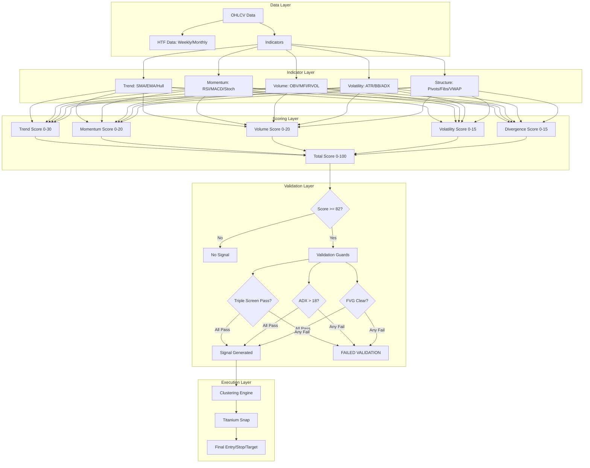
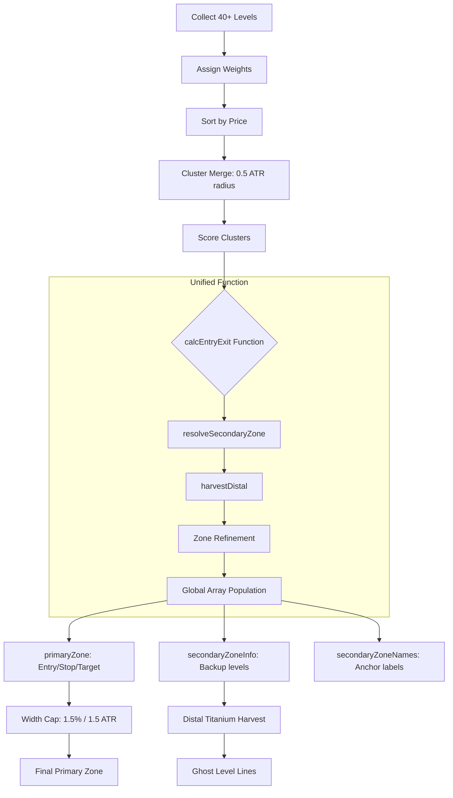
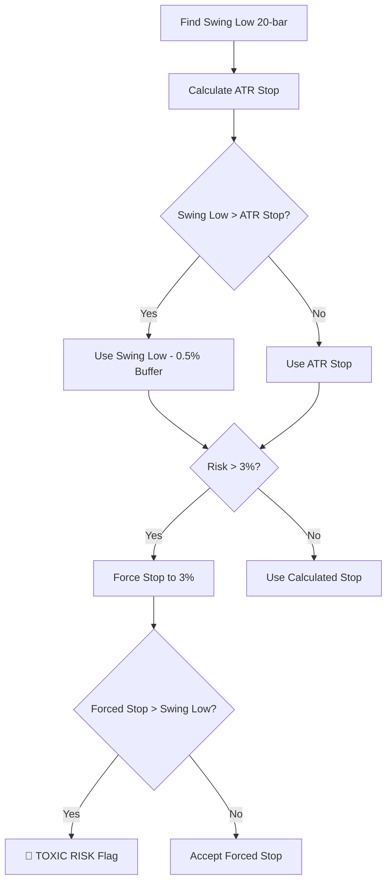
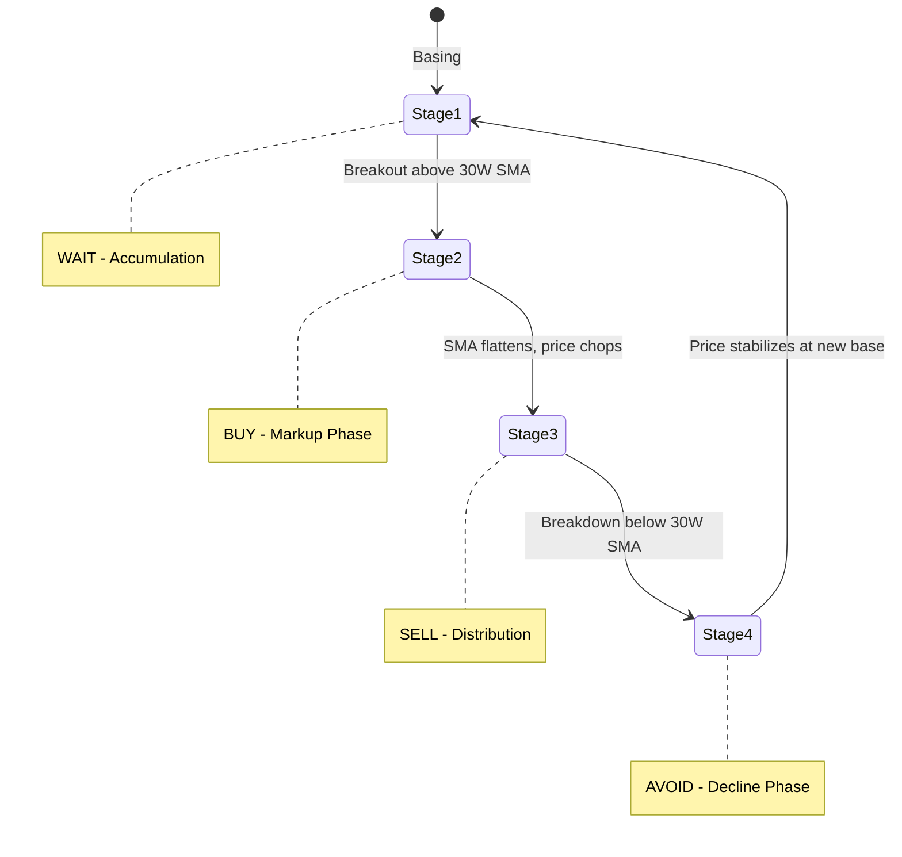
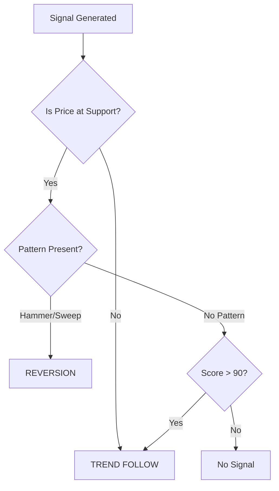
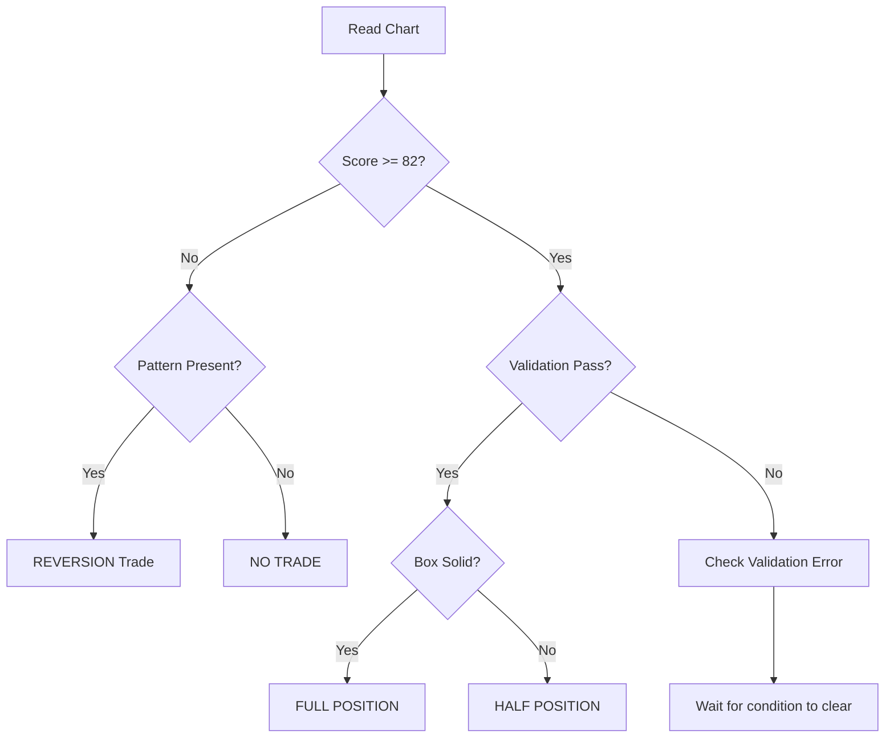
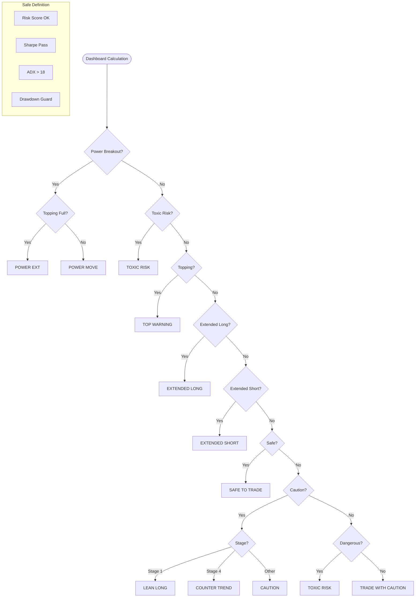
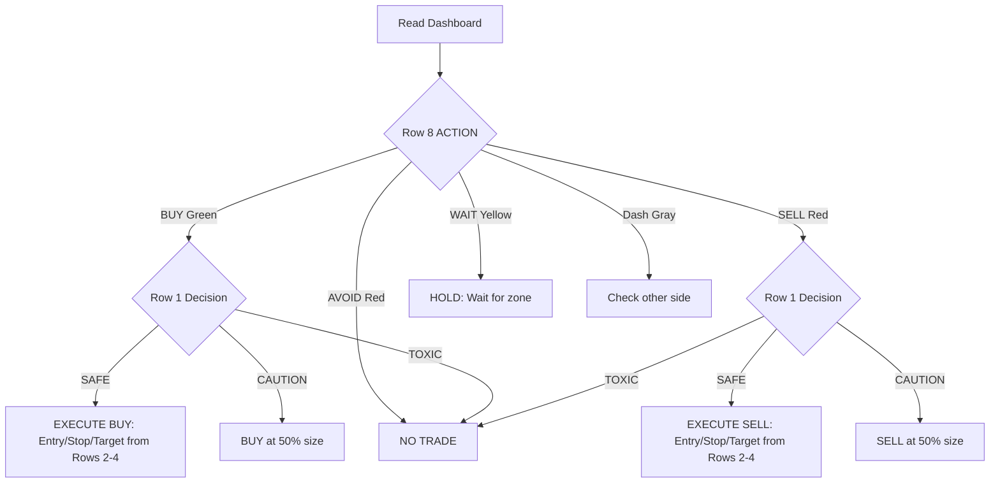
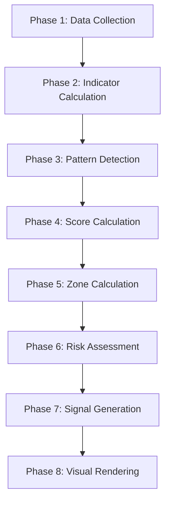

# Revanth Enhanced Strategy v2.0 - Complete Technical Reference Manual

---

## Table of Contents
1. [System Architecture](#1-system-architecture)
2. [Indicator Reference](#2-indicator-reference)
3. [Signal Labels & Actions](#3-signal-labels--actions)
4. [Validation Errors & Fixes](#4-validation-errors--fixes)
5. [Dashboard Fields](#5-dashboard-fields)
6. [Clustering Algorithm](#6-clustering-algorithm)
7. [Risk Management Logic](#7-risk-management-logic)
8. [Visual Opacity Logic](#8-visual-opacity-logic)
9. [Quick Reference Card](#9-quick-reference-card)
10. [Edge Cases & Conflict Resolution](#10-edge-cases--conflict-resolution)
11. [Timeframe Considerations](#11-timeframe-considerations)
12. [Troubleshooting Guide](#12-troubleshooting-guide)
13. [Appendix: Formula Reference](#13-appendix-formula-reference)
14. [Glossary](#14-glossary)
15. [Tooltip Field Reference](#15-tooltip-field-reference)
16. [Visual Element Guide](#16-visual-element-guide)
17. [Signal Type Definitions](#17-signal-type-definitions)
18. [Anchor Type Reference](#18-anchor-type-reference)

---

## 1. System Architecture



---

## 2. Indicator Reference

### 2.1 Trend Indicators

| Indicator | Period | Purpose |
|-----------|--------|---------|
| **SMA 20** | 20 bars | Short-term trend direction |
| **SMA 50** | 50 bars | Medium-term trend direction |
| **SMA 200** | 200 bars | Long-term trend direction (Institutional) |
| **EMA 5** | 5 bars | Fast momentum (Sprint) |
| **EMA 8** | 8 bars | "Rocket" line |
| **EMA 13** | 13 bars | Elder Impulse component |
| **EMA 50** | 50 bars | Intermediate trend |
| **Hull MA 20** | 20 bars | Low-lag trend filter |
| **30-Week SMA** | 150 bars | Weinstein Stage Analysis |

### 2.2 Momentum Indicators

| Indicator | Parameters | Interpretation |
|-----------|------------|----------------|
| **RSI** | Length: 14 | >50 = Bullish Control, >70 = Overbought |
| **Stochastic %K** | K:14, D:3 | <20 = Oversold, >80 = Overbought |
| **MACD Line** | 12/26/9 | Trend momentum (fast EMA minus slow EMA) |
| **MACD Histogram** | - | Acceleration/Deceleration (MACD minus its signal line) |
| **Force Index** | 13 bars | Volume-weighted momentum |
| **Momentum** | 10 bars | Raw price change over 10 bars |

### 2.3 Volume Indicators

| Indicator | Purpose |
|-----------|---------|
| **OBV** | Cumulative volume (+/− by close direction) — institutional accumulation/distribution |
| **Relative Volume** | Volume vs its 20-bar average — abnormal-activity detection |
| **Chaikin MFI** | Money flow direction |
| **Volume Z-Score** | Statistical significance of volume (vs its mean/standard-deviation) |

### 2.4 Volatility Indicators

| Indicator | Purpose |
|-----------|---------|
| **ATR** | Average candle size over 14 bars (Stop-Loss basis) |
| **ADX** | Trend strength (not direction), 14 bars |
| **Bollinger Bands** | Volatility envelope (SMA ± 2 standard deviations) |
| **BB Width** | Squeeze detection ((upper − lower) / middle) |
| **Directive** | PRIME / LEAN / STALK | Row 8 Action Label |
| **HV Rank** | Historical Volatility % | Volatility Energy Rank |

### 2.5 Structural Indicators

| Indicator | Description | Weight |
|-----------|-------------|--------|
| **Weekly Open** | First price of current week | Titanium (5.0) |
| **Monthly Open** | First price of current month | Titanium (5.0) |
| **Yearly Open** | First price of current year | Titanium (5.0) |
| **52-Week High** | Highest price in 252 bars | Titanium (5.0) |
| **52-Week Low** | Lowest price in 252 bars | Titanium (5.0) |
| **Anchored VWAP** | VWAP from highest volume bar (252-day lookback) | Titanium (5.0) |
| **Daily Pivot** | (H + L + C) / 3 | Gold (3.0) |
| **Fibonacci 61.8%** | Retracement level | Gold (3.0) |
| **Swing Low (20)** | Lowest low in 20 bars | Silver (1.0) |
| **Swing High (20)** | Highest high in 20 bars | Silver (1.0) |

---

## 3. Signal Labels & Actions

### 3.1 BUY Signals

| Label | Trigger Condition | Action Required |
|-------|-------------------|-----------------|
| **🚀 ROCKET** | Score ≥95, Velocity Z >2.0, Parabolic | **HOLD/ADD**: Momentum confirmed. If already in trade, HOLD. If missed entry, wait for pullback to zone before adding. Do NOT chase at signal bar - move already started. |
| **💎 STRONG BUY** | Score ≥82, All Filters Pass | **STANDARD ENTRY**: Enter at blue zone. Stop at KEY SUP. |
| **📈 BUY** | Score ≥82, Some Filters Weak | **CAUTIOUS ENTRY**: Reduce size. Monitor closely. |
| **📈 BUY ⚠️** | Score ≥80 but Filters Failed | **WAIT**: Do not enter. Wait for filter confirmation. |

### 3.2 SELL Signals

| Label | Trigger Condition | Action Required |
|-------|-------------------|-----------------|
| **☄️ CRASH** | Score ≥95, Velocity Z <-2.0 | **PANIC SHORT**: Fast declining. Short or exit longs immediately. |
| **💎 STRONG SELL** | Score ≥82, All Filters Pass | **STANDARD SHORT**: Enter at red zone. Stop at KEY RES. |
| **📉 SELL** | Score ≥82, Some Filters Weak | **CAUTIOUS SHORT**: Reduce size. |
| **📉 SELL ⚠️** | Score ≥80 but Filters Failed | **WAIT**: Do not short. Wait for confirmation. |

### 3.3 Warning Labels

| Label | Meaning | Action Required |
|-------|---------|-----------------|
| **⏳ PENDING** | Signal forming but bar not closed | **WATCH**: Signal is likely. Wait for bar close to confirm. Prepare entry. |
| **⚠️ FAILED VALIDATION** | Signal blocked by guards | **DO NOT TRADE**. See Section 4 for specific error. |
| **🛑 TOXIC RISK** | Stop loss inside noise zone OR global danger override (drawdown/volatility) | **DO NOT TRADE**. R:R is invalid or asset is too volatile. |
| **⚠️ TOP WARNING** | RSI >70 + Topping Pattern | **EXIT LONGS**. Prepare for reversal. |
| **📉 INTERNAL WEAKNESS** | Score divergence — price rising but Buy Score declining. Hidden distribution. **Regime-gated:** suppressed on healthy Stage-2 breakouts (Stage 2 with Buy Score ≥ 70) so it no longer fires on a leader digesting near highs; a real Stage-3 top or a decayed Stage-2 (Buy Score < 70) still fires. | **CAUTION**: Reduce longs. Stealth selling underway. |
| **📈 BEAR WEAKNESS** | Bearish score divergence — price falling but sell score declining. Hidden accumulation. | **WATCH**: Smart money may be accumulating. |
| **🌊 RSI CASCADE** | Multi-timeframe RSI cascade (daily + intraday + weekly alignment at extremes). | **EXIT**: Exhaustion across all timeframes. High reversal probability. |
| **⚡ EXTREME EXTENSION** | Severely overextended price (Z-score extreme). | **DO NOT CHASE**. Parabolic exhaustion imminent. |
| **! EXTENDED LONG** | Price far above support | **REDUCE SIZE**. Wait for pullback. |
| **! EXTENDED SHORT** | Price far below resistance | **REDUCE SIZE**. Wait for bounce. |
| **TRAP** | False breakout detected | **FADE THE MOVE**. Trade opposite direction. |
| **SWEEP** | Liquidity grab reversal. Green = Bullish floor reclaim. Red = Bearish ceiling rejection. | **REVERSAL PLAY**: Enter opposite direction. |
| **💎 FAILURE SWEEP** | Previous sweep level is broken. High probability momentum explosion. | **AGGRESSIVE ENTRY**: Teal = Long Squeeze. Red = Bearish Trapdoor. |
| **BOUNCE XX%** | Price touched KEY SUP and bounced. Confidence scored (trend+RSI+vol+candle). Green ≥70%, Yellow ≥40%, Gray <40%. | **CONFIRMATION**: Validates support. Higher % = stronger. |
| **REJECT XX%** | Price touched KEY RES and rejected. Same confidence scoring. Red ≥70%, Orange ≥40%. | **CONFIRMATION**: Validates resistance. Higher % = stronger. |
| **GOLDEN CROSS** | EMA 50 crosses above SMA 200. Yellow X below bar. | **BULLISH STRUCTURE**: Long-term trend shift. |
| **DEATH CROSS** | EMA 50 crosses below SMA 200. Black X above bar. | **BEARISH STRUCTURE**: Long-term trend breakdown. |
| **QUAD 🧙** | Quadruple witching options expiration day. Purple label + dotted vertical line. | **CAUTION**: High volume/volatility from expiry. |
| **HIKKAKE** | Inside bar fake-out pattern. Green = Bullish (fake breakdown reversed up), Red = Bearish (fake breakout reversed down). | **REVERSAL**: Trapped traders on wrong side. Trade the reversal. |
| **OOPS** | Larry Williams gap reversal. Green = Gap down recovered above prior low, Red = Gap up failed below prior high. | **REVERSAL**: Institutional absorption of gap. High-probability signal. |
| **🔑 KEY REV** | Key Reversal Bar — violent institutional rejection. Green = Bullish (new low → close above prior high), Red = Bearish (new high → close below prior low). | **STRONG REVERSAL**: Full-range institutional rejection. |
| **🧱 WEAK RES** | Key resistance tested >3 times in 25 bars. Each test weakens it. | **WATCH**: Breakout may be imminent. |
| **🧱 WEAK SUPPORT** | Key support tested >3 times in 25 bars. Each test weakens it. | **WATCH**: Breakdown may be imminent. |
| **ANCHOR RES / SUP** | Price touching institutional AVWAP anchor. Red = Resistance, Green = Support. | **KEY LEVEL**: Institutional cost basis. |

### 3.4 Confirmation Labels (v3.1)

Confirmation patterns are **independent** — they display alongside warning labels when conditions are met.

| Label | Condition | Meaning |
|-------|-----------|---------|
| **📍** (Green below) | Bullish Pin Bar near support (within 5%) | Strong rejection wick. **Confirmation to BUY.** |
| **📍** (Red above) | Bearish Pin Bar near resistance (within 5%) | Strong rejection wick. **Confirmation to SHORT.** |
| **🔥** (Green below) | Bullish Engulfing near support (within 5%) | Momentum shift. **Confirmation to BUY.** |
| **🔥** (Red above) | Bearish Engulfing near resistance (within 5%) | Momentum shift. **Confirmation to SHORT.** |

> **Three-Tier Label System:**
> - **Top Warnings** (EXTREME EXTENSION, INTERNAL WEAKNESS, BEAR WEAKNESS, RSI CASCADE, TOP WARNING): Priority chain — only one fires per bar. Suppressed during Power Breakout. Priority: Extension > Weakness > RSI Cascade > Topping.
> - **Pattern Warnings** (TRAP, SWEEP, HIKKAKE, OOPS, KEY REV, FAILURE SWEEP, WEAK RES/SUP): Appear in a separate `else if` chain — only one pattern warning per bar.
> - **Confirmations** (PIN BAR, ENGULF): Appear independently via separate `if` statements — can appear alongside warnings.

**Removed Labels (v3.1):** `WEAK PULSE` and `CHURN` were removed to save tokens and reduce chart noise.

---

## 4. Validation Errors & Fixes

When you see **"⚠️ FAILED VALIDATION"**, check the tooltip for the specific error:

### 4.1 Triple Screen: HTF Trend Mismatch ❌

| Error | Meaning | Fix |
|-------|---------|-----|
| **HTF Trend Mismatch** | Weekly chart opposes your Daily signal | **WAIT** for Weekly MACD to turn. OR trade smaller timeframe (4H) for scalp only. |

**Technical Details:**
- Checks Weekly MACD Histogram direction
- Long blocked if Weekly Histogram declining
- Short blocked if Weekly Histogram rising

### 4.2 Trend Quality: Market Choppy (ADX < 18) ⚠️

| Error | Meaning | Fix |
|-------|---------|-----|
| **Market Choppy** | No directional trend. Random noise. | **WAIT** for ADX to rise above 18. OR only take "SWEEP" patterns (Reversal plays work in chop). |

**Technical Details:**
- ADX measures trend strength, not direction
- ADX < 18 = Market is ranging/consolidating
- Breakout signals in low ADX fail 60%+ of time

### 4.3 FVG Filter: Trading against active GAP 🛑

| Error | Meaning | Fix |
|-------|---------|-----|
| **Trading against GAP** | Buying directly into overhead gap resistance | **WAIT** for gap to fill. OR wait for breakout ABOVE the gap. |

**Technical Details:**
- Fair Value Gaps act as magnet + resistance
- Price tends to fill gaps then reject
- Never buy INTO a bearish FVG

### 4.4 Entry Zone: Price not at Support

| Error | Meaning | Fix |
|-------|---------|-----|
| **Not at Support** | Price is mid-range, not at key level | **WAIT** for pullback to blue zone. Score is high but entry is poor. |

### 4.5 Dedup: Still in previous Signal Zone

| Error | Meaning | Fix |
|-------|---------|-----|
| **Still in zone** | You already have a signal here | **HOLD** existing position. No new entry needed. |

### 4.6 Cooldown: Signal active (Bars < 10)

| Error | Meaning | Fix |
|-------|---------|-----|
| **Cooldown active** | Signal fired recently | **HOLD**. Prevents overtrading same setup. Wait 10 bars. |

### 4.7 Entry Zone: Price not at Resistance

| Error | Meaning | Fix |
|-------|---------|-----|
| **Not at Resistance** | Short signal fired but price is mid-range, not at key resistance | **WAIT** for rally to red zone. Score is high but entry is poor. |

### 4.8 Capital Protection (CapProtect)

| Error | Meaning | Fix |
|-------|---------|-----|
| **CapProtect** | Signal blocked by global danger override (drawdown guard, extreme volatility) | **SKIP**. The 🛑 label fires with no text — just the emoji. Wait for danger to clear. |

---

## 5. Dashboard Fields

### 5.1 Row Layout (v3.1 - 12-Row AI-Readable Matrix)

| Row | Label | Left Cell | Center Cell | Right Cell |
|-----|-------|-----------|-------------|------------|
| 0   | **HEADER** | 🟢 LONG + Net σ | Timeframe (DAILY/etc) | 🔴 SHORT + Net σ |
| 1   | **BIAS** | BULL/BEAR/SIDE | Market Temp (Bias + Score) | BULL/BEAR/SIDE |
| 2   | **ENTRY ZONE** | Active Zone (Pri/Sec) | 📍 ENTRY ZONE | Active Zone (Pri/Sec) |
| 3   | **STOP** | Long Stop Price | 🛑 STOP | Short Stop Price |
| 4   | **TARGET** | Long Target Price | 🎯 TARGET | Short Target Price |
| 5   | **ANCHOR** | 🎯 Long Anchor Name | ANCHOR | 🎯 Short Anchor Name |
| 7   | **STAGE** | Weinstein Stage | DMI:+DI▲/-DI▼ | Darvas Status |
| 8   | **ACTION** | Long Directive | ⚡ ACTION | Short Directive |
| 9   | **ENERGY** | HV Value (Rank%) | ⚡ ENERGY | SQUEEZE/WARMING/EXPANSION |
| 10  | **DECISION** | ▲/▼/▬ Score + "Buy" | Final Decision / ⚠️ LAG | ▲/▼/▬ Score + "Sell" |
| 11  | **REV ZONE** | 🎯 ZONE 0/1/2 or — | 🔄 REV ZONE | 🎯 ZONE 0/1/2 or — |
| 12  | **MTF** | Long MTF Status | % MTF Aligned | Short MTF Status |

> **Note on Entry Zones:** Row 2 now features **Auto-Fallback**. If the Primary Zone is inactive (hidden), the dashboard will display the Secondary Zone range (colored Orange with suffix `(2)`) to ensure you always have actionable levels visible.

### 5.2 AI Signal Matrix Color Coding

| Color | RGB Value | Meaning | When Used |
|-------|-----------|---------|-----------|
| **Emerald Green** | `rgb(16, 185, 129)` | Active Bullish Signal | In-zone Long, Stage 2, ADX >25 |
| **Rose Red** | `rgb(239, 68, 68)` | Active Bearish Signal | In-zone Short, Stage 4, ADX >25 |
| **Amber Gold** | `rgb(245, 158, 11)` | Caution/Waiting | Counter-trend, Waiting for zone |
| **Slate Gray** | `rgb(107, 114, 128)` | Inactive/Neutral | Non-dominant side, choppy market |
| **Violet Purple** | `rgb(139, 92, 246)` | Institutional | Anchor rows, confluence levels |

### 5.3 ACTION Row Logic (Row 8)

**(See Section 5.7 for detailed Breakdown)**

### 5.4 Strategy State Table

| State | Column | Color | Meaning | Action |
|-------|--------|-------|---------|--------|
| **✓ PRIME BUY** | Long | Green | Score ≥ 85 + In Zone + Valid R:R | **EXECUTE** at zone |
| **✓ ACTION BUY** | Long | Green | Score 70-84 + In Zone | **ENTER** (Standard) |
| **👀 WATCH** | Long | Yellow | Score 50-69 + In Zone | **PREPARE** |
| **⚠️ LOW R:R** | Either | Red | Target/Stop ratio < 1.5 | **SKIP** or wait for dip |
| **✓ PRIME SELL** | Short | Red | Score ≥ 85 + In Zone + Valid R:R | **EXECUTE** short |
| **✓ ACTION SELL** | Short | Red | Score 70-84 + In Zone | **ENTER** (Standard) |
| **👀 WATCH** | Short | Yellow | Score 50-69 + In Zone | **PREPARE** |
| **⏳ FORMING** | Long | Orange | Score ≥70, awaiting 60m zone confirmation | **WATCH** for 60m confirmation |
| **⏳ FORMING** | Long | Red | Score ≥70 + Stage 4 or Topping active | **HIGH RISK** - counter-trend forming |
| **⏳ FORMING** | Short | Orange | Score ≥70, awaiting 60m zone confirmation | **WATCH** for 60m confirmation |
| **⏳ FORMING** | Short | Red | Score ≥70 + Stage 2 or Bottoming active | **HIGH RISK** - counter-trend forming |
| **! EXTENDED** | Either | Orange | Price far from zone | **WAIT** for pullback |
| **⚠️ TOP WARNING** | Long | Red | RSI extreme / Topping pattern | **EXIT** longs |
| **⚠️ BOT WARNING** | Short | Red | RSI extreme / Bottoming pattern | **EXIT** shorts |
| **⚠️ VOLATILE** | Either | Orange | RAM < 1.0 + High velocity (choppy) | **WAIT** - Unstable trend |
| **⚠️ PARABOLIC** | Either | Red | >60% from MA200 + exhaustion confirm (decel/div/reversal/loss of fast MA); score capped ≤60 | **NO FRESH ENTRY** - hold/trail/hedge. Outranks PRIME/POWER (catches smooth parabolas like SNDK). |
| **⚡ ACCELERATION** | Long | Green | Velocity Z > 2.0 on a YOUNG uptrend (Stage 1/2, <20 bars) **AND score ≥ 50** | **MOMENTUM ENTRY OK** - ignition the evidence trusts, not exhaustion |
| **⚡ EARLY** | Long | Amber | Same velocity/stage thrust as ACCELERATION **but score < 50** | **DO NOT BUY YET** - unconfirmed thrust; the Bayesian score doesn't back it. Treated as caution, NOT actionable. Never match as a BUY. |
| **⚡ BREAKDOWN** | Short | Red | Velocity Z < -2.0 on a YOUNG downtrend (Stage 3/4, <20 bars) | **MOMENTUM SHORT OK** - ignition, not capitulation |
| **⚠️ BLOW-OFF** | Long | Red | Velocity Z > 2.0 on a MATURE/non-ignition trend | **DO NOT BUY** - velocity exhaustion |
| **⚠️ CAPITULATION** | Short | Red | Velocity Z < -2.0 on a MATURE/non-ignition downtrend | **DO NOT SHORT** - panic exhaustion |
| **✓ POWER MOVE** | Either | Green | Strong momentum breakout | **EXECUTE** (Aggressive) |
| **✓ POWER (EXT)** | Either | Yellow | Power move but overextended | **CAUTION** (Red. Size) |
| **🛑 TOXIC RISK** | Either | Red | Stop inside noise floor OR global danger override | **SKIP** |
| **⚠️ STRETCHED** | Either | Orange | Elasticity Z 1.5-2.0 + Score ≥70 | **CAUTION** - Overextended |
| **WAIT** | Either | Gray | No actionable setup | **WAIT** |

> **RAM (Risk-Adjusted Momentum)**: Calculated as `ROC(20) / StDev(ROC(1), 20)`. A high RAM (>2.0) indicates a stable, controlled trend. A low RAM (<1.0) combined with high velocity signals choppy, dangerous price action (Kakushadze & Serur, Formula 269).

### 5.5 Dashboard Row Deep-Dives

#### 5.5.1 Header Row (Row 0) — "Net σ" (NOT the Buy/Sell Score)

The header renders `🟢 LONG / Net {x}σ` and `🔴 SHORT / Net {x}σ`.

- **What it is:** `Net σ` = the **raw net evidence-sigma per side BEFORE the Bayesian/stage prior**. It is **NOT** the 0-100 conviction score (that lives in Row 10 DECISION) and it is **NOT** pure price-stretch.
- **It can be NEGATIVE.** A blow-off top once printed 9.41σ next to LONG — which is why the old "conviction"/"Stretch" labels were wrong; it was relabeled **"Net σ"** with a tooltip.
- **How to read it:** a **high Buy Score with Net σ ≈ 0** means the score is **trend-PRIOR-driven, not evidence-driven** (a low-conviction, trend-coasting long). Direction/decision still comes from **Row 10 score + Dir Prob**, not from this header number.

#### 5.6 Stage/DMI/Darvas Row (Row 7)

| Left Cell | Center Cell | Right Cell |
|-----------|-------------|------------|
| **Weinstein Stage** | **DMI Trend** | **Darvas Status** |
| (Stage 1-4) | (+DI/-DI Direction) | (Box Position) |

**What This Row Measures:** Structural trend and price action "boxing."

- **Center Cell (DMI Trend)** — exact strings:

| String | Meaning |
|--------|---------|
| `DMI:+DI▲` | Hull DMI bullish (momentum rising) |
| `DMI:-DI▼` | Hull DMI bearish |
| `DMI:—` | Neither (flat / no clear DMI trend) |

> **Now a Data Window export** via the `R-VRVP` companion — read `ADX (14)` + `DMI +DI` / `DMI -DI` from the Data Window (`+DI > −DI` ⇒ `+DI▲`); do not OCR this cell. See §5.13.2.

- **Right Cell (Darvas)** — all 6 exact strings:

| String | Meaning |
|--------|---------|
| `BREAKOUT 🚀` | Strong breakout (breaking box top on volume **in Stage 2** — best case) |
| `BREAKING OUT ⬆️` | Breakout of box top on volume (not Stage-2 confirmed) |
| `IN BOX 📦` | Price inside a valid Darvas box (consolidating) |
| `ABOVE BOX ✅` | Price above box top (no active breakout bar) |
| `BELOW BOX ❌` | Price below box bottom (breakdown / structure broken) |
| `NO BOX` | No valid Darvas box currently formed |

- **Left Cell (Weinstein Stage)** — all exact strings:

| String | Stage | Meaning |
|--------|-------|---------|
| `STAGE 1: BASING ⏳` | 1 | Basing below/near MA, not falling |
| `STAGE 2: ADVANCING ✅` | 2 | Uptrend, price > rising MA |
| `STAGE 2: PULLBACK ⚠️` | 2 | Dipped below MA but above swing low — caution |
| `STAGE 2: BOUNCE 🔄` | 2 | Recovering from pullback (still below MA) — re-entry watch |
| `STAGE 3: TOPPING ⚠️` | 3 | Sideways after run, MA flattening |
| `STAGE 4: DECLINING ❌` | 4 | Downtrend, price < falling MA |
| `STAGE 4: RALLY ⚠️` | 4 | Close > MA within Stage 4 (bear rally — do not trust) |
| `STAGE 4: CRASH 🛑` | 4 | Crash mode (extreme decline) |
| `STAGE 4: RECOVERY 🌤️` | 5 | Potential reversal (Stage 5) — buys allowed with caution |
| `STAGE: IPO/NEW (NO DATA)` | 0 | Insufficient history to stage |

> **Weinstein Stage Mechanics (Reactive vs. Predictive)**
> *   **Standard Stages (Reactive):** Based on Price vs. 30W (200D) MA.
>     *   **Stage 1 (Basing):** Price Sideways near 30W MA.
>     *   **Stage 2 (Advancing):** Price > 30W MA + MA Rising.
>     *   **Stage 2: PULLBACK ⚠️:** Price dipped below MA but above recent swing low. Caution.
>     *   **Stage 2: BOUNCE 🔄:** Price recovering from pullback (rising from lows, still below MA). Re-entry opportunity.
>     *   **Stage 3 (Topping):** Price Sideways after run + MA Flattening.
>     *   **⚠️ DISTRIBUTION:** Proactive override — Stage 2/3 with bearish RSI divergence (smart money exiting). Overrides stage label.
>     *   **Stage 4 (Declining):** Price < 30W MA + MA Falling.
>     *   **Stage 4: RALLY ⚠️:** Close > Weinstein MA while in Stage 4 (bear rally — do not trust).
>     *   **Stage 4: CRASH 🛑:** Crash mode active (extreme decline).
>     *   **Stage 4: RECOVERY 🌤️:** Potential trend reversal (Stage 5). Buys allowed with caution.
> *   **Predictive Transitions:**
>     *   **Volume Skew:** Rising volume on up-days during Stage 1 predicts Stage 2 breakout.
>     *   **Momentum Divergence:** Falling RSI/OBV during Stage 3 predicts Stage 4 breakdown.

#### 5.7 Action Row (Row 8)

The ACTION row (Row 8) displays the **Strategic Directive** for Long and Short sides.
*   **Left Cell:** Long Signal (e.g., `✓ PRIME BUY`, `⚠️ TOP WARNING`).
*   **Center Cell:** `⚡ ACTION`.
*   **Right Cell:** Short Signal (e.g., `✓ PRIME SELL`, `⚠️ BOT WARNING`).

#### 5.7.1 Zone Proximity Override (v2.1+)

**Problem:** High score + far from zone = misleading ACTION signal.

**Solution:** ACTION is overridden to `WAIT` when price is statistically far from entry zone.

| Condition | Threshold | Action |
|-----------|-----------|--------|
| Z-score of distance > 2.0 | Statistical (250-bar lookback) | Override to WAIT |
| Distance > 10% (fallback) | Used when Z-score unreliable | Override to WAIT |

**Tooltip shows:** `📍 Price X% above Zone (Score: Y valid, wait for pullback)`

**Why this matters:**
- Score = Trend Quality (Is this a good stock?)
- ACTION = Entry Timing (Can I enter NOW?)
- High score + far from zone = Good stock, bad entry point

#### 5.8 Volatility Energy Row (Row 9)

| Left Cell | Center Cell | Right Cell |
|-----------|-------------|------------|
| **HV (Rank%)** | **ENERGY Label** | **Energy State** |
| e.g., "9.54 (58%)" | "⚡ ENERGY" | SQUEEZE/EXPANSION |

> **Now a Data Window export** via the `R-VRVP` companion — read `Energy IV30 (ann %)` (value), `Energy IV Rank %` (rank), `Energy IV-HV Spread (ivS)` + `Energy State 3Exp2Warm1Sqz0Dorm` (state code), and `HV20 (ann %)` from the JSON; do not OCR this cell. See §5.13.2.

**What This Row Measures:** Volatility Expansion vs Contraction (Breakout Timing)

> [!WARNING]
> This is **NOT Implied Volatility (IV)**. This indicator cannot access options-chain data.
> **Do NOT use this for options pricing.** For options, use external data (CBOE, brokerage).

**Left Cell (HV Rank):** Where current Historical Volatility sits in its 1-year range.
- **Cyan (<50%):** Low volatility → Price is calm → Energy building
- **Orange (50-80%):** Rising volatility → Movement starting
- **Purple (>80%):** High volatility → Price moving fast

**Right Cell (Energy State):**
| Color | Background | State | Meaning | Action |
|-------|------------|-------|---------|--------|
| 🔵 Cyan | `color.aqua` | **SQUEEZE** | Volatility compressing | Prepare for breakout |
| 🟠 Orange | `color.orange` | **WARMING** | Volatility rising | Breakout imminent |
| 🟣 Purple | `color.purple` | **EXPANSION** | Price moving fast | Ride trend, trail stops |
| ⚪ Gray | `color.gray` | **DORMANT** | Very low volatility | Wait for catalyst |

**Trading Application:** Use this row for **breakout timing** (TTM Squeeze logic), not options pricing.

#### 5.9 Conviction Row (Row 10)

| Left Cell | Center Cell | Right Cell |
|-----------|-------------|------------|
| **▲/▼/▬ Score + "Buy"** | **Bias + Score / Decision** | **▲/▼/▬ Score + "Sell"** |

**What This Row Measures:** The high-level synthesis of all scoring engines plus score momentum.

**Left/Right Cells — Score Momentum Arrows:**
- **▲** (Green) = Score rising. 3-bar EMA delta > +2. Conviction strengthening.
- **▼** (Red) = Score falling. 3-bar EMA delta < -2. Conviction weakening.
- **▬** (Gray) = Score stable. Delta between -2 and +2. Steady state.
- Example: `▲ 71 Buy` = Buy score is 71 and improving. `▼ 20 Sell` = Sell score is 20 and deteriorating.
- **Trading Impact:** A ▲ arrow on the dominant side adds confidence. A ▼ on a PRIME/ACTION signal should trigger skepticism — consider reducing size or waiting one bar for confirmation.

**Center Cell — Decision Display:**
- When ACTION is non-critical (WAIT/WATCH): Shows Bias string (e.g., `BULLISH 80`).
- When ACTION is actionable: Shows the action state (e.g., `✓ PRIME BUY`, `⚠️ TOP WARNING`).
- **Critical Alerts:** `🛑 TOXIC RISK` overrides all other displays.

**⚠️ BIAS LAG (Orange):**
- **Trigger:** the gap between the stage-expected direction and the score-predicted direction is ≥ 1.5, AND the dominant score > 50.
- **Stage Expected Values:** Stage 2 → +1.0, Stage 4 → -1.0, Stage 3 → -0.5, Stage 1 → 0.0.
- **Score Predicted:** Bullish bias → +1.0, Bearish bias → -1.0.
- **Format:** `⚠️ LAG 71` — the number is the dominant score.
- **Interpretation by Stage:**
  - Stage 3 + Bullish Score: Distribution phase but score hasn't caught up. **Do not trust score — structure is breaking.**
  - Stage 4 + Bullish Score: Decline but score says buy. **Early reversal or bull trap?** Use tighter stops.
  - Stage 2 + Bearish Score: Uptrend but score says sell. **Pullback or topping?** Reduce size.
- **Action:** When LAG shows, prioritize Stage over Score. Do not take full-size entries on the lagging side.

#### 5.10 Mean Reversion Zones (REV ZONE Row - Row 11)

The REV ZONE row (Row 11) provides **independent reversal scoring** using Larry Connors methodology. This row operates separately from the ACTION row and identifies potential mean reversion opportunities even when the main system shows "TOXIC RISK".

#### Zone Display
| Display | Score | Meaning |
|---------|-------|---------|
| **🎯 ZONE 0** | 10+ | Extreme oversold/overbought - High probability reversal |
| **🎯 ZONE 1** | 7-9 | Strong oversold/overbought - Setup forming |
| **🎯 ZONE 2** | 4-6 | Forming - Watch for development |
| **—** | < 4 | No reversal zone |

#### Scoring Factors (Long Reversal - Oversold Bounce) - Research-Calibrated
| Tier | Factor | Condition | Points | Source |
|------|--------|-----------|--------|--------|
| **T0** | **Titanium Zone** | 52W/Y.O/POC Anchor + In Zone | **+2.5** | Institutional level research |
| **T0** | **Structural Zone** | Price touching any Zone | **+1.5** | General confluence |
| T1 | RSI(2) Extreme | `< 10` / `< 15` / `< 25` | +3/+2/+1 | Connors Research (86-91% win rate) |
| T1 | RSI(14) Extreme | `< 25` / `< 30` | +2/+1 | Standard oversold threshold |
| T1 | MTF RSI Cascade | Weekly < 40 + Daily < 30 + Intraday < 30 | +3 | Multi-TF oversold confluence |
| T1 | RSI Divergence | Price lower, RSI higher | +2.5 | Less reliable than raw oversold |
| **T2** | **Near 52W Low** | within ~5% of the 52-week low | **+2.5** | Institutional magnet |
| **T2** | **Trap Pattern** | Hikkake / Failed Sweep / Bear Trap / Bull Trap | **+2.0** | Institutional trap validation |
| T2 | Near Key Support | within ~2% of key support | +1.5 | General key level |
| T2 | Below BB Lower | below the lower Bollinger Band | +1.5 | Bollinger Band extremes |
| T2 | Elasticity Extreme | elasticity z-score < −1.5 | +1 | Price stretch |
| T3 | Stoch Cross | Stochastic oversold + bullish %K/%D cross | +1.5 | Momentum confirmation |
| T3 | MACD Bullish | MACD bullish | +1.5 | Momentum confirmation |
| T3 | OBV Divergence | OBV rising, price falling | +1 | Volume divergence |
| T4 | Hammer Pattern | Candlestick pattern | +1.5 | Pattern recognition |
| T4 | Bullish Engulfing | Candlestick pattern | +1.5 | Pattern recognition |
| **T4B** | **"Oops" Pattern** | Gap down + recover above prior low | **+2.0** | Larry Williams (proven edge) |
| **T4B** | **Key Reversal Bar** | Open < prior low, close > prior high | **+2.5** | Institutional rejection |
| T5 | Consecutive Down Days | `>= 5` / `>= 4` | +2/+1 | Validated capitulation signal |
| T5 | Volume Climax | `vol > 2x avg` | +2 | Capitulation signature |
| T6 | Oscillators | Williams/MFI/CCI OS | +0.5 each | Minor confluence |
| **Bonus** | **Connors Filter** | Above 200 SMA | **+2.0** | Validated (significantly improves win rate) |
| **Bonus** | **Trap Volume Spike** | Trap + `ln(V/V_prev) > 0.69` | **+1.0** | Kakushadze (Sec 10.3.1): Validates institutional participation |
| **Gate** | **Sigma Validation** | Oops/KeyRev + 2-Sigma Move | **Gate** | Kakushadze (Price-SUM): Only allow Gap patterns if Price-SUM > 2.0 |
| **Penalty** | **Low-Vol Anomaly** | ATR in bottom 10% (252 bars) | **-2.0** | Kakushadze & Serur (Strategy 3.4): Trends persist in low-vol regimes |

#### 5.11 MTF Context Row (Row 12)

| Left Cell | Center Cell | Right Cell |
|-----------|-------------|------------|
| **Long MTF** | **% MTF Aligned** | **Short MTF** |

**What This Row Measures:** Cumulative alignment across 5 timeframes (Monthly, Weekly, Daily, 4H, 1H).
- **100% (Green):** Institutional agreement.
- **<40% (Orange/Red):** Counter-trend or choppy environment.

### 5.12 Exhaustion Filters (Anti-Chase Logic)
| Tier | Factor | Condition | Points |
|------|--------|-----------|--------|
| T5 | Consecutive Down Days | `>= 5` / `>= 4` | +2/+1 |
| T5 | Volume Climax | `vol > 2x avg and close < open` | +2 |
| T6 | Oscillators | Williams/MFI/CCI OS | +0.5 each |
| Bonus | Above 200 SMA | Connors trend filter | +1.5 |

#### Short Reversal Scoring
Symmetrical to Long with inverted conditions (RSI > 90, close > weekHigh52 * 0.95, etc.). Includes sell-side category sigma bonus for symmetric scoring with buy side.

#### Institutional Trap Integration (v3.4)
Bear Trap and Bull Trap signals now feed into reversion scoring:
- **Bear Trap detected** → +2.0 points to Long reversion score (trapped shorts must cover → bullish).
- **Bull Trap detected** → +2.0 points to Short reversion score (trapped longs must liquidate → bearish).
- Trap + Volume Spike bonus: Additional +1.0 if `ln(volume / volume[1]) > 0.69` (Kakushadze validation).
- **High-conviction combo:** Bear Trap + Zone 0 Long + RSI(2) < 10 = institutional capitulation reversal.

#### Cooldown Override (v3.4)
Strong signals bypass the standard 10-bar cooldown:
```
cooldownOKBuy  = cooldownPassedBuy  or buyScore >= 90 or isReversionBuy
cooldownOKSell = cooldownPassedSell or sellScore >= 90 or isReversionSell
```
- Score ≥ 90: High-conviction signals shouldn't be blocked by dedup.
- Reversion patterns: pattern-based reversion signals (System B) also bypass cooldown.
- This prevents the cooldown from suppressing legitimate rapid-fire entries during extreme reversals.

#### Chart Icons
- **🎯 plotshape** appears below bar for Zone 0 Long (score 10+)
- **🎯 plotshape** appears above bar for Zone 0 Short (score 10+)
- Only triggers on confirmed (closed) bars

#### Important Notes
1. **Independence**: REV ZONE scoring (System A: the mean-reversion score) runs independently of reversal zones. But ACTION depends on the combination: high reversion score + zone presence = counter-trend override in DECISION row.
2. **Two Reversion Systems:**
   - **System A** (Mean Reversion Score): statistical scoring → Zone 0/1/2 display on dashboard + 🎯 chart icon.
   - **System B** (Pattern-based Reversion): candlestick + structure reversion patterns → influence cooldown gating and final signal overrides.
   - Systems are independent but combine at the signal validation layer.
3. **Risk Awareness**: Zone 0 Long in a "TOXIC RISK" environment is a high-risk reversal play.
4. **Max Score**: Theoretical max ~30 points. Zone 0 (10+) captures top 33% of setups.
5. **Marubozu Kill**: If a Marubozu candle is detected (body > 60% of range, close near extreme), reversion score is zeroed out. Do not fade a trend bar.

### 5.13 Data Window Exports (Automated Gemini Analysis)

> ⚑ **PRIMARY SOURCE = the Data Window.** Every numeric value comes from the Data Window (right-side panel), which is the authoritative ground truth. The **dashboard table drawn on the chart image is ADVISORY / visual only** — use it for pattern context (candle shapes, zone boxes, where labels sit), but **NEVER read a number, an ACTION state, a DMI arrow, or an energy value off the dashboard image.** Where a value appears in both, the Data Window wins. This section is self-contained: everything you need to decode every field is here — no external tool or code is required.

The Data Window shows **44 rows in this exact top-to-bottom order**: **12** chart price-levels/flags (also drawn on the chart) followed by **32** dedicated state exports. Read them as NUMBERS (do not estimate by counting chart labels). NOTE: the numbered example table below predates the **Group B+** ACTION/MTF exports (fields 35-38) — those sit right after `Expected Value (R)` and push the recency-mask group to fields 39-44 (see the Group B+ table).

**EXACT Data Window (order + example values from a live GLW read):**

| # | Data Window Field | Example | Notes |
|---|-------------------|---------|-------|
| 1 | Sprint Line (EMA 5) | 339.62 | Fast cloud line. |
| 2 | Hull Baseline (HMA 20) | 346.51 | Slow cloud line. |
| 3 | MA 20 | 331.38 | `ma1`. |
| 4 | MA 50 | 324.27 | `ma2`. |
| 5 | MA 200 | 324.28 | `ma3` (the Ext% reference line). |
| 6 | Weinstein MA(150) - Stage Analysis 30-week MA | 313.84 | Stage MA. |
| 7 | Golden Cross | 0.0000 | 1 on the bar EMA50 crosses **above** MA200, else 0. |
| 8 | Death Cross | 0.0000 | 1 on EMA50 crossing **below** MA200, else 0. |
| 9 | Zone 0 Long | 0.0000 | 1 when an extreme long reversal (revScoreLong ≥ 10) prints, else 0. |
| 10 | Zone 0 Short | 0.0000 | 1 when extreme short reversal (revScoreShort ≥ 10), else 0. |
| 11 | AVWAP Resistance | 339.69 | Anchored VWAP resistance. |
| 12 | AVWAP Support | 314.75 | Anchored VWAP support. |
| 13 | Buy Score | 98.22 | see Group A. |
| 14 | Sell Score | 42.92 | |
| 15 | Stage (1=Base,2=Up,3=Top,4=Dn) | 2.00 | |
| 16 | Long Entry Zone Bot | 335.84 | |
| 17 | Long Entry Zone Top | 337.71 | |
| 18 | Long Stop Loss | 332.11 | |
| 19 | Long Target | 346.11 | |
| 20 | Short Entry Zone Bot | 348.20 | |
| 21 | Short Entry Zone Top | 351.05 | |
| 22 | Short Stop Loss | 355.10 | |
| 23 | Short Target | 340.00 | |
| 24 | Long Rev Zone | 0.0000 | |
| 25 | Short Rev Zone | 5.00 | |
| 26 | Ext% (vs MA200) | 4.31 | see Group B. |
| 27 | Exhaustion Gradient 0-1 | 0.0260 | |
| 28 | Regime (0Hlt1Ext2Clmx3Dist4Dn5Ign6Sqz) | 0.0000 | |
| 29 | Exp Move % (21b) | 7.53 | |
| 30 | Dir Prob % (>50 bull) | 82.08 | |
| 31 | Long Ignition (1=fresh breakout) | 0.0000 | |
| 32 | Win Prob % (EV gate) | 78.5 | |
| 33 | R:R to target | 1.9 | |
| 34 | Expected Value (R) | 0.71 | |
| 35 | Bear Warning Mask | 0.0000 | see Group C. |
| 36 | Reversal Pattern Mask | 2241.00 | |
| 37 | Weak Level Mask | 0.0000 | |
| 38 | Bear Warning Age | ∅ | |
| 39 | Reversal Pattern Age | 3.00 | |
| 40 | Weak Level Age | ∅ | |

> Rows 1-12 are ordinary chart plots that also surface in the Data Window. Rows 7-10 are boolean flags (0/1). Rows 13-44 are the **32 dedicated exports** detailed below.

**Group A — Trade-level exports (13):**

| # | Data Window Field | Meaning |
|---|-------------------|---------|
| 1 | **Buy Score** | 0-100 long conviction (post-Bayesian, reversion-weighted — quiet at breakouts, loud at dips). |
| 2 | **Sell Score** | 0-100 short conviction. |
| 3 | **Stage (1=Base,2=Up,3=Top,4=Dn)** | Weinstein stage integer (also 5 = Recovery internally). |
| 4 | **Long Entry Zone Bot** | Lower bound of the long entry zone. |
| 5 | **Long Entry Zone Top** | Upper bound of the long entry zone. |
| 6 | **Long Stop Loss** | Structure-first stop, capped by the max-risk % (5% stocks / 3% ETFs). |
| 7 | **Long Target** | Long take-profit = the **nearest real resistance above entry** (structure-first: KEY RES / pivot high / weekly MA / Darvas top / BB upper, whichever is lowest). **No R:R filter** — a wall close to entry is still the honest target (a low R:R is *reported*, not hidden). Only when there is genuinely no resistance overhead (blue-sky / new highs) is a target synthesized (Fib extension, then a 6%/2×ATR sanity cap on the synthetic value ONLY). Whether the trade is worth taking is decided by the **statistical EV gate** (fields 32-34), not by moving the target. |
| 8 | **Short Entry Zone Bot** | Lower bound of the short entry zone. |
| 9 | **Short Entry Zone Top** | Upper bound of the short entry zone. |
| 10 | **Short Stop Loss** | Structure-first stop, capped by the max-risk %, short side. |
| 11 | **Short Target** | Short take-profit — mirror logic of field 7 (nearest real support below entry). |
| 12 | **Long Rev Zone** | Mean-reversion (dip-buy) score, long side. |
| 13 | **Short Rev Zone** | Mean-reversion score, short side. |

**Group B — Mathematical-state exports (6) — these OUTRANK the visual labels:**

| # | Data Window Field | Range | Meaning / How to use |
|---|-------------------|-------|----------------------|
| 26 | **Ext% (vs MA200)** | % (can be neg) | Absolute price distance from the plotted MA200. <20% normal · 20-50% extended · **>60% = parabolic** (SNDK/MU) · >100% extreme. |
| 27 | **Exhaustion Gradient 0-1** | 0.0-1.0 | Blended trend-maturity/overheat (extension + age + velocity + divergence). <0.3 healthy (ride) · 0.3-0.7 extended (pullback-only) · **>0.7 terminal climax** (hedge). |
| 28 | **Regime (0Hlt1Ext2Clmx3Dist4Dn5Ign6Sqz)** | 0-6 int | 0 Healthy · 1 Extended · 2 Terminal-Climax · 3 Distribution · 4 Stage4-Decline · 5 Ignition/Breakout · 6 Squeeze. Ext% > 60 OR gradient > 0.7 forces **2**; an active volatility squeeze forces **6**. |
| 29 | **Exp Move % (21b)** | % | ~1-month (21-day) expected move from realized volatility. Sanity-checks targets/strikes. |
| 30 | **Dir Prob % (>50 bull)** | 0-100 | Buy-minus-Sell spread standardized vs its own 250-bar history, then mapped through the logistic. Informationless spread → ~50. **Damped toward 50** on counter-trend bars (Stage-4 rally / Stage-2 pullback) so a violent counter-trend candle can't fake an edge. |
| 31 | **Long Ignition (1=fresh breakout)** | 0 / 1 | 1 = EARLY IGNITION (see 5.13.1). Deliberate INVERSE of the reversion-weighted Buy Score — can be **1 while Buy Score is LOW**. A low Buy Score on an Ignition=1 bar is EXPECTED, not a conflict. |
| 32 | **Win Prob % (EV gate)** | 50-95 | Dir Prob shrunk toward 50 by a haircut (overfit edges decay live). The probability the EV gate actually trusts — raw Dir Prob is the *pre-haircut* view. Side follows the dominant score. |
| 33 | **R:R to target** | ratio | Honest reward:risk from entry to the structure-first target (field 7 or 11). Can be **< 1** — truthful, not a bug (near resistance in a strong trend). |
| 34 | **Expected Value (R)** | R multiples | p·RR − (1−p) with p = field 32. **> 0 = positive-EV trade.** The real go/no-go: a 0.9 R:R at 93% Dir Prob is strongly +EV; a 1.4 R:R at a coin-flip is not. Minimum R:R demanded = break-even (1−p)/p × a fractional-Kelly buffer, floored — replaced the old fixed 1.5 (which discarded good near-resistance targets and invented worse ones). |

**Group B+ — ACTION / MTF state exports (4) — the Row 8 "Supreme" cell + Row 12 MTF as NUMBERS:**

These make the two most decision-critical chart-only cells un-hallucinatable (vision models were reading `⏳ FORMING` as "PRIME BUY"). Decode each number with the enum below — this reference is self-contained; no external tool is needed.

| # | Data Window Field | Range | Meaning / How to use |
|---|-------------------|-------|----------------------|
| 35 | **Action Long Code** | 0-18 enum | Row 8 LEFT cell as a status enum (decode with the legend below). |
| 36 | **Action Short Code** | 0-18 enum | Row 8 RIGHT cell — the side is the field name, so a HIGH code here means a strong SHORT, not bullish. |
| 37 | **MTF Long Aligned (0-3)** | 0-3 | Count of Monthly/Weekly/Daily timeframes in uptrend (3 = full alignment). |
| 38 | **MTF Short Aligned (0-3)** | 0-3 | Count of timeframes in downtrend. |

**ACTION-code enum (pure status, NOT ordinal):** `1 PRIME · 2 ACTION · 3 POWER MOVE · 4 POWER (EXT) · 5 LOW R:R` = **CONFIRMED actionable entries** (LOW R:R = score≥85 in-zone, only R:R-to-suggested-target thin — still actionable) · `6 ACCELERATION/BREAKDOWN · 7 EARLY` = **UNCONFIRMED thrust** (not a zone entry) · `8 WATCH · 9 FORMING · 10 WAIT` = **NOT triggered** (never treat as a buy, whatever the Buy Score) · `11 EXTENDED · 12 STRETCHED · 13 VOLATILE · 14 COUNTER-TREND · 15 TOP/BOT WARNING · 16 BLOW-OFF/CAPITULATION · 17 PARABOLIC · 18 TOXIC RISK` = **caution/danger** (15–18 forbid fresh entry) · `0 none/unknown`. Per Golden Rule 5 the ACTION cell is SUPREME: codes 8/9/10 mean the setup is not triggered no matter how high the score. BUY/SELL, ACCEL/BREAKDOWN, TOP/BOT-WARNING, BLOW-OFF/CAPITULATION are merged per-pair (side is the field name).

> Note: the gem prompts reference "6 math-state values" — that is Group B fields 26-31. Fields **32-34** (Win Prob / R:R / EV) then **35-38** (Action Long/Short Code + MTF Long/Short) were added later. Group A (**13**) + Group B (6+3) + **Group B+ (4)** + Group C (6) = **32** dedicated exports; add the 12 chart plots above = **44** Data Window rows. Group C (recency masks/ages) now occupies fields **39-44**.

**Group C — Label-recency bitmasks + ages (6) — CONTEXT, not triggers:**

Three integer bitmasks encode WHICH chart labels fired in the **last 30 bars** (each set bit = that label is fresh), paired with three ages = **bars since the freshest member of the group** (blank/∅ = nothing fresh in 30 bars, 0 = fired this bar). Decode a mask by summing its set bits. Example: `Reversal Pattern Mask = 2241 = 2048+128+64+1` → OOPS_BEAR + TRAP_BEAR + TRAP_BULL + KEY_REV_BULL, and `Reversal Pattern Age = 3` = the freshest of those fired 3 bars ago.

| # | Data Window Field | Bit legend |
|---|-------------------|------------|
| 39 | **Bear Warning Mask** | 1 TOP · 2 RSI_CASCADE · 4 INTERNAL_WEAKNESS · 8 EXTREME_EXTENSION · **16 BEAR_WEAKNESS**. Bits 1-8 are bearish; **bit 16 is BULLISH** (hidden accumulation) despite the group name. |
| 40 | **Reversal Pattern Mask** | Each bit's directional meaning is given explicitly below — **do NOT infer polarity from the `_BULL`/`_BEAR` suffix, four bits are INVERTED**: 1 KEY_REV_BULL *(bullish)* · 2 KEY_REV_BEAR *(bearish)* · 4 SWEEP_BULL *(bullish — swept lows, closed back up)* · 8 SWEEP_BEAR *(bearish)* · 16 FAILSWEEP_BULL *(**BEARISH** — a bullish sweep that FAILED = trapped bulls)* · 32 FAILSWEEP_BEAR *(**BULLISH** — a bearish sweep that FAILED = trapped bears)* · 64 TRAP_BULL *(**BEARISH** — failed up-break)* · 128 TRAP_BEAR *(**BULLISH** — failed down-break)* · 256 HIKKAKE_BULL *(bullish)* · 512 HIKKAKE_BEAR *(bearish)* · 1024 OOPS_BULL *(bullish)* · 2048 OOPS_BEAR *(bearish)*. ⚠️ The four inverted bits are **FAILSWEEP_BULL & TRAP_BULL = bearish**, **FAILSWEEP_BEAR & TRAP_BEAR = bullish**. When summarizing a cluster, count net bullish vs bearish by the *(polarity)* tags above, never by the name. |
| 41 | **Weak Level Mask** | 1 RESISTANCE_WEAKENED (**bullish** — resistance breaking) · 2 SUPPORT_WEAKENED (bearish). |
| 42 | **Bear Warning Age** | Bars since the freshest Bear-Warning member (∅ = none in 30 bars). |
| 43 | **Reversal Pattern Age** | Bars since the freshest Reversal-Pattern member. |
| 44 | **Weak Level Age** | Bars since the freshest Weak-Level member. |

These are timing **CONTEXT only** — they never set direction or triage on their own. Decode a mask by summing its set bits (bit legend above); the paired age = bars since the freshest member fired. Use them to phrase "a bear-trap + bullish OOPS fired ~3 bars ago," not to override Group B.

#### 5.13.1 Long Ignition — the EARLY IGNITION flag

Catches a relative-strength leader breaking out of a base / squeeze-release-up **before** it extends — the setup the reversion-weighted Buy Score stays quiet on. `Long Ignition = 1` only when ALL seven conditions hold:

| Gate | Condition | Why |
|------|-----------|-----|
| Breakout trigger | Price above the fast Sprint-over-Hull cloud, OR a fresh upward squeeze release, OR a power breakout | Breakout in progress; self-times-out when price loses the cloud. |
| Fresh stage | Weinstein Stage 1 or 2 (basing or advancing) | NOT age-gated — mature-leader continuation breakouts qualify. |
| Accumulation | On-Balance-Volume rising AND volume above ~1.3× its 20-bar average | Smart-money proxy: accumulation + volume expansion. |
| Relative strength | Leading its benchmark index | Only leaders, not laggards. |
| Not extended | Price less than **12% above its OWN fast Hull(20) trend** (NOT the 200-day MA) | Distance from the *fast* trend is what matters — leaders 40%+ above their 200-day MA still qualify on a base breakout. |
| Has edge | **Dir Prob ≥ 55** | Probability confirm — filters extended parabolas whose Dir Prob has collapsed to ~50 (e.g. TECH 50.4 → Ignition 0) while keeping confident base breakouts (e.g. IFF 92.6 → Ignition 1). |
| Not climax | **Regime ≠ 2** (not a terminal climax) | Rejects an exhausted top. |

**Design intent:** there is **no hard 200-day-MA distance cap** — *edge (Dir Prob), not distance, decides* — so real continuation leaders far above their 200-day MA are not clipped. `Long Ignition = 1` is an actionable fresh-breakout momentum candidate even when Buy Score is quiet; a strong dip-buy (high Buy Score / A+ Trend Long) correctly shows `Long Ignition = 0`. That is the division of labor, not a contradiction.

**Override rule (matches gem):** on a `Long Ignition = 1` bar, do NOT require a high Buy Score and do NOT treat a low Buy Score as a veto — the ignition already carries its own edge proof (Dir Prob ≥ 55) and climax filter.

#### 5.13.2 Companion (R-VRVP) Data Window exports — Volume Profile + Energy + DMI

These come from the **separate** companion indicator (shorttitle `R-VRVP`), NOT the main engine — kept separate for capacity reasons. Add BOTH indicators to the chart; the Data Window shows every indicator's plots, so all of these appear alongside the main indicator's rows.

**Why they exist:** the **Row 9 ENERGY** (HV/IV value + rank + state) and **Row 7 DMI** cells otherwise live ONLY as dashboard cells, so the deep-research models were forced to read them off the chart image and disagreed (e.g. GE read as `EXPANSION 43.76` by one model, `SQUEEZE 10.78` by another; ADX fabricated as `27.65`). These exports make Energy and DMI **JSON ground-truth**. They use the exact same volatility and DMI definitions the main dashboard uses, so a companion value can **never contradict** the dashboard cell.

| Data Window Field | Meaning / How to use |
|-------------------|----------------------|
| `VP POC` / `VP VAH` / `VP VAL` | Real intraday volume-profile Point of Control / Value-Area High / Low over the fixed lookback. This is the "TOS Structural Reality" — read it here, not from a TOS screenshot. |
| `VP HVN Above` / `VP HVN Below` | Nearest High-Volume Node above/below close (`∅` = none). Magnet/again support-resistance shelves. |
| `RVOL (vs avg)` | Relative volume vs the N-day average. >1 = above-average participation. |
| `Energy IV30 (ann %)` | The **left ENERGY cell value** — synthetic IV30, annualized. |
| `Energy IV Rank %` | The **left ENERGY cell rank**, 0-100 percentile over 252 bars. |
| `Energy IV-HV Spread (ivS)` | The state driver: `>20 EXPANSION · >0 WARMING · >−20 SQUEEZE · else DORMANT`. |
| `Energy State 3Exp2Warm1Sqz0Dorm` | The **right ENERGY cell** as a code: `3`=🟣 EXPANSION · `2`=🟠 WARMING · `1`=🔵 SQUEEZE · `0`=⚪ DORMANT. Identical thresholds to §5.8. |
| `HV20 (ann %)` | Realized (historical) volatility, annualized — the HV in the IV-vs-HV spread. |
| `ADX (14)` | Trend strength. <15 choppy · >25 strong trend. |
| `DMI +DI` / `DMI -DI` | Directional indicators. `+DI > −DI` ⇒ the dashboard's `DMI:+DI▲` (bullish); `−DI > +DI` ⇒ `DMI:-DI▼`. |

> The Energy/DMI companion values match the dashboard cells exactly (verified: GE `7.51 (46.03%)` / `EXPANSION` and `DMI:+DI▲` reproduced from `Energy IV30 7.51` / `IV Rank 46.03` / `Energy State 3` and `+DI 36.46 > −DI 8.17`). Read Energy (Row 9) and DMI (Row 7) from these fields — never OCR them from the image.

### 5.14 Complete Dashboard Symbol Glossary (every row, every string)

Authoritative list of **every** cell string/emoji the 12-row dashboard can render. This is the master reference — if a symbol appears on the dashboard, it is here.

| Row | Cell | Exact strings it can show |
|-----|------|---------------------------|
| **0 HEADER** | Left / Right | `🟢 LONG` / `Net {x}σ` · `🔴 SHORT` / `Net {x}σ` (Net σ can be **negative**; see §5.5.1). Center = timeframe (`DAILY` etc.). |
| **1 BIAS** | Left / Right | `BULL` · `SIDE` · `BEAR` (left = long-trend, right = short-trend). |
| **1 BIAS** | Center | `BULLISH {score}` · `BEARISH {score}` · `⚠️ LAG {score}` (stage-vs-score conflict). **Not** "SAFE/CAUTION/TOXIC" — that older wording is retired. |
| **2 ENTRY ZONE** | L / R | `{lo}-{hi}` (primary) · `{lo}-{hi} (2)` (secondary fallback) · `NONE`. Center = `📍 ENTRY ZONE`. |
| **3 STOP** | L / R | price `#.##` · `—` (no active zone). Center = `🛑 STOP`. |
| **4 TARGET** | L / R | price `#.##` (+ ` ⚠️` suffix when target is near S/R) · `—`. Center = `🎯 TARGET`. |
| **5 ANCHOR** | L / R | `🎯 {anchor name}`. Center = `ANCHOR`. |
| **7 STAGE** | Left | 10 Weinstein strings — see §5.6 table. |
| **7 DMI** | Center | `DMI:+DI▲` · `DMI:-DI▼` · `DMI:—`. |
| **7 DARVAS** | Right | `BREAKOUT 🚀` · `BREAKING OUT ⬆️` · `IN BOX 📦` · `ABOVE BOX ✅` · `BELOW BOX ❌` · `NO BOX`. |
| **8 ACTION** | L / R | The full action-label set — see §3.2 & §5.3. Includes `✓ PRIME BUY/SELL` · `✓ ACTION BUY/SELL` · `✓ POWER MOVE` · `✓ POWER (EXT)` · `⚡ ACCELERATION` · `⚡ EARLY` · `⚡ BREAKDOWN` · `👀 WATCH` · `⏳ FORMING` · `⚠️ TOP/BOT WARNING` · `⚠️ BLOW-OFF` · `⚠️ CAPITULATION` · `⚠️ PARABOLIC` · `⚠️ EXTENDED` · `⚠️ STRETCHED` · `⚠️ VOLATILE` · `⚠️ LOW R:R` · `🛑 TOXIC RISK` · `BUY @ {p}` · `SELL @ {p}` · `WAIT {p}` · `AVOID` · `—`. Center = `⚡ ACTION`. **Now also a Data Window export** — `Action Long Code`/`Action Short Code` (status enum, §5.13 Group B+). Read the code, don't OCR this cell. |
| **9 ENERGY** | Left | `{HV} ({rank}%)` e.g. `12.5 (21%)`. Center = `⚡ ENERGY`. |
| **9 ENERGY** | Right | `🟣 EXPANSION` · `🟠 WARMING` · `🔵 SQUEEZE` · `⚪ DORMANT` (see §5.8). |
| **10 DECISION** | L / R | `{▲\|▼\|▬} {score} Buy` · `{▲\|▼\|▬} {score} Sell` (arrows = 3-bar EMA score delta; §5.9). |
| **10 DECISION** | Center | = the Row 8 ACTION label when actionable, else falls back to the Row 1 center bias (`BULLISH/BEARISH/⚠️ LAG {score}`). |
| **11 REV ZONE** | L / R | `🎯 Z0({n})` · `🎯 Z1({n})` · `🎯 Z2({n})` · `—`. Center = `🔄 REV ZONE`. |
| **12 MTF** | L / R | MTF status text. Center = `{n}% MTF`. **Now also a Data Window export** — `MTF Long Aligned (0-3)`/`MTF Short Aligned (0-3)` = count of M/W/D timeframes aligned (§5.13 Group B+). |

> **Bias/Base-decision tokens** (used in tooltips / net-bias engine, ~lines 484-500): `🟢 STRONG LONG` · `🟢 Lean Long` · `🟡 Lean Long` · `🟡 EXTENDED LONG` · `⚖️ NEUTRAL` · `🔴 Lean Short` · `🔴 STRONG SHORT` · `🟡 EXTENDED SHORT` · `⚠️ TOP WARNING / WAIT` · `⚠️ BOTTOM WARNING / WAIT` · `⚠️ STAGE 4 RALLY (EXIT?)` · `⚠️ STAGE 2 PULLBACK (BUY?)` · `⏳ STAGE 1 ACCUMULATION` · `⏳ STAGE 1 DISTRIBUTION`.

> **Note on §23.5 worked examples:** those illustrative readings predate the current Row 1 wording and show a `SAFE TO TRADE`-style string in the Row 1 center. The live dashboard puts `BULLISH/BEARISH/⚠️ LAG {score}` there (Row 1) and the decision label in Row 10 center. Trust this glossary and §5.6 over the example prose.


---


## 6. Clustering Algorithm (v3.0 - Unified Architecture)

### 6.1 Purpose
Convert 40+ discrete price levels into 2-3 actionable "Zones" with institutional-grade precision using a **unified function** for both Long and Short calculations.

### 6.2 Architecture Overview (Unified calcEntryExit)



### 6.3 Unified calcEntryExit Function

The Long and Short calculations are handled by a **single routine** with a long/short switch:

```pine
calcEntryExit(bool isLong, float[] fl, bool[] bl, int sPrior, float cBox, float atrMaxMult) =>
    // Shared logic for clustering, scoring, and zone election
    // Returns: [entry, stop, target, rawTarget, zoneHigh, zoneLow, anchorName, zoneScore, zoneStartIdx]
```

**Benefits:**
- Token efficiency (reduced from 2 functions to 1)
- Consistent zone calculation logic for both sides
- Easier maintenance and bug fixes

### 6.4 Merge Formula
When Level A merges with Level B:
```
New_Center = (Level_A × Weight_A + Level_B × Weight_B) / (Weight_A + Weight_B)
New_Score = Weight_A + Weight_B + 0.5 (Confluence Bonus)
Merge_Radius = 0.5 × ATR (Statistically validated)
```

### 6.5 Dual-Mode Election

| Mode | Target | Logic | Multiplier |
|------|--------|-------|------------|
| **Primary** | Actionable entry | Proximity-First with Defender Hysteresis | 1.5x Recency |
| **Secondary** | Backup scaling point | Filter-First with Shadow Recency | 1.35x Recency |

### 6.6 Proximity-First Engine
```
Proximity_Decay = e^(-0.5 × distance_in_ATR)  // Primary
Proximity_Decay = e^(-0.4 × distance_in_ATR)  // Secondary (smoother)
Electoral_Score = Raw_Score × Proximity_Decay × Recency_Multiplier
```
**Research Basis**: Exponential decay with 0.5 ATR half-life aligns with institutional zone width literature (0.5-1.0 ATR).

### 6.7 Defender Logic (Anti-Flicker Hysteresis)
```
σ = Standard Deviation of all cluster scores
Taper_Factor = e^(-0.5 × price_distance_from_zone / ATR)
Stability_Factor = 0.5 (Daily), 0.8 (4H), 1.0 (1H), 1.5 (Intraday)
Defender_Bonus = Stability_Factor × σ × Taper_Factor × (2.0 if Titanium else 1.0)

If (Challenger_Score - Defender_Score) < Defender_Bonus:
    Keep_Previous_Zone()
```

### 6.8 Titanium Snap Logic
If cluster contains a Titanium level (Weight ≥ 5.0):
```
Final_Entry = Titanium_Level (NOT the weighted average)
```
**Why:** Institutions defend specific numbers ($100.00), not calculated averages ($100.23).

### 6.9 Secondary Zone Filters (Filter-First)
```
For each cluster ≠ Primary:
    1. Separation: |Secondary_Center - Primary_Center| ≥ 0.75 ATR
    2. Depth: Secondary must be DEEPER than Primary (for scaling)
    3. Electoral Score = Raw_Score × e^(-0.4 × dist) × 1.35
    
Winner = Max(Electoral_Score) among valid candidates
```

### 6.10 Zone Width Caps (Sniper Refinement)
```
maxWidth = max(ATR * 0.5, min(1% of price, ATR * 0.8))
MIN_HEIGHT = 0.25 ATR  // Prevents invisibly thin zones
```
**Research Basis**: Professional traders use 0.5-0.8 ATR for zone widths to balance precision and capture rate. The 1% price cap prevents zones from becoming too large on high-priced assets.

### 6.11 Merge Formula (TOL)
Zones are merged based on a dynamic tolerance:
```
TOL = max(0.3%, 0.4 * ATR_Pct) * (in_strong_trend ? 0.7 : 1.0)
```
Merging is tighter in strong trends to distinguish between rapid pullbacks and structural turns.

### 6.11 Proximity-Based Target Selection
Targets and stops now prioritize **proximity** over fixed priority to ensure realistic levels on high-priced assets.

**Stop Loss Selection (Multi-Tier):**
1. **Key Support/Resistance:** Priority if within 2.5 ATR of entry. Offset by 0.5 ATR.
2. **ATR Fallback:** Clamp stop to max 2 ATR if structural levels are too distant.
3. **Topological Check:** Ensure stop is on the correct side of entry zone.

**Take Profit Selection (Proximity-Scored):**
The engine finds the **nearest** valid structural level that meets the 1.5:1 minimum R:R.
- **Long Candidates:** key resistance, Darvas top, pivot high, weekly MA(50), upper Bollinger Band, weekly MA(200).
- **Short Candidates:** key support, Darvas bottom, pivot low, weekly MA(50), lower Bollinger Band, weekly MA(200).
- **Fallback:** If no level meets R:R, uses 2:1 risk-based target (clamped to 6% projected move).

### 6.12 Precision Logic Enhancements (v3.4)

#### 1. Directional Strictness ("Underfoot/Overhead" Rule)
The engine now explicitly purges zones that violate directional logic:
- **Long Zones:** MUST be at or below current price. No "breakout buy" zones above price are allowed in the entry array.
- **Short Zones:** MUST be at or above current price.

#### 2. "Blue Sky" Filter
To prevent shorting into a parabolic breakout:
- If Price > 52-Week High: **Secondary Short Zones are suppressed.**
- Logic: "Never short a blue sky breakout with a B-grade setup."
- Primary Short Zones (strong reversal clusters) are still permitted but require higher scores.

#### 3. Zone Anchor Clamping
Zones are now mathematically anchored to the entry side to prevent "floating":
- Long Zones expand **downwards** from the entry Price.
- Short Zones expand **upwards** from the entry Price.
- This ensures the `Entry Price` is always the leading edge of the zone.

### 6.12 Continuous Momentum Engine (v3.3)
To eliminate abrupt score drops ("cliffs"), momentum components now use continuous mathematical functions instead of binary toggles.

| Component | Math Model | Benefit |
|-----------|------------|---------|
| **Trend Strength** | Logarithmic ADX Growth | Smooth intensity scaling (faster at low values) |
| **Impulse** | MACD Histogram Sigmoid | Continuous transition from bearish to bullish |
| **Velocity** | MA Slope Sigmoid | Smooth transition based on MA 5-bar velocity |
| **Proximity** | ATR-Normalized Distance | Smooth bonus/penalty as price nears MAs |

**Smoothing:** The final Buy Score and Sell Score are smoothed by a 3-bar EMA to prevent noise/flicker.

### 6.12 Distal Titanium Persistence ("Ghost Levels")
Non-elected Titanium clusters are harvested and rendered as persistent dashed lines:
```
For each cluster with isTitanium = true AND idx ≠ Primary AND idx ≠ Secondary:
    Store in secondaryZoneInfo[10-14] for Long
    Store in secondaryZoneInfo[15-19] for Short
    Render as dashed gray line with "KEY FLOOR" / "KEY RES" label
```
**Purpose**: Deep structural context (52W Lows, Golden Crosses) visible regardless of price proximity.

### 6.13 Anti-Flicker MTF Confirmation (60m Gating)
To prevent intraday "flicker" where a zone appears and disappears rapidly, the engine now employs a **2-Bar Confirmation Protocol** using 60-minute data:

1.  **Requirement:** Price must close inside the zone on the 60m timeframe OR touch the zone for **2 consecutive 60m bars**.
2.  **Logic:**
    ```
    ltfConfirmed = ltfTouchCount >= 2 or ltfCloseInZone
    ```
3.  **Reset Triggers:**
    - Zone Break: Price moves > 0.25 ATR beyond zone.
    - Zone Shift: Zone center moves > 0.5 ATR (re-calculation).
4.  **Dashboard Impact:** If a high-score signal exists (PRIME or ACTION) but lower-timeframe confirmation is FALSE, the dashboard displays **⏳ FORMING** instead of the signal. This prevents premature entry on transient wicks.

### 6.14 Global Arrays for State Management

> Internal implementation detail — not needed for analysis.

| Store | Size | Purpose |
|-------|------|---------|
| Secondary-zone values | 20 numbers | Zone highs, lows, and scores for Long (slots 0-9) and Short (slots 10-19) |
| Secondary-zone names | 2 strings | Anchor names for the Long and Short secondary zones |

**Offset Logic:**
```
Long:  offSetI = 0,  offSetC = 6,  offSetN = 0
Short: offSetI = 3,  offSetC = 7,  offSetN = 1
```


---

## 7. Risk Management Logic

### 7.1 Stop Loss Calculation



### 7.2 The 3% Supreme Law
```
Max_Risk = 3% of Entry Price
If (Entry - Stop) / Entry > 0.03:
    Stop = Entry × 0.97
```

### 7.3 Toxic Risk Definition
A trade is TOXIC if:
```
Forced_Stop (3% rule) > Structural_Swing_Low
```
**Meaning:** The mathematically required stop is ABOVE the logical support. You WILL get stopped out by noise.

### 7.4 Take Profit Calculation
```
Risk = Entry - Stop
Target = Entry + (Risk × R:R_Ratio)
Default R:R = 2.0
```

---

## 8. Visual Opacity Logic (Indicator-Driven)

### 8.1 Confidence to Opacity Mapping
```
Base_Alpha = Zone_Confidence_Percent (0-100)
```

### 8.2 Structural Opacity Penalty
Instead of arbitrary caps, opacity is derived from immediate market structure. Severe topping/bottoming signals "ghost" the zone to signal high risk.

| Category | Component | Weight | Justification |
|----------|-----------|--------|---------------|
| **Indicator** | RSI Deviation from 50 | `0.5 * abs(RSI-50)` | Equilibrium distance |
| **Indicator** | Velocity Z-Score | `10 * max(0, z-1)` | Parabolic moves ghost zones |
| **Indicator** | Elasticity Z-Score | `8 * max(0, z-1)` | Price stretch ghosts zones |
| **Pattern** | RSI Cascade | 15 pts | Multi-TF momentum breakdown |
| **Pattern** | Score Divergence | 12 pts | Price/momentum disconnect |
| **Pattern** | RSI Failure Swing | 10 pts | Momentum reversal signal |
| **Pattern** | Extreme + Confirmation | 8 pts | Stretched + confirmation pattern |

### 8.3 Zone Score Shield (Strong Zones Resist)
Stronger zones (high confluence) resist ghosting.
```
shield = min(0.5, zoneScore / 30) // Max 50% penalty reduction
totalPenalty = (IndicatorPenalties + PatternPenalties) * (1 - shield)
```

### 8.4 Final Formula
```
finalConfidence = max(10, baseConfidence - totalPenalty)
finalAlpha = calcZoneAlpha(finalConfidence)
```

### 8.5 Interpretation Guide
| Opacity | Meaning | Action |
|---------|---------|--------|
| **100% Solid** | High confidence, safe structure | Full position size |
| **70-99%** | Good confidence, slight extension | Standard position size |
| **35-69%** | Faded: Elevated risk / extension | Half position size |
| **10-35%** | Ghost: Extreme risk / Topping | Quarter position or skip |

> [!IMPORTANT]
> A "Ghosted" zone (low opacity) is a visual warning that while a support/resistance level exists, the immediate momentum (RSI, Velocity) makes entering it dangerous.

---

## 9. Quick Reference Card

### When to BUY
✅ Score ≥ 82
✅ Stage 2 (Advancing)
✅ ADX > 18
✅ Weekly Trend Up
✅ Blue Box is SOLID
✅ Price at Support Zone

### When to SKIP
❌ Score < 82
❌ Stage 4 (Declining)
❌ ADX < 18 (Choppy)
❌ Weekly Trend Down
❌ Blue Box is FADED
❌ FAILED VALIDATION label
❌ TOXIC RISK label

### Emergency Actions
| See This | Do This |
|----------|---------|
| 🛑 TOXIC RISK | Close position immediately |
| ⚠️ TOP WARNING | Take partial profits |
| TRAP | Reverse position |
| SWEEP | Enter opposite direction |

---

## 10. Edge Cases & Conflict Resolution

### 10.1 Conflicting Signals (Long AND Short Active)

**Scenario:** Both LONG and SHORT zones appear on chart simultaneously.

| Condition | Resolution |
|-----------|------------|
| **Long Score > Short Score by 20+** | Trust LONG. Ignore SHORT zone. |
| **Short Score > Long Score by 20+** | Trust SHORT. Ignore LONG zone. |
| **Scores within 20 of each other** | **NEUTRAL**. Do not trade. Market is indecisive. |
| **Both scores < 50** | No directional bias. Wait for breakout. |

**Dashboard Indicator:** Check "BIAS" field:
- "Strong Long" = Long dominates
- "Strong Short" = Short dominates
- "Neutral" = No trade

### 10.2 Stage Transitions (Weinstein)



| Current Stage | Signal Allowed? | Exception |
|---------------|-----------------|-----------|
| **Stage 1** | ❌ No Buy | ✅ Allow if SWEEP pattern detected |
| **Stage 2** | ✅ Buy Allowed | Full size. PULLBACK ⚠️ = 50% size. BOUNCE 🔄 = 75% size. |
| **Stage 2/3 + ⚠️ DISTRIBUTION** | ⚠️ Caution | Bearish RSI divergence — smart money exiting. Tighten stops. |
| **Stage 3** | ⚠️ Caution | Half size, tight stops |
| **Stage 4** | ❌ No Buy | ✅ Allow if RECOVERY 🌤️ (Stage 5) or V-Shape (Velocity Z > 2.5) |
| **Stage 4: RALLY ⚠️** | ❌ No Buy | Bear rally — do not trust. Short on failure. |
| **Stage 4: CRASH 🛑** | ❌ No Buy | Extreme decline. Wait for RECOVERY stage. |

### 10.3 Gap Scenarios (FVG Handling)

| Gap Type | Location | Action |
|----------|----------|--------|
| **Bullish FVG** | Below current price | Acts as SUPPORT. Valid buy zone. |
| **Bullish FVG** | Above current price | Target zone. Expect magnet effect. |
| **Bearish FVG** | Above current price | Acts as RESISTANCE. Block longs. |
| **Bearish FVG** | Below current price | Target for shorts. |

**Gap Fill Logic:**
- Gaps < 3 days old have 70% fill probability
- Gaps > 10 days old have 30% fill probability
- Gaps near Titanium levels have 90% fill probability

### 10.4 Earnings Proximity

| Days to Earnings | Action |
|------------------|--------|
| **> 14 days** | Trade normally |
| **7-14 days** | Reduce position size by 50% |
| **< 7 days** | ⚠️ Earnings Warning active. Consider closing. |
| **< 2 days** | 🛑 Do NOT enter new positions |

**Visual Indicator:** Green "E" icon appears on chart timeline when earnings detected.

### 10.5 Zone Overlap (Primary vs Secondary)

| Scenario | Resolution |
|----------|------------|
| **Zones overlap by > 50%** | Treat as SINGLE strong zone. Merged. |
| **Zones overlap by < 50%** | Two distinct zones. Trade nearest to current price. |
| **Secondary zone has higher score** | Primary zone gets "Defender Bonus". Usually wins anyway. |
| **Price between both zones** | Wait for price to touch one zone before entering. |

### 10.6 Re-Entry Logic (After Stop Out)

| Condition | Allow Re-Entry? |
|-----------|-----------------|
| **Stopped out, price returns to zone** | ✅ Allow if zone is still active (not dissolved) |
| **Stopped out, zone has moved** | ✅ Use new zone for new entry |
| **Stopped out twice in same zone** | ❌ Block. Zone is invalid. Wait for new cluster formation. |
| **Stopped out, now showing TOXIC** | ❌ Block. Risk profile has degraded. |

---

## 11. Timeframe Considerations

### 11.1 Timeframe-Specific Behavior

| Timeframe | ATR Multiplier | Cooldown Bars | Zone Stickiness |
|-----------|----------------|---------------|-----------------|
| **1-5 min** | 1.0x | 5 bars | Low (frequent updates) |
| **15-30 min** | 1.5x | 8 bars | Medium |
| **1H-4H** | 2.0x | 10 bars | High |
| **Daily** | 2.5x | 10 bars | Very High |
| **Weekly** | 3.0x | 5 bars | Maximum |

### 11.2 Multi-Timeframe (MTF) Alignment

**Hierarchy (De Prado):**
```
Monthly > Weekly > Daily > 4H > 1H
```

| MTF Status | Meaning | Action |
|------------|---------|--------|
| **All Aligned** | Strong confluence | Full position, wide stop |
| **Daily vs Weekly conflict** | Pullback likely | Half position, tight stop |
| **Daily vs Monthly conflict** | Counter-trend trade | Quarter position OR skip |

### 11.3 Triple Screen Implementation

| Screen | Timeframe | Indicator | Purpose |
|--------|-----------|-----------|---------|
| **Screen 1 (Tide)** | Weekly | MACD Histogram | Direction filter |
| **Screen 2 (Wave)** | Daily | Force Index / Elder Ray | Pullback detector |
| **Screen 3 (Ripple)** | Daily/4H | Entry signal | Timing |

**Rule:** You can ONLY trade Screen 3 in the direction of Screen 1.

---

## 12. Troubleshooting Guide

### 12.1 Common Issues

| Problem | Cause | Solution |
|---------|-------|----------|
| **No signals appear** | Score too low OR all filters blocking | Lower score threshold (not recommended) OR wait for better setup |
| **Zones keep flickering** | Low volatility causing cluster recalculation | Check ADX. If < 15, market is dead. Wait. |
| **Dashboard shows "N/A"** | Insufficient historical data | Need 252+ bars of history. Use higher timeframe or wait. |
| **Stop shows as "N/A"** | No swing low found in range | Widen lookback period OR use ATR-based stop |
| **TOXIC on every trade** | Asset is too volatile for 3% rule | This asset requires wider stops. Reduce position size instead. |

### 12.2 Signal Quality Diagnostics

| Symptom | Diagnosis | Fix |
|---------|-----------|-----|
| **High score, Faded box** | Risk Zone triggered (RSI > 70 or extended) | Not a bug. Script is warning you. Reduce size. |
| **STRONG BUY but Red candle** | Signal fired on pullback candle | Valid entry point. Buy the dip. |
| **Score 100 but FAILED** | Validation guards blocked it | Check tooltip for specific guard. Wait for that condition to clear. |
| **Zone very far from price** | Clustering found distant support | Not ideal entry. Wait for pullback OR use the zone as stop reference only. |

### 12.3 False Signal Identification

| False Signal Type | How to Identify | Prevention |
|-------------------|-----------------|------------|
| **Fakeout Breakout** | TRAP label appears after entry | Wait for close above level, not just intraday touch |
| **Dead Cat Bounce** | Stage 4 + SWEEP | Treat as scalp only. Take profits quickly. |
| **Chop Whipsaw** | ADX < 18 + repeated signals | Disable trading until ADX > 20 |
| **Earnings Trap** | "E" marker within 5 bars of signal | Close before earnings OR skip entirely |

### 12.4 Performance Optimization

| Issue | Solution |
|-------|----------|
| **Script running slow** | Reduce lookback periods. Disable secondary zone. |
| **Too many objects on chart** | Limit label history. Disable unused features. |
| **Zones drawing incorrectly** | Refresh chart (F5). Zones are drawn only on the last (most recent) bar. |

---

## 13. Appendix: Formula Reference

### 13.1 Bayesian Score Calculation
```
Likelihood_Z = momentum-Z + volume-Z + pattern-Z
Posterior_Z  = (Likelihood_Z + Prior_Z) / 2.0        // fixed 50/50 blend, not a tunable weight
Score        = 100 / (1 + e^(-1.5 * Posterior_Z))    // sigmoid, k = 1.5
```
**Priors, derived from Weinstein Stage win rates via inverse-normal-CDF — separate values for the long call vs the short call:**

| Stage | Long prior | Short prior |
|-------|------------|-------------|
| 1 (Basing) | 0.0 (or +0.15 if V-Shape) | 0.0 |
| 2 (Advancing) | +0.44 | -0.44 |
| 3 (Topping) | -0.1 | +0.1 |
| 4 (Declining) | -0.44 (or -0.1 if V-Shape) | +0.18 |
| 5 (Recovery) | +0.25 | -0.25 (or -0.1 if V-Shape) |

**V-Shape Recovery Logic:** on a V-shape recovery, the Stage-4-long / Stage-2-and-5-short counter-trend penalty is damped from -0.44 to **-0.1** (not fully neutralized to 0.0) — a partial, not full, override.

### 13.2 Efficiency Ratio (Kaufman)
```
ER = |Close - Close[N]| / Σ|Close[i] - Close[i-1]|

Where:
N = Lookback period (default 10)
Numerator = Net price change
Denominator = Sum of all bar-to-bar movements
```

### 13.3 Force Index (Elder)
```
Force = EMA(Volume × (Close - Close[1]), 13)
```

### 13.4 Cluster Merge Threshold
```
Merge_Distance = ATR(14) × 0.005 × Price

If |Level_A - Level_B| ≤ Merge_Distance:
    Merge()
```

### 13.5 Weighted Center Calculation
```
Center = Σ(Level_i × Weight_i) / Σ(Weight_i)
```

### 13.6 Defender Bonus (Anti-Flicker)
```
Bonus = ATR × 1.5 × (1 + Volatility_Percentile / 100)

If (New_Score - Old_Score) < Bonus:
    Keep_Old_Zone()
```

### 13.7 Risk/Reward Calculation
```
Risk = |Entry - Stop|
Reward = |Target - Entry|
R:R = Reward / Risk
```

### 13.8 Position Sizing (Implied)
```
Position_Size = (Account_Risk × Account_Size) / Risk_Per_Share

Where:
Account_Risk = 1-2% (conservative)
Risk_Per_Share = Entry - Stop
```

---

## 14. Glossary

| Term | Definition |
|------|------------|
| **Titanium Level** | High-weight institutional level (Weekly Open, 52W High, AVWAP) |
| **Cluster** | Group of merged support/resistance levels |
| **Defender** | Previous zone that resists being replaced by new calculations |
| **Ghost Box** | Faded zone indicating high risk despite high score |
| **SWEEP** | Liquidity grab below support that reverses (Bullish) |
| **TRAP** | Failed breakout that reverses (Bearish if Bull Trap, Bullish if Bear Trap) |
| **Sigma** | Standard deviation unit in Z-Score calculations |
| **FVG** | Fair Value Gap - unfilled price gap acting as magnet/barrier |
| **VCP** | Volatility Contraction Pattern (O'Neil) - tightening range before breakout |
| **MTF** | Multi-Timeframe Analysis |
| **HTF** | Higher Timeframe (Weekly/Monthly relative to Daily) |
| **R:R** | Risk to Reward Ratio |
| **TOXIC** | Trade where stop loss is mathematically invalid due to 3% rule |

---

## 15. Tooltip Field Reference

When you click on a signal label, a tooltip popup appears. Here is how to read every field:

### 15.1 Header Section

| Field | Example | Meaning |
|-------|---------|---------|
| **BUY SCORE** | `100` | Total buy confluence score (0-100) |
| **SELL SCORE** | `0` | Total sell confluence score (0-100) |
| **Type** | `REVERSION (Dip Buy)` | Signal category (see Section 17) |
| **Logic** | `Fib 50 (Titanium Snap)` | The anchor level that triggered entry (see Section 18) |
| **Distance** | `+ 1.3% from current price` | How far entry zone is from current price |

### 15.2 SETUP Section

| Field | Example | Meaning |
|-------|---------|---------|
| **SMART MONEY ACCUMULATING** | Present/Absent | Institutional buying pattern detected |
| **SQUEEZE DETECTED** | Present/Absent | Bollinger Band compression active |
| **RANGE CONTRACTED** | Present/Absent | VCP pattern forming |

### 15.3 REASON Section (For REVERSION signals)

| Field | Value | Meaning |
|-------|-------|---------|
| **Hammer Candle** | YES ✅ / NO | Bullish reversal candle present? |
| **Near Support** | YES ✅ / NO | Price at key support level? |
| **Darvas Breakout** | YES ✅ / NO | Breaking out of Darvas Box? |
| **Liquidity Sweep** | YES ✅ / NO | False breakdown reversed? |

### 15.4 SCORE BREAKDOWN Section

Format: `BREAKDOWN (X/5)` where X = number of categories contributing.

| Category | Points | Triggers |
|----------|--------|----------|
| **Trend** | 0-30 | MA alignment, Stage 2, Cloud color |
| **Momentum** | 0-20 | RSI, MACD, Stoch, Impulse |
| **Volume** | 0-20 | OBV, RVOL, MFI |
| **Support** | 0-15 | Near key level, Fib, VWAP |
| **Divergence** | 0-15 | RSI/MACD divergence |

**Reading the breakdown line:**
`BUY: ✓ Trend ✓ Mom × Vol ✓ Support × Div`
- ✓ = This category contributed points
- × = This category did NOT contribute

### 15.5 FILTERS Section

| Field | Pass Value | Fail Value | Meaning |
|-------|------------|------------|---------|
| **Fast Cloud** | GREEN/PASSED ✅ | RED ❌ | Short-term momentum filter |
| **ADX** | Strong/Passed ✅ | Weak ❌ | Trend strength filter |

### 15.6 WARNINGS Section

| Warning | Meaning |
|---------|---------|
| **TIMEOUT WARNING: Signal active (High Frequency)** | Signal fired recently. Cooldown period active. |
| **WARNING: Red Candle (Weak Close)** | Buy signal on a red candle. Wait for confirmation. |
| **WARNING: Green Candle (Buyers Winning)** | Sell signal on a green candle. Wait for confirmation. |
| **PARABOLIC MODE (Score > 90)** | High risk chase. Reduce size. |

### 15.7 Confidence Field

| Value | Meaning | Action |
|-------|---------|--------|
| **HIGH** | All filters pass, trend aligned | Full position size |
| **MODERATE (Faded)** | Some filters weak or counter-trend | Half position size |

---

## 16. Visual Element Guide

### 16.1 On-Chart Zones (Boxes)

| Element | Color | Meaning |
|---------|-------|---------|
| **Solid Blue Box** | Blue (100% opacity) | High confidence BUY zone |
| **Faded Blue Box** | Blue (35% opacity) | Caution BUY zone (extended/risky) |
| **Solid Red Box** | Red (100% opacity) | High confidence SELL zone |
| **Faded Red Box** | Red (35% opacity) | Caution SELL zone |
| **Yellow Box** | Yellow/Orange | Secondary zone (lower priority) |

### 16.2 On-Chart Lines

| Line | Color | Style | Meaning |
|------|-------|-------|---------|
| **Blue Horizontal** | Blue | Solid/Dashed | LONG ENTRY level |
| **Red Horizontal** | Red | Solid | LONG STOP level |
| **Green Horizontal** | Green | Solid | LONG TARGET level |
| **Orange Dashed** | Orange | Dashed | Darvas Box Top/Bottom |
| **Pink Dashed** | Pink | Dashed | SHORT ENTRY level |

**Line Style:**
- **Solid** = Price is currently IN the zone
- **Dashed** = Price is OUTSIDE the zone

### 16.3 On-Chart Labels

| Label | Color | Meaning |
|-------|-------|---------|
| **LONG ENTRY** | Blue | Suggested buy price |
| **LONG STOP** | Red | Stop loss price for longs |
| **LONG TARGET** | Green | Take profit price for longs |
| **SHORT ENTRY** | Red | Suggested short price |
| **SHORT STOP** | Pink | Stop loss price for shorts |
| **SHORT TARGET** | Green | Take profit price for shorts |
| **KEY SUP** | Green circle | Critical support level |
| **KEY RES** | Red circle | Critical resistance level |
| **BOX TOP** | Orange | Darvas Box ceiling |
| **BOX BOT** | Orange | Darvas Box floor |

### 16.4 Zone Label Text

The text inside zone boxes follows this format:
```
[ZONE TYPE]
[Anchor Description]
```

**Examples:**
- `BUY ZONE` / `Visual Swing Low + SMA 50 + Bullish FVG`
- `SELL ZONE` / `Darvas Box High + Visual Swing High + Liquidity Sweep`

### 16.5 Dashboard Color Coding

| Cell Color | Meaning |
|------------|---------|
| **Green** | Bullish / Positive / Pass |
| **Red** | Bearish / Negative / Fail |
| **Yellow** | Caution / Neutral |
| **Orange** | Warning |
| **Gray** | Inactive / N/A |

### 16.6 Timeline Icons

| Icon | Color | Meaning |
|------|-------|---------|
| **E** | Green circle | Earnings event nearby |
| **D** | Red circle | Dividend date |
| **📈** | Green | Historical buy signal |
| **📉** | Red | Historical sell signal |

---

## 17. Signal Type Definitions

### 17.1 Entry Types

| Type | Trigger | Risk Level | Recommended Hold |
|------|---------|------------|------------------|
| **TREND FOLLOW (Breakout)** | Score > 82, Price breaking resistance, Stage 2 | Medium | Days to Weeks |
| **REVERSION (Dip Buy)** | Score > 50, Price at support, Hammer/Sweep pattern | Lower | Days to Weeks |
| **ROCKET** | Score > 95, Velocity Z > 2.0, Parabolic momentum | High | Hours to Days |
| **CRASH** | Score > 95 (Sell), Velocity Z < -2.0, Panic selling | High | Hours to Days |
| **FAILURE SWEEP** | Trapped trader sequence (Red Sweep High broken OR Blue Sweep Low broken) | Low (Contextual) | Days |

### 17.2 TREND FOLLOW vs REVERSION



| Aspect | TREND FOLLOW | REVERSION |
|--------|--------------|-----------|
| **Entry Location** | Breakout (above resistance) | Pullback (at support) |
| **Score Required** | ≥ 82 | ≥ 50 (pattern-driven) |
| **Pattern Required** | No | Yes (Hammer, Sweep, Engulfing) |
| **Risk** | Higher (chasing) | Lower (buying dip) |
| **Stop Location** | Below breakout level | Below swing low |

### 17.3 ROCKET vs STRONG BUY

| Aspect | ROCKET | STRONG BUY |
|--------|--------|------------|
| **Score** | ≥ 95 | ≥ 82 |
| **Velocity** | Z > 2.0 (Parabolic) | Normal |
| **Filters** | All Pass | All Pass |
| **Position at Support** | Not required | Required OR Score > 90 |
| **Risk Level** | Higher (climax move) | Normal |
| **Box Opacity** | Often Faded (Ghost) | Usually Solid |

---

## 18. Anchor Type Reference

The "Logic" field in tooltips shows which level(s) anchored the entry zone.

### 18.1 Titanium Anchors (Weight 5.0)

| Anchor | Description | Significance |
|--------|-------------|--------------|
| **Weekly Open** | First price of the week | Institutional rebalancing level |
| **Monthly Open** | First price of the month | Fund allocation level |
| **Yearly Open** | First price of the year | Major psychological level |
| **52W High** | Highest price in 252 bars | Breakout trigger |
| **52W Low** | Lowest price in 252 bars | Capitulation level |
| **Anchored VWAP** | VWAP from highest volume bar | Institutional cost basis |
| **Quarterly Open** | First price of quarter | Rebalancing level |

### 18.2 Gold Anchors (Weight 3.0)

| Anchor | Description |
|--------|-------------|
| **SMA 200** | Long-term trend line |
| **SMA 50** | Medium-term trend line |
| **EMA 50** | Responsive medium-term trend |
| **Daily Pivot** | (H+L+C)/3 of previous day |
| **Fib 61.8** | Golden ratio retracement |
| **Fib 50** | 50% retracement (not true Fib but common) |
| **HTF Pivot** | Weekly/Monthly pivot point |

### 18.3 Silver Anchors (Weight 1.0)

| Anchor | Description |
|--------|-------------|
| **Visual Swing Low** | Recent swing low visible on chart |
| **Visual Swing High** | Recent swing high visible on chart |
| **EMA 8** | "Rocket" line |
| **SMA 20** | Short-term trend |
| **Lower BB** | Lower Bollinger Band |
| **Upper BB** | Upper Bollinger Band |

### 18.4 Special Anchors

| Anchor | Weight | Description |
|--------|--------|-------------|
| **Bullish FVG** | 2.5 | Fair Value Gap acting as support |
| **Bearish FVG** | 2.5 | Fair Value Gap acting as resistance |
| **Liquidity Sweep** | 3.0 | Reversion anchor (Standard Sweep) |
| **Failure Sweep** | 5.0 | Momentum anchor (Squeeze/Trapdoor) |
| **Darvas Box Bottom** | 2.0 | Box floor support |
| **Darvas Box Top** | 2.0 | Box ceiling resistance |

### 18.5 Reading Compound Anchors

When tooltip shows multiple anchors, they are listed in order of weight:
```
Logic: Fib 50 (Titanium Snap) + SMA 50 + Bullish FVG
```

**Interpretation:**
1. **Fib 50 (Titanium Snap)** = Entry snapped to Fib level
2. **SMA 50** = Additional confluence at this zone
3. **Bullish FVG** = Gap acting as support

**Higher confluence = Higher confidence**

---

## 19. Chart Reading Checklist (For AI Agents)

When analyzing a chart, extract and report these fields:

### 19.1 Required Data Points

| Data Point | Where to Find | Example |
|------------|---------------|---------|
| **Ticker** | Top left | MRVL |
| **Timeframe** | Top left | 1D |
| **Buy Score** | Dashboard or Tooltip | 100 |
| **Sell Score** | Dashboard or Tooltip | 0 |
| **Signal Type** | Tooltip "Type" field | REVERSION (Dip Buy) |
| **Anchor Logic** | Tooltip "Logic" field | Fib 50 (Titanium Snap) |
| **Stage** | Dashboard CTX row | Stage 2: ADVANCING |
| **Filters** | Tooltip FILTERS section | Fast Cloud: PASSED, ADX: PASSED |
| **Decision** | Dashboard header | ✓ SAFE TO TRADE |
| **Box Opacity** | Visual inspection | Solid / Faded |
| **Validation Status** | Label on chart | None / FAILED VALIDATION |

### 19.2 Decision Matrix



### 19.3 Example Analysis Output

**For the MRVL chart provided:**
```
TICKER: MRVL
TIMEFRAME: Daily
SCORE: Buy 100 / Sell 0
SIGNAL TYPE: REVERSION (Dip Buy)
ANCHOR: Fib 50 (Titanium Snap)
STAGE: Stage 2 - ADVANCING ✓
ELDER: Green Impulse ✓
FILTERS: Fast Cloud PASSED ✓, ADX PASSED ✓
DECISION: BUY SIGNAL TRIGGERED
BOX OPACITY: Solid Blue
VALIDATION: All guards passed

RECOMMENDATION: VALID ENTRY
- Entry: Blue Zone (~$86.50)
- Stop: KEY SUP $81.18
- Target: LONG TARGET $91.58
- Risk: ~6% (exceeds 3% rule - size accordingly)
- Confidence: HIGH
```

---

## 20. Zero-Lag Dynamic UI Engine

### 20.1 Architectural Requirement
To ensure historical accuracy without visual latency, all major UI components (S/R Lines, Labels, Zones) must follow the price dynamically during chart dragging and zooming. 

### 20.2 Execution Logic
*   **Terminal Anchoring**: Elements are rendered using `var` objects and updated via `set_xy` on the terminal bar index.
*   **Segmented History**: S/R lines are drawn as bar-by-bar segments (`line.new(bar_index-1, price, bar_index, price)`) to ensure they "stick" to historical candlesticks while the active label remains at the leading edge.
*   **Hysteresis Protection**: `AnchorData` objects track the closest structural proximity to current price to prevent label flickering between competing levels.

### 20.3 Institutional Sweep Detection (Math)
```pinescript
// Bullish Sweep: Low < PivotLow AND Close > PivotLow (Excludes Weakened S/R)
bullishSweep = low < activeLiqPivotLow and close > activeLiqPivotLow and not isSupWeak

// Failed Bullish Sweep: Close crosses under the extreme of a previous Bullish Sweep
failedBullishSweep = ta.crossunder(close, lastBullSweepLow) and (bar_index - lastBullSweepBar <= 10)
```

---

## 21. Dashboard Decision Logic (The "Brain")

The central header of the dashboard is the ultimate filter. It combines technical structure, probability, and safety guards.

### 21.1 Comprehensive Decision Flowchart




### 21.2 Actionable Matrix

| Dashboard String | Context | Professional Action |
| :--- | :--- | :--- |
| **✓ POWER MOVE** | High-velocity breakout with momentum alignment. | **AGGRESSIVE**: Enter on breakout or small retest. |
| **🛑 TOXIC RISK** | Stop inside noise floor, OR drawdown/volatility danger override. | **NO TRADE**: R:R is mathematically invalid or asset is too volatile. |
| **⚠️ TOP WARNING** | Price is stalling at extreme overbought levels. | **TAKE PROFITS**: Tighten stops on existing longs. |
| **✓ SAFE TO TRADE** | All mathematical and structural filters are Green. | **STANDARD**: Follow the trade plan in the dashboard. |
| **! COUNTER TREND** | Trend is Stage 4 (Down) but Buy Signal fired. | **REDUCE SIZE**: High probability of a "Bull Trap." |
| **! TRADE WITH CAUTION** | Default state. One or more filters are yellow. | **SELECTIVE**: Only enter if you have additional confluence. |

---

## 22. Verification Workflow (Video Auditing)

To validate the real-time performance and zero-lag rendering of the indicator, use the following forensic process for video files.

### 22.1 Frame Extraction Command
```bash
# Extract frames at 2 frames per second for granular analysis
ffmpeg -i backtest_video.mov -vf "fps=2" -q:v 2 frames/frame_%04d.png
```

### 22.2 Audit Points
| Focus Area | Visual Check | Logic Link |
| :--- | :--- | :--- |
| **Label Latency** | Does `💎 STRONG BUY` appear exactly when price touches the zone? | Proximity-First Engine (Section 6.5) |
| **Dashboard Drift** | Does the `BIAS` cell flip color on the exact bar close? | Bias Calculation (Section 5.1) |
| **Sweep Squeeze** | Does the 💎 appear at the break of the Red Sweep high? | Institutional Sweep Detection (Section 20.3) |
| **Toxic Activation** | Does `🛑 TOXIC RISK` flash if high volatility narrows the safety window? | The 3% Supreme Law (Section 7.2) |

### 22.3 Reporting Template
*   **Timestamp/Frame**: [00:15 / Frame 0030]
*   **Price Event**: Price breaks resistance at $XXX.
*   **Indicator Response**: Dashboard flips to `✓ POWER MOVE`, Supertrend turns Green.
*   **Pass/Fail**: [PASS] - Zero latency observed.


---

## 23. AI Decision Framework (Complete Autonomous Trading Logic)

This section provides everything an AI agent needs to make trading decisions autonomously using only the dashboard data.

### 23.1 Master Decision Flow Chart




### 23.2 If/Then Decision Rules

```
RULE 1: EXECUTE LONG
IF Row 8 Left Cell = "BUY @ $X" (Green background)
AND Row 1 Center Cell contains "SAFE" or "POWER"
AND Row 7 Left Cell contains "STAGE 2" (Green background)
THEN → EXECUTE BUY at $X with Stop from Row 3, Target from Row 4

RULE 2: EXECUTE SHORT
IF Row 8 Right Cell = "SELL @ $X" (Red background)
AND Row 1 Center Cell contains "SAFE" or "POWER"
AND Row 7 Left Cell contains "STAGE 4" (Red background)
THEN → EXECUTE SELL at $X with Stop from Row 3, Target from Row 4

RULE 3: WAIT FOR ENTRY
IF Row 8 Cell = "WAIT $X" (Yellow background)
THEN → DO NOT TRADE. Set alert for price to reach $X.

RULE 4: REDUCE SIZE
IF Row 8 Cell shows action BUT Row 1 contains "CAUTION" or "EXTENDED" or "COUNTER"
THEN → EXECUTE at 50% position size

RULE 5: AVOID
IF Row 8 Cell = "AVOID" (Red background)
OR Row 1 contains "TOXIC RISK"
THEN → DO NOT TRADE. Skip this ticker.

RULE 6: NEUTRAL
IF Row 8 Left Cell = "—" AND Right Cell = "—"
THEN → NO TRADE. Market is indecisive.
```

### 23.3 Priority Order (When Signals Conflict)

| Priority | Signal | Action |
|----------|--------|--------|
| 1 (Highest) | "AVOID" / "TOXIC" | Always skip. No exceptions. |
| 2 | Row 8 ACTION shows "BUY @" or "SELL @" with Green/Red | Execute trade |
| 3 | Row 8 shows "WAIT" | Hold, set alert |
| 4 | Row 10 Conviction shows "PRIME" or "LEAN" | Direction confirmed |
| 5 | Row 7 Stage shows GREEN (Stage 2) | Long bias confirmed |
| 6 | Row 12 MTF shows "100%" | Full conviction |
| 7 (Lowest) | Row 8 shows "—" on one side | That side is inactive |

### 23.4 Position Sizing Guidelines

| Confidence Level | Row 1 Decision | Row 8 Color | Position Size |
|------------------|----------------|-------------|---------------|
| **MAX (100%)** | "✓ SAFE TO TRADE" + Green | Green | 100% of planned size |
| **HIGH (75%)** | "✓ SAFE TO TRADE" | Yellow | 75% of planned size |
| **MODERATE (50%)** | "CAUTION" or "COUNTER" | Yellow | 50% of planned size |
| **LOW (25%)** | "⚠️ EXTENDED" or "! EXTENDED" | Orange | 25% of planned size |
| **SKIP (0%)** | "TOXIC RISK" | Red | 0% - Do not trade |

### 23.5 Real Examples with Decision Walkthrough

#### Example 1: MSFT - Perfect Long Setup
```
Dashboard Reading:
- Row 0: 🟢 LONG Net +5.2σ | DAILY | 🔴 SHORT Net -2.1σ   ← header = Net σ (raw evidence), NOT the 0-100 score (that's Row 10)
- Row 1: BULL | ✓ SAFE TO TRADE (Green) | SIDE
- Row 2: 462.85-465.50 | 📍 ENTRY ZONE | NONE
- Row 3: 454.79 | 🛑 STOP | 491.48
- Row 4: 482.07 | 🎯 TARGET | 454.42
- Row 7: STAGE 2: ADVANCING ✓ (Green) | DMI:+DI▲ (Green) | BREAKOUT 🚀 (Green)
- Row 8: BUY @ 462.85 (Green) | ⚡ ACTION (Green) | — (Gray)
- Row 9: 12.5 (21%) | ⚡ ENERGY (White) | ⚪ DORMANT
- Row 10: 100 Buy | ✓ SAFE TO TRADE (Green) | 21 Sell
- Row 12: 100% | 100% MTF (Green) | 0%

AI Decision Process:
1. Row 8 Left Cell = "BUY @ 462.85" with GREEN background → ACTIONABLE
2. Row 1 Center = "✓ SAFE TO TRADE" → CONFIRMED
3. Row 7 = "STAGE 2" with GREEN → TREND ALIGNED
4. Row 8 Right = "—" → Short side inactive, ignore

DECISION: EXECUTE BUY at $462.85
- Entry: $462.85
- Stop: $454.79 (from Row 3)
- Target: $482.07 (from Row 4)
- Position Size: 100% (Safe + Green)
```

#### Example 2: AAPL - Caution Setup
```
Dashboard Reading:
- Row 0: 🟢 LONG Net +1.6σ | DAILY | 🔴 SHORT Net -1.3σ   ← Buy Score 87 but Net σ only +1.6 = trend-prior-driven, lower conviction
- Row 1: BULL | ! TRADE WITH CAUTION (Yellow) | SIDE
- Row 7: STAGE 2: ADVANCING ✓ (Green) | DMI:+DI▲ (Green) | IN BOX 📦 (Yellow)
- Row 8: WAIT 267.31 (Yellow) | ⚡ ACTION (Yellow) | — (Gray)
- Row 9: 45.2 (88%) | ⚡ ENERGY (Orange) | 🟠 WARMING
- Row 10: 87 Buy | ! TRADE WITH CAUTION (Yellow) | 21 Sell
- Row 12: 60% | 60% MTF (Yellow) | 20%

AI Decision Process:
1. Row 8 Left Cell = "WAIT 267.31" with YELLOW background → NOT IN ZONE YET
2. Row 1 Center = "! TRADE WITH CAUTION" → REDUCED CONFIDENCE
3. Row 10 shows "! CHASE" → Extended, likely to pull back

DECISION: DO NOT TRADE YET
- Wait for price to reach $267.31 zone
- When in zone, execute at 50% size due to "CAUTION"
- Set price alert at $267.31
```

#### Example 3: UNH - Toxic Skip
```
Dashboard Reading:
- Row 0: 🟢 LONG Net -1.2σ | DAILY | 🔴 SHORT Net +1.5σ
- Row 1: SIDE | 🛑 TOXIC RISK (Red) | BEAR
- Row 7: STAGE 4: DECLINING ❌ (Red) | DMI:-DI▼ (Red) | BELOW BOX ❌ (Red)
- Row 8: AVOID (Red) | ⚡ ACTION (Red) | AVOID (Red)
- Row 9: 68.4 (95%) | ⚡ ENERGY (Purple) | 🟣 EXPANSION
- Row 10: 45 Buy | 🛑 TOXIC RISK (Red) | 55 Sell

AI Decision Process:
1. Row 8 = "AVOID" with RED background → IMMEDIATE SKIP
2. Row 1 = "🛑 TOXIC RISK" → CONFIRMED SKIP
3. Row 7 = "STAGE 4" with RED → Downtrend, no longs

DECISION: DO NOT TRADE
- Skip this ticker entirely
- Move to next opportunity
```

#### Example 4: GOOGL - Short Setup
```
Dashboard Reading:
- Row 0: 🟢 LONG Net -2.4σ | DAILY | 🔴 SHORT Net +4.1σ
- Row 1: SIDE | ✓ SAFE TO TRADE (Green) | BEAR
- Row 2: NONE | 📍 ENTRY ZONE | 331.57-336.20
- Row 7: STAGE 3: TOPPING ⚠️ (Yellow) | DMI:-DI▼ (Red) | IN BOX 📦 (Yellow)
- Row 8: — (Gray) | ⚡ ACTION (Red) | SELL @ 331.57 (Red)
- Row 9: 55.4 (92%) | ⚡ ENERGY (Purple) | 🟣 EXPANSION
- Row 9: 35 Buy | ✓ SAFE TO TRADE (Green) | 78 Sell
- Row 11: 40% | 40% MTF (Yellow) | 80% (Red)

AI Decision Process:
1. Row 8 Right Cell = "SELL @ 331.57" with RED background → SHORT ACTIONABLE
2. Row 1 Center = "✓ SAFE TO TRADE" → CONFIRMED
3. Row 8 Left = "—" → Long side inactive (ACTION row)
4. Row 7 = "STAGE 3: TOPPING" → Distribution phase, short bias

DECISION: EXECUTE SHORT at $331.57
- Entry: $331.57
- Stop: From Row 3 Short column
- Target: From Row 4 Short column
- Position Size: 100% (Safe + Red confirmed)
```

### 23.6 Edge Cases for AI

#### Edge Case 1: Both Sides Show "WAIT"
```
Row 8: WAIT 462.00 (Yellow) | ⚡ ACTION (Yellow) | WAIT 478.00 (Yellow)
```
**Resolution:** Market is in a range. NO TRADE. Wait for directional breakout.

#### Edge Case 2: ACTION is Green but Stage is Red
```
Row 8: BUY @ 342.00 (Green) | ⚡ ACTION (Green) | — (Gray)
Row 7: STAGE 4: DECLINING ❌ (Red) | ADX:25 | BELOW BOX ❌
```
**Resolution:** This is a COUNTER-TREND trade. Check Row 1:
- If "CAUTION" or "COUNTER" → Execute at 25% size only
- If "TOXIC" → Skip

#### Edge Case 3: High Score but Low ADX
```
Row 0: 🟢 LONG 95 | DAILY | 🔴 SHORT 10
Row 7: STAGE 2 ✓ | ADX:12 (Gray) | IN BOX
Row 8: WAIT 150.00 (Yellow) | ⚡ ACTION | —
```
**Resolution:** ADX < 15 means CHOPPY market. Even with high score:
- Do NOT take breakout trades
- Wait for ADX > 18 before entering
- Or only trade SWEEP/TRAP reversal patterns

#### Edge Case 4: MTF Not Aligned
```
Row 12: M ✓ W X D X | 33% MTF (Orange) | XM XW XD
```
**Resolution:** Only 33% of timeframes agree. This is a LOW CONVICTION trade:
- If Row 8 shows "BUY @" → Execute at 50% size max
- If Row 1 also shows "CAUTION" → Skip entirely

#### Edge Case 5: STOP/TARGET Shows "—" (Dash)
```
Row 2: NONE | 📍 ENTRY ZONE | NONE
Row 3: — | 🛑 STOP | —
Row 4: — | 🎯 TARGET | —
```
**Resolution:** When primary entry zone is "NONE", STOP and TARGET display "—" to indicate no actionable levels:
- This is intentional to prevent showing stale/irrelevant exit levels
- Wait for a valid entry zone to form before looking at stop/target
- Secondary zone may still be visible on chart for reference

#### Edge Case 6: Entry Zone Shows "(2)" Suffix
```
Row 2: 637.82-642.26 (2) | 📍 ENTRY ZONE | NONE
```
**Resolution:** The "(2)" suffix indicates the **Secondary Zone** is being displayed because the Primary Zone is inactive:
- Primary Zone was too far from price or didn't meet cluster threshold
- Secondary Zone is still valid but lower conviction
- Use 50-75% position size when entering on Secondary Zone
- Check chart for the orange "SECONDARY" box visual

#### Edge Case 7: DMI Shows "—" (Neutral)
```
Row 7: STAGE 2 ✓ | DMI:— | IN BOX 📦
```
**Resolution:** DMI:— means neither bullish nor bearish momentum is dominant:
- Condition: Neither `+DI > -DI with ADX rising` (Bull) nor `-DI > +DI` (Bear)
- Market is choppy/consolidating
- If ADX < 15 AND DMI:— → Avoid breakout trades
- Exception: If Darvas shows "ABOVE BOX ✓" or "BREAKOUT 🚀", momentum may be building despite DMI neutrality

#### Edge Case 8: REV ZONE Conflicts with ACTION
```
Row 8: WAIT | ⚡ ACTION | WAIT
Row 11: 🎯 Z0(12) | 🔄 REV ZONE | —
```
**Resolution:** REV ZONE shows extreme reversal (Zone 0) but ACTION says WAIT:
- REV ZONE is **informational only** — it does NOT override ACTION
- This is a high-risk counter-trend reversal opportunity
- If you want to take the reversal: Use 25-50% size, tight stop
- Wait for a confirmation candle (Pin Bar, Engulfing) before entry
- Safer approach: Wait for ACTION to flip to "BUY @" or "SELL @"

#### Edge Case 9: ENERGY SQUEEZE but ACTION WAIT
```
Row 8: WAIT | ⚡ ACTION | WAIT
Row 9: 15.2 (12%) | ⚡ ENERGY | 🔵 SQUEEZE
```
**Resolution:** Volatility is compressing (breakout imminent) but no actionable signal yet:
- SQUEEZE = Energy building, breakout likely within days
- Set price alerts at KEY SUP and KEY RES levels
- When breakout occurs, ACTION should flip to "BUY @" or "SELL @"
- Pre-position is risky — wait for direction confirmation

#### Edge Case 10: BIAS LAG at Stage 3 (The NVDA Pattern)
```
Row 1: BULL | ⚠️ LAG 71 | SIDE
Row 7: STAGE 3: TOPPING ⚠️ | DMI:-DI▼ | IN BOX 📦
Row 8: ⚠️ TOP WARNING | ⚡ ACTION | WAIT
Row 9: 28.91 (32.14%) | ⚡ ENERGY | ⚪ DORMANT
Row 10: ▲ 71 Buy | ⚠️ TOP WARNING | ▼ 20 Sell
```
**Resolution:** Stage 3 TOPPING with bullish score = classic bias lag. The score hasn't caught up to the structural deterioration:
- stage-expected −0.5 (Stage 3) vs score-predicted +1.0 (bullish) → gap = 1.5 → triggers LAG
- **Do NOT enter longs.** The LAG tells you the score is unreliable.
- TOP WARNING confirms distribution is underway.
- DORMANT energy = no catalyst to break out; compression before potential breakdown.
- **Action:** Wait for Stage 4 confirmation (short) or score collapse below 50 (confirms structural shift).

#### Edge Case 11: Score Momentum Divergence (▲ Arrow + Stage Transition)
```
Row 7: STAGE 2 → STAGE 3 transition
Row 10: ▲ 75 Buy | BULLISH 75 | ▼ 22 Sell
```
**Resolution:** Buy score is rising (▲) but Stage is transitioning from 2 to 3:
- The ▲ arrow reflects momentum inertia — indicators haven't caught up to the stage shift.
- This is a TRAP scenario. Treat as equivalent to BIAS LAG.
- **Action:** Reduce to 25% size or skip entirely. Wait for Stage to stabilize.

#### Edge Case 12: Institutional Trap + Reversion Zone Confluence
```
Chart: ⚠️ BEAR TRAP label visible
Row 11: 🎯 Z0(12) | 🔄 REV ZONE | —
Row 7: STAGE 4: DECLINING ❌
```
**Resolution:** Bear Trap feeds +2.0 into reversion scoring, pushing it to Zone 0:
- Trapped shorts must cover → mechanical buying pressure.
- Zone 0 + Bear Trap = one of the highest conviction reversal setups.
- **Action:** Enter counter-trend long at 75% size with tight stop below trap level.
- If Volume Spike present on trap bar: +1.0 bonus → even higher conviction.

#### Edge Case 13: Cooldown Override (Score ≥ 90 Bypass)
```
Previous signal: 5 bars ago
Current: buyScore = 92, cooldown = 10 bars (not passed)
```
**Resolution:** Score ≥ 90 bypasses the 10-bar cooldown restriction:
- A buy bypasses the cooldown when the cooldown has passed, OR Buy Score ≥ 90, OR it is a reversion buy.
- Valid signal — the override exists for legitimate high-conviction entries during rapid reversals.
- **Action:** Execute normally. The cooldown override is intentional, not a bug.

#### Edge Case 14: Dual REV ZONE (Both Sides Active)
```
Row 11: 🎯 Z1(8) | 🔄 REV ZONE | 🎯 Z2(5)
```
**Resolution:** Both Long and Short reversion zones are active simultaneously:
- Market is in extreme chop — both sides showing reversion potential.
- **Action:** SKIP. Wait for one side to clear (drop to `—`) before trading the other.
- Exception: If one side is Zone 0 (score 10+) and the other is Zone 2 (score 4-6), favor the Zone 0 side.

#### Edge Case 15: POWER MOVE + BIAS LAG
```
Row 8: ✓ POWER MOVE | ⚡ ACTION | WAIT
Row 10: ▲ 88 Buy | ⚠️ LAG 88 | ▼ 15 Sell
```
**Resolution:** Momentum breakout with Stage conflict:
- POWER MOVE says "execute aggressively" but LAG says "Stage hasn't confirmed."
- This is either a genuine breakout (Stage about to confirm) or a massive bull trap.
- **Action:** Enter at 50% size with tight stop. If Stage confirms within 3 bars, add to full. If not, exit.

#### Edge Case 16: Both Sides Show Secondary (2) Zones
```
Row 2: 129.72-130.47 (2) | 📍 ENTRY ZONE | 144.41-145.15 (2)
```
**Resolution:** Neither side has a strong enough primary cluster — both display fallback secondary zones:
- These are lower-conviction levels. Use 50-75% position size max.
- Check which side has the higher score (Row 0) and trade only that side.
- If both scores are within 20 points of each other, SKIP — market is directionless.

#### Edge Case 17: ⚠️ DISTRIBUTION Stage with Bullish DMI
```
Row 7: ⚠️ DISTRIBUTION | DMI:+DI▲ | ABOVE BOX ✅
```
**Resolution:** Proactive distribution override fired (bearish RSI divergence in Stage 2/3) despite bullish DMI and Darvas breakout:
- Smart money is exiting while price is still technically strong.
- This is an early warning — DO NOT add to longs.
- If already in a position, tighten stops to KEY SUP.
- Wait for either the divergence to resolve (score stays high) or Stage 3/4 confirmation (exit).

### 23.7 AI Execution Checklist

Before executing any trade, AI must verify ALL of these:

```
□ Row 8 shows actionable state (PRIME/ACTION/POWER, not "WAIT", "AVOID", or "—")
□ Row 1 does NOT contain "TOXIC RISK"
□ Row 10 center does NOT show "⚠️ LAG" (if it does, trust Stage over Score)
□ Row 10 score arrow is NOT ▼ on the dominant side (if ▼, reduce size by 25%)
□ Row 7 DMI Trend is NOT gray (Yellow/Gray = choppy/non-trending)
□ Row 7 Stage matches trade direction (Stage 2 for Long, Stage 4 for Short)
□ Row 10 Conviction confirms direction (Buy Score > Sell Score for Long)
□ Row 3 Stop is populated (not "N/A" or "—")
□ Row 4 Target is populated (not "N/A" or "—")
```

If ANY checkbox fails, reduce size or skip.

---

## 24. Quick Decision Matrix (AI Lookup Table)

### 24.1 Primary Action Matrix

| Row 8 ACTION | Row 1 Decision | Row 7 Stage | Score Arrow | Action | Size |
|--------------|----------------|-------------|------------|--------|------|
| BUY @ (Green) | SAFE (Green) | Stage 2 (Green) | ▲ or ▬ | **EXECUTE LONG** | 100% |
| BUY @ (Green) | SAFE (Green) | Stage 2 (Green) | ▼ | **EXECUTE LONG** (skeptical) | 75% |
| BUY @ (Green) | CAUTION (Yellow) | Stage 2 (Green) | Any | **EXECUTE LONG** | 50% |
| BUY @ (Green) | SAFE (Green) | Stage 3 (Yellow) | Any | **EXECUTE LONG** | 75% |
| BUY @ (Yellow) | SAFE (Green) | Stage 2 (Green) | Any | **EXECUTE LONG** | 75% |
| BUY @ (Green) | SAFE (Green) | Stage 2: BOUNCE 🔄 | Any | **EXECUTE LONG** | 75% |
| BUY @ (Green) | SAFE (Green) | Stage 1 (Gray) | Any | **STALKING** | 25% |
| Any BUY | ⚠️ LAG (Orange) | Stage 3/4 | Any | **SKIP or EXIT** | 0% |
| WAIT (Yellow) | Any | Any | Any | **HOLD** | 0% |
| AVOID (Red) | Any | Any | Any | **SKIP** | 0% |
| — (Gray) | Any | Any | Any | **INACTIVE** | 0% |
| SELL @ (Red) | SAFE (Green) | Stage 4 (Red) | ▲ or ▬ | **EXECUTE SHORT** | 100% |
| SELL @ (Red) | SAFE (Green) | Stage 4 (Red) | ▼ | **EXECUTE SHORT** (skeptical) | 75% |
| SELL @ (Red) | CAUTION (Yellow) | Stage 4 (Red) | Any | **EXECUTE SHORT** | 50% |
| SELL @ (Red) | SAFE (Green) | Stage 3 (Yellow) | Any | **EXECUTE SHORT** | 75% |
| Any | TOXIC (Red) | Any | Any | **SKIP** | 0% |
| Any | Any | Stage 4 (Red) | Any | **NO LONGS** | 0% |
| Any | Any | Stage 2: PULLBACK ⚠️ | Any | **CAUTION** | 50% |

### 24.2 REV ZONE Combinations (Counter-Trend)

| Row 11 REV ZONE | Row 8 ACTION | Row 7 Stage | Trap Label? | Action | Size |
|-----------------|--------------|-------------|-------------|--------|------|
| 🎯 ZONE 0 (Long) | WAIT | Stage 4 | BEAR TRAP ✅ | **HIGH CONVICTION REVERSAL** | 75% |
| 🎯 ZONE 0 (Long) | WAIT | Stage 4 | No | **REVERSAL LONG** | 50% |
| 🎯 ZONE 0 (Long) | TOXIC RISK | Stage 4 | No | **HIGH RISK REVERSAL** | 25% |
| 🎯 ZONE 1 (Long) | WAIT | Any | No | **WATCH FOR ENTRY** | 0% |
| 🎯 ZONE 1 (Long) | WAIT | Any | BEAR TRAP ✅ | **EARLY REVERSAL** | 25% |
| 🎯 ZONE 0 (Short) | WAIT | Stage 2 | BULL TRAP ✅ | **HIGH CONVICTION REVERSAL** | 75% |
| 🎯 ZONE 0 (Short) | WAIT | Stage 2 | No | **REVERSAL SHORT** | 50% |
| 🎯 ZONE 0 (Short) | TOXIC RISK | Stage 2 | No | **HIGH RISK REVERSAL** | 25% |
| Both sides active | Any | Any | Any | **SKIP — chop** | 0% |
| — | Any | Any | Any | **NO REVERSAL PLAY** | — |

### 24.3 Energy/Volatility Combinations

| Row 9 ENERGY | Row 8 ACTION | Meaning | Action |
|--------------|--------------|---------|--------|
| 🔵 SQUEEZE | BUY @ | Breakout imminent | **EXECUTE** - Tight stop |
| 🔵 SQUEEZE | WAIT | Compression building | **PREPARE** - Watch for signal |
| 🟠 WARMING | BUY @ | Volatility rising | **EXECUTE** - Normal stop |
| 🟣 EXPANSION | BUY @ | Already moving | **EXECUTE** - Trail stop |
| 🟣 EXPANSION | ! EXTENDED | Parabolic move | **DO NOT CHASE** |
| ⚪ DORMANT | Any | Dead market | **SKIP** - Wait for catalyst |

### 24.4 MTF Alignment Combinations

| Row 12 MTF | Row 8 ACTION | Row 7 Stage | Action | Size |
|------------|--------------|-------------|--------|------|
| 100% ✓ | BUY @ | Stage 2 | **HIGH CONVICTION** | 100% |
| 80% | BUY @ | Stage 2 | **EXECUTE** | 100% |
| 60% | BUY @ | Stage 2 | **EXECUTE** | 75% |
| 40% | BUY @ | Stage 2 | **CAUTION** | 50% |
| <40% | BUY @ | Any | **LOW CONVICTION** | 25% |
| <40% | Any | Stage 4 | **SKIP** | 0% |

### 24.5 Pattern Label Combinations

| Chart Label | Row 8 ACTION | Row 7 Stage | Action |
|-------------|--------------|-------------|--------|
| 📍 PIN BAR (Green) | BUY @ | Stage 2 | **CONFIRMED ENTRY** |
| 📍 PIN BAR (Green) | WAIT | Stage 2 | **EARLY WARNING** - Prepare |
| 🔥 ENGULF (Green) | BUY @ | Stage 2 | **CONFIRMED ENTRY** |
| 🔥 ENGULF (Green) | WAIT | Stage 1 | **BREAKOUT SIGNAL** |
| TRAP (Yellow) | — | Any | **FADE OPPOSITE** |
| 💎 FAILURE SWEEP (Teal) | Any | Any | **AGGRESSIVE LONG** |
| 💎 FAILURE SWEEP (Red) | Any | Any | **AGGRESSIVE SHORT** |
| SWEEP (Green) | WAIT | Any | **REVERSAL LONG** |
| SWEEP (Red) | WAIT | Any | **REVERSAL SHORT** |

### 24.6 Darvas Box Combinations

| Row 7 Darvas | Row 8 ACTION | Row 9 ENERGY | Action |
|--------------|--------------|--------------|--------|
| BREAKOUT 🚀 | BUY @ | EXPANSION | **RIDE THE WAVE** |
| BREAKOUT 🚀 | BUY @ | SQUEEZE | **FRESH BREAKOUT** - Execute |
| ABOVE BOX ✅ | BUY @ | Any | **EXECUTE** - Box is floor |
| IN BOX 📦 | WAIT | SQUEEZE | **PREPARE** - Breakout building |
| IN BOX 📦 | BUY @ | Any | **CAUTION** - 50% size |
| BELOW BOX ❌ | BUY @ | Any | **SKIP** - Structure broken |
| BELOW BOX ❌ | SELL @ | Any | **EXECUTE SHORT** |

### 24.7 Extended/Warning Combinations

| Row 8 ACTION | Row 7 Stage | Condition | Action |
|--------------|-------------|-----------|--------|
| ! EXTENDED | Stage 2 | Price far above zone | **WAIT FOR PULLBACK** |
| ⚠️ TOP WARNING | Stage 2 | RSI >70 + Topping | **EXIT LONGS** |
| ⚠️ PARABOLIC | Any | >60% from MA200 + exhaustion confirm | **NO FRESH ENTRY** (outranks PRIME/POWER) |
| ⚡ ACCELERATION | Stage 1/2 | Velocity Z >2 on YOUNG trend (<20 bars) **+ score ≥50** | **MOMENTUM ENTRY OK** (ignition) |
| ⚡ EARLY | Stage 1/2 | Same thrust **but score <50** | **WAIT** — unconfirmed thrust, not actionable |
| ⚡ BREAKDOWN | Stage 3/4 | Velocity Z <-2 on YOUNG downtrend (<20 bars) | **MOMENTUM SHORT OK** (ignition) |
| ⚠️ BLOW-OFF | Stage 2 | Velocity Z >2 on MATURE/non-ignition trend | **DO NOT BUY** |
| ⚠️ CAPITULATION | Stage 4 | Velocity Z <-2 on MATURE/non-ignition downtrend | **DO NOT SHORT** |
| ⚠️ BOT WARNING | Stage 4 | RSI <30 + Bottoming | **EXIT SHORTS** |
| 🛑 TOXIC RISK | Any | Stop inside noise OR global danger | **SKIP** |

### 24.8 BIAS LAG Combinations

| Row 10 Center | Row 7 Stage | Score Arrow | Interpretation | Action |
|---------------|-------------|------------|----------------|--------|
| ⚠️ LAG 71+ | Stage 3: TOPPING | ▲ | Score rising into distribution. **Classic trap.** | **EXIT longs / SKIP** |
| ⚠️ LAG 71+ | Stage 3: TOPPING | ▼ | Score finally catching up to stage. Confirming top. | **SHORT preparation** |
| ⚠️ LAG 60-70 | Stage 4 | ▲ | Possible early reversal — score improving against declining stage. | **WATCH — may turn to Recovery** |
| ⚠️ LAG 60-70 | Stage 4 | ▼ | Score collapsing to match stage. Full alignment forming. | **SHORT if ACTION confirms** |
| ⚠️ LAG 55+ | Stage 2 (bearish score) | ▲ | Bearish score rising in uptrend. Possible pullback. | **Tighten stops on longs** |
| ⚠️ LAG 55+ | Stage 2 (bearish score) | ▼ | Bearish pressure fading. Uptrend resuming. | **HOLD longs** |
| No LAG | Any | Any | Score and Stage aligned. | **Normal execution rules** |

### 24.9 Score Momentum Arrow Combinations

| Dominant Score | Arrow | ACTION State | Meaning | Size Adjustment |
|----------------|-------|-------------|---------|-----------------|
| 85+ | ▲ | PRIME | Strengthening conviction at peak | **Full size** |
| 85+ | ▬ | PRIME | Stable high conviction | **Full size** |
| 85+ | ▼ | PRIME | Score peaked and declining | **75% — momentum fading** |
| 70-84 | ▲ | ACTION | Approaching PRIME threshold | **Standard + add if hits 85** |
| 70-84 | ▼ | ACTION | Dropping from ACTION zone | **50% — may lose signal** |
| 50-69 | ▲ | WATCH | Score improving toward ACTION | **Prepare entry — set alerts** |
| 50-69 | ▼ | WATCH | Deteriorating — unlikely to trigger | **Skip — wait for base** |
| < 50 | Any | WAIT | Insufficient confluence | **No trade** |


---

## 25. Input Parameters (Complete Configuration Reference)

> **Internal configuration reference — NOT needed for chart analysis.** These are the indicator's tunable settings and their defaults, for a human configuring the indicator. A model reading a chart does not use this section (the parameter names below are the indicator's own setting labels).

All tunable settings and their defaults are listed below.
**The script does NOT use `input()` functions** - all settings are hardcoded `var` declarations for token efficiency.

### 25.1 Entry Filters
| Parameter | Default | Purpose |
|-----------|---------|---------|
| `requireWeinsteinStage` | `true` | Only allow entries in correct Weinstein stage |

### 25.2 Core Settings
| Parameter | Default | Purpose |
|-----------|---------|---------|
| `scoreThreshold` | `82` | Minimum score to generate signal |
| `signalCooldown` | `10` | Bars to wait between signals |
| `showEntryExit` | `true` | Display entry/exit zones |
| `showStopLoss` | `true` | Display stop loss levels |
| `requireConfluence` | `true` | Require 3+ categories for signal |
| `minSignalQuality` | `35` | Minimum MTF alignment % |

### 25.3 Top Detection
| Parameter | Default | Purpose |
|-----------|---------|---------|
| `rsiTopThreshold` | `65` | RSI level for topping concern |
| `rsiExtremeThreshold` | `75` | RSI level for extreme overbought |
| `enableRsiCascade` | `true` | Multi-timeframe RSI cascade detection |
| `cascadeTimeframe` | `'60'` | Intraday timeframe for cascade |
| `enableScoreDivergence` | `true` | Enable score-based divergence |

> **RSI Cascade Asymmetry (By Design):**
> - **Bearish Cascade (Tops)**: Weekly RSI > 70 AND (Daily > 70 OR Intraday > 70) — Lenient (2 of 3). Tops form gradually.
> - **Bullish Cascade (Bottoms)**: Weekly RSI < 40 AND Daily < 30 AND Intraday < 30 — Strict (all 3). Bottoms are violent capitulation events requiring extreme confluence.

### 25.4 Institutional Tools
| Parameter | Default | Purpose |
|-----------|---------|---------|
| `enableAvwap` | `true` | Show Anchored VWAP levels |
| `enableGapZones` | `true` | Show Fair Value Gaps |

### 25.5 Predictive Engine
| Parameter | Default | Purpose |
|-----------|---------|---------|
| `erLength` | `20` | Efficiency Ratio lookback |
| `adxTrendThresh` | `18` | ADX threshold for trend confirmation |
| `liqPivotLength` | `10` | Liquidity sweep pivot lookback |

### 25.6 MTF Analysis
| Parameter | Default | Purpose |
|-----------|---------|---------|
| `enableMTF` | `true` | Enable multi-timeframe analysis |
| `htfTrend` | `'W'` | Higher timeframe for trend (W=Weekly) |
| `mtfStrict` | `true` | Require all timeframes aligned |
| `useMtfConfirmation` | `true` | Use MTF for signal confirmation |
| `strictMtfMode` | `false` | Ultra-strict MTF filtering |

### 25.7 Pattern Detection
| Parameter | Default | Purpose |
|-----------|---------|---------|
| `useSmartFiltering` | `true` | Enable intelligent signal filtering |
| `minConfidenceScore` | `75` | Minimum pattern confidence |
| `structurePriorityMode` | `true` | Prioritize structural levels |

### 25.8 Moving Averages
| Parameter | Default | Purpose |
|-----------|---------|---------|
| `maSprintLength` | `5` | Fast EMA ("Sprint") |
| `maHullLength` | `20` | Hull MA for momentum |
| `ma1Length` | `20` | Short-term MA (EMA 20) |
| `ma2Length` | `50` | Medium-term MA (EMA 50) |
| `ma3Length` | `200` | Long-term MA (SMA 200) |

### 25.9 Momentum Indicators
| Parameter | Default | Purpose |
|-----------|---------|---------|
| `rsiLength` | `14` | RSI calculation period |
| `macdFast` | `12` | MACD fast EMA |
| `macdSlow` | `26` | MACD slow EMA |
| `macdSignal` | `9` | MACD signal line |

### 25.10 Risk Management
| Parameter | Default | Purpose |
|-----------|---------|---------|
| `atrLength` | `14` | ATR calculation period |
| `atrMultiplierTF` | `2.0 (M) / 1.5 (W) / 1.2 (D) / 1.0 (Intraday)` | ATR multiplier for stops (timeframe-adaptive) |
| `riskRewardTF` | `2.0` | Target risk:reward ratio |
| `baseMaxRisk` | `0.05 (stocks) / 0.03 (funds)` | Maximum risk per trade |
| `riskFreeRate` | `0.045` | Risk-free rate for Sharpe |
| `baseMaxRiskScore` | `60` | Max risk score allowed |

### 25.11 Relative Strength
| Parameter | Default | Purpose |
|-----------|---------|---------|
| `enableRelativeStrength` | `true` | Compare to benchmark |
| `benchmarkSymbol` | `'SPY'` | Benchmark for RS calculation |
| `rsMinimum` | `70` | Minimum RS score |
| `requireNewHighs` | `false` | Require new highs for signal |

### 25.12 Visual Settings
| Parameter | Default | Purpose |
|-----------|---------|---------|
| `maxLabelHistory` | `50` | Max labels to keep on chart |
| `showCandlePatterns` | `true` | Display candle patterns |
| `showChartPatterns` | `true` | Display chart patterns |
| `showSR` | `true` | Display support/resistance |
| `showGaps` | `true` | Display gap zones |
| `fibLength` | `50` | Fibonacci lookback |

---

## 26. Score Calculation (Complete Breakdown)

### 26.1 Score Components

> **This section (§26) is internal mechanics, for completeness.** Trading decisions use the FINAL **Buy Score / Sell Score** (0-100) already in the Data Window — you do NOT need to recompute them from the recipes below.

The dashboard **Buy Score / Sell Score** (0-100) do **NOT** come from summing these 5 categories to 100. The categories below are a separate, much smaller tally (raw integers, max ~30 combined) used only for two things: the Murphy 3-category confluence gate (a setup needs **≥ 3 of the 5 categories non-zero**) and the tooltip's `BREAKDOWN (X/5)` display. The actual 0-100 score comes from the sigma/Bayesian pipeline (§26.9 and §13.1): net evidence-sigma → Bayesian posterior → sigmoid.

| Category | Real Max | What It Measures |
|----------|----------|------------------|
| **Trend** | 8 | MA alignment, Golden Cross, MTF alignment, Weinstein Stage 2 |
| **Momentum** | 10 | RSI, MACD cross, Stochastic %K/%D, Elder signals, impulse |
| **Volatility / Support-Breakout** | 7 | MA pullback support, Fib 50 support, ADX strength, squeeze, Darvas |
| **Volume** | 4 | OBV, volume Z-score surge, Chaikin A/D line |
| **Divergence** | 1 | Single flag: bullish RSI/MACD divergence present |

### 26.2 Trend Score (max 8)

| Condition | Points |
|-----------|--------|
| Fast MA crosses above slow MA, in an uptrend | +1 |
| Golden Cross (50 above 200) | +1 |
| Uptrend, price above MA20, MA20 above MA50 (MA50 still below MA200) | +1 |
| All timeframes aligned bullish | +2 |
| Major timeframes aligned bullish, in an uptrend | +1 |
| Weinstein Stage 2 | +2 |

### 26.3 Momentum Score (max 10)

| Condition | Points |
|-----------|--------|
| RSI < 30 and turning up, not in a downtrend (oversold bounce) | +1 |
| MACD line crosses above its signal line | +1 |
| Stochastic %K crosses %D bullish | +1 |
| Momentum bullish | +1 |
| MACD line above signal and above zero | +1 |
| RSI > 50 and rising more than 5 points | +1 |
| Elder buy / strong-buy / triple-screen buy | +2 |
| New local high (above the prior bar's high) | +1 |
| Elder Impulse green | +1 |

### 26.4 Volatility / Support-Breakout Score (max 7)

Despite the name, this measures support/breakout confluence, not raw volatility.

| Condition | Points |
|-----------|--------|
| Pullback reclaim of MA20 support, in an uptrend | +2 |
| Reclaim of the 50% Fibonacci support in a strong trend | +1 |
| Strong trend + uptrend + ADX > 30 | +1 |
| Volatility squeeze active | +1 |
| Strong Darvas breakout (or +1 for an in-box with quality ≥ 60) | +2 (or +1) |

### 26.5 Volume Score (max 4)

| Condition | Points |
|-----------|--------|
| Volume confirms + OBV bullish | +1 |
| Volume Z-score > 2 surge on an up close | +1 |
| OBV bullish, in an uptrend | +1 |
| Chaikin A/D line bullish, in an uptrend | +1 |

### 26.6 Divergence Score (max 1)

Single flag, not additive: 1 if a bullish RSI or MACD divergence (or the bearish score-divergence flag) is present, else 0.

### 26.7 Score Finalization

After component calculation, the score is finalized via a consolidation step:

```
1. Add sweep bonuses (+10 for bullish sweep)
2. Add FVG bonuses (+5 for bullish FVG)
3. Add new high bonus (+5 for 3M new high)
4. Apply Stage filter (Stage 2 = no penalty, Stage 4 = heavy penalty)
5. Apply Impulse filter (Green impulse = bonus)
6. ADX Multiplier: If ADX < 18, multiply score by 0.8 (penalty for choppy)
7. Extension survival multiplier: Reduce score for overextended price
8. Sell-side category sigma bonus: Symmetric with buy side
9. Capital protection filters (drawdown guard, risk flags)
```

### 26.8 Score Smoothing & Momentum Tracking

**EMA Smoothing (3-bar):**
Final Buy Score and Sell Score are smoothed by a 3-bar EMA to prevent noise/flicker. Scores change gradually rather than jumping bar-to-bar.

**Score Momentum Delta:**
```
buyDelta  = buyScore  - buyScore[3]   (3-bar change)
sellDelta = sellScore - sellScore[3]  (3-bar change)
```

**Dashboard Arrow Mapping:**
| Delta | Arrow | Color | Meaning |
|-------|-------|-------|---------|
| > +2 | ▲ | Green | Score improving — conviction strengthening |
| < -2 | ▼ | Red | Score deteriorating — conviction weakening |
| -2 to +2 | ▬ | Gray | Score stable — steady state |

**Signal Gating Impact:**
- A ▲ arrow adds implicit confidence to the signal quality.
- A ▼ arrow on PRIME/ACTION is a skepticism trigger — the signal may downgrade next bar.
- The delta is harvested from the EMA-smoothed score, not the raw score, so it reflects genuine momentum shifts rather than noise.

### 26.9 Complete Scoring Pipeline (End-to-End)

```
Raw Indicators → Category Sigma (Trend/Mom/Vol/Sup/Div)
    → Bayesian Fusion (Prior from Stage + Likelihood from Sigma)
    → EMA Smoothing (3-bar)
    → Extension Survival Multiplier
    → ADX Multiplier
    → Capital Protection Filters
    → Final buyScore / sellScore (0-100)
    → Score Momentum Delta (▲/▼/▬)
    → Signal Validation (score threshold + zone + confluence)
    → Cooldown Gate (with ≥90 / reversion override)
    → Triple Screen Filter
    → Final Signal (PRIME / ACTION / WATCH / WAIT)
    → Dashboard Rendering (Row 10 with arrows + bias lag)
```

### 26.10 Murphy's Confluence Rule (3-Category Minimum)

Signals require contributions from **at least 3 different categories**:

```
confluenceMetBuy = buyCategories >= 3

If buyScore >= 82 BUT buyCategories < 3:
    Signal is BLOCKED (not enough confluence)
```

---

## 27. Function Inventory (Complete List)

> **Internal implementation reference — NOT needed for chart analysis.** This lists the indicator's internal functions for developers; a model reading a chart does not use it.

### 27.1 Core Calculation Functions

| Function | Purpose | Returns |
|----------|---------|---------|
| `calcEntryExit(isLong, fl, bl, sPrior, cBox, atrMult)` | Unified zone calculation | [entry, stop, target, rawTarget, zoneHigh, zoneLow, anchorName, score, startIdx] |
| `finalizeConsolidatedScores(buyScore, sellScore, ...)` | Score finalization | [finalBuyScore, finalSellScore] |
| `calcMTFQuality(mAlign, wAlign, dAlign, htfAlign, enable)` | MTF alignment % | signalQuality (0-100) |

### 27.2 Zone Resolution Functions

| Function | Purpose | Returns |
|----------|---------|---------|
| `resolveSecondaryZone(clusters, primaryIdx, atr, isLong)` | Find secondary zone | [zoneHigh, zoneLow, anchorName, score] |
| `harvestDistal(clusters, primaryIdx, secondaryIdx, isLong)` | Extract ghost levels | Array of distal Titanium levels |

### 27.3 Visual Rendering Functions

| Function | Purpose |
|----------|---------|
| `renderMainDashboard(data, strH, lZone, sZone, lvls, secInfo, secNames)` | Draws 12-row dashboard |
| `renderDashRow(tab, row, valL, lbl, valS, ...)` | Draws single dashboard row |
| `drawTopWarnings(...)` | Draws TOP WARNING, INTERNAL WEAKNESS, BEAR WEAKNESS, RSI CASCADE, EXTREME EXTENSION labels |
| `drawInstitutionalVisuals(...)` | Draws AVWAP, gaps, sweeps |

### 27.4 Detection Functions

| Function | Purpose | Returns |
|----------|---------|---------|
| `checkOverextended(c, ma1, ma3, rsi, bbU)` | Overbought detection | boolean |
| `checkOverextendedDown(c, ma1, ma3, rsi, bbL)` | Oversold detection | boolean |
| `isTitaniumLevel(weight)` | Check if level is Titanium | boolean (weight >= 5.0) |

### 27.5 Formatting Functions

| Function | Purpose | Example |
|----------|---------|---------|
| `fmt1(val)` | Format to 2 decimals | "123.45" |
| `fmt2(val)` | Format to mintick | "123.4567" |
| `fmt0(val)` | Format to integer | "123" |
| `fmtSafeP(val, fallback)` | Safe percentage format | "45%" or "--" |

### 27.6 Helper Functions

| Function | Purpose |
|----------|---------|
| `buildSignalList(signals, labels, offset)` | Build tooltip signal list |
| `createTableCell(tbl, col, row, txt, ...)` | Create table cell |
| `isExpirationDay()` | Check for options expiration |

---

## 28. Data Flow (Script Execution Order)

> **Internal implementation reference — NOT needed for chart analysis.** This documents how the script executes internally, for developers.

### 28.1 Execution Phases



### 28.2 Phase Details

| Phase | Line Range | Key Operations |
|-------|------------|----------------|
| **1. Data Collection** | 1-200 | OHLCV, MTF security calls, parameter setup |
| **2. Indicators** | 200-1000 | MAs, RSI, MACD, ATR, Bollinger, ADX |
| **3. Patterns** | 1000-2000 | Sweeps, traps, candle patterns, Darvas, Weinstein |
| **4. Scoring** | 2000-3600 | Category scores, confluence check, finalization |
| **5. Zones** | 2800-3000 | calcEntryExit calls, structural floor override |
| **6. Risk** | 3000-3200 | Toxic flag, Sharpe ratio, risk zone checks |
| **7. Signals** | 3200-3800 | Buy/Sell signal generation, validation |
| **8. Visuals** | 3800-5076 | Dashboard, zones, labels, lines |

### 28.3 Key Data Structures

| Structure | Type | Purpose |
|-----------|------|---------|
| `techFloatsL` | array<float> | 41 floats for Long zone calculation |
| `techFloatsS` | array<float> | 41 floats for Short zone calculation |
| `techBoolsL` | array<bool> | 6 booleans for Long conditions |
| `techBoolsS` | array<bool> | 6 booleans for Short conditions |
| `secondaryZoneInfo` | array<float> | 20 floats for secondary zones |
| `secondaryZoneNames` | array<string> | 2 strings for anchor names |

### 28.4 MTF Data Flow

```
Monthly Security Call → monthlyClose, monthlyMA1, monthlyMA2, monthlyMA3
Weekly Security Call → weeklyClose, weeklyMA1, weeklyMA2, weeklyMA3, RSI, MACD
Daily Security Call → dailyClose, dailyMA1, dailyMA2, dailyMA3, 52W High/Low
Intraday Security Call → rsiIntraday (for cascade detection)
```

---

## 29. Color Constants (Complete Reference)

### 29.1 AI Signal Matrix Colors (Dashboard)

| Constant | RGB | Alpha | Usage |
|----------|-----|-------|-------|
| `COL_SIGNAL_BULL` | `rgb(16, 185, 129)` | 15% | Active bullish cells |
| `COL_SIGNAL_BEAR` | `rgb(239, 68, 68)` | 15% | Active bearish cells |
| `COL_SIGNAL_CAUTION` | `rgb(245, 158, 11)` | 20% | Caution/waiting cells |
| `COL_SIGNAL_INACTIVE` | `rgb(107, 114, 128)` | 60% | Inactive/neutral cells |
| `COL_SIGNAL_INST` | `rgb(139, 92, 246)` | 25% | Institutional/anchor cells |
| `COL_ORANGE` | `color.orange` | 0% | Warning/extended |

### 29.2 Zone Colors

| Element | Bullish | Bearish | Meaning |
|---------|---------|---------|---------|
| **Primary Zone** | Blue (solid) | Red (solid) | High confidence entry |
| **Primary Zone (Faded)** | Blue (60% alpha) | Red (60% alpha) | Caution entry |
| **Secondary Zone** | Blue (80% alpha) | Red (80% alpha) | Backup scaling |
| **Ghost Level** | Gray dashed | Gray dashed | Distal Titanium |

### 29.3 Label Colors

| Label | Color | Background |
|-------|-------|------------|
| STRONG BUY | White | Green |
| BUY | White | Lime |
| ROCKET | White | Teal |
| STRONG SELL | White | Red |
| SELL | White | Maroon |
| CRASH | White | Purple |
| TOP WARNING | White | Red |
| INTERNAL WEAKNESS 📉 | White | Orange |
| BEAR WEAKNESS 📈 | White | Lime |
| RSI CASCADE 🌊 | White | Orange |
| EXTREME EXTENSION ⚡ | White | Red |
| HIKKAKE (Bull) | White | Green |
| HIKKAKE (Bear) | White | Red |
| OOPS (Bull) | White | Green |
| OOPS (Bear) | White | Red |
| KEY REV (Bull) | White | Green |
| KEY REV (Bear) | White | Red |
| WEAK RES | Black | Orange |
| WEAK SUPPORT | White | Red |
| SWEEP (Bull) | White | Green |
| SWEEP (Bear) | White | Red |
| TRAP | White | Orange |


---

## 30. Common Mistakes (Avoid These Pitfalls)

### 30.1 Signal Chasing Errors

| Mistake | Why It's Wrong | Correct Action |
|---------|----------------|----------------|
| **Chasing 🚀 ROCKET signals** | ROCKET appears AFTER the move started. You're buying the climax. | Wait for pullback to Entry Zone. ROCKET = "Hold if in, don't chase if out." |
| **Buying after 💎 STRONG BUY bar closes** | Signal bar already moved. Entry is now mid-range. | Set alert for pullback to zone. If already in zone, enter on next candle open. |
| **Entering on PENDING ⏳** | Bar hasn't closed. Signal may disappear. | Wait for bar close to confirm signal. |

### 30.2 Zone Interpretation Errors

| Mistake | Why It's Wrong | Correct Action |
|---------|----------------|----------------|
| **Entering when price is ABOVE zone** | You're chasing. Zone is below you. | Wait for pullback INTO the zone (between zone high and low). |
| **Ignoring faded/ghost zones** | Faded zones still show structure | Treat as valid but reduce position size by 50%. |
| **Using Secondary Zone as primary** | Secondary is for scaling, not initial entry | Enter at Primary Zone first, add at Secondary if it holds. |

### 30.3 Dashboard Misreads

| Mistake | Why It's Wrong | Correct Action |
|---------|----------------|----------------|
| **Trading when Row 8 shows "WAIT"** | You're not at the entry zone yet | Set price alert for the WAIT price level. |
| **Trading when Row 8 shows "—"** | That side is inactive (non-dominant bias) | Only trade the active side (the one with BUY/SELL directive). |
| **Ignoring Row 1 "CAUTION" or "TOXIC"** | Decision overrides everything | CAUTION = 50% size. TOXIC = skip entirely. |
| **Thinking SAFE means guaranteed** | SAFE just means filters passed | Still use stop loss. SAFE ≠ Can't lose. |
| **Ignoring ⚠️ BIAS LAG** | Score lags structural reality (Stage) | Trust Stage over Score. Reduce size or skip. LAG at Stage 3 = don't trust bullish score. |
| **Ignoring ▼ score momentum arrow** | Conviction is weakening on your side | A ▼ on a PRIME/ACTION signal = reduce size 25%. Score may drop below threshold next bar. |
| **Trading both REV ZONE sides** | Both sides showing reversion = extreme chop | Skip when both Long and Short REV ZONEs are active simultaneously. |

### 30.4 Risk Management Errors

| Mistake | Why It's Wrong | Correct Action |
|---------|----------------|----------------|
| **Moving stop loss to "give room"** | If stop is hit, thesis was wrong | Accept stop loss. Never widen after entry. |
| **Ignoring 🛑 TOXIC RISK** | Math says you'll get stopped by noise | Skip the trade. Find another setup. |
| **Full size when ADX < 15** | No trend = whipsaw. You'll get chopped. | Reduce size by 75% or wait for ADX > 18. |
| **Holding through earnings** | Binary event. Indicator can't predict news. | Close or heavily reduce before earnings. |

### 30.5 Stage/Trend Errors

| Mistake | Why It's Wrong | Correct Action |
|---------|----------------|----------------|
| **Buying longs in Stage 4** | Stage 4 = Distribution/Decline. Trend is against you. | Only short or skip. Wait for Stage 1 basing. |
| **Counter-trend trading full size** | You're fighting the trend | If Row 1 shows "COUNTER" → 25% size max. |
| **Ignoring TOP WARNING** | Topping signals often precede reversals | Take partial profits. Tighten stops. |

### 30.6 Over-Trading Errors

| Mistake | Why It's Wrong | Correct Action |
|---------|----------------|----------------|
| **Re-entering after stop out** | Same zone failed. Thesis was wrong. | Wait for NEW zone formation or price structure. |
| **Multiple entries in cooldown** | Signal already active. Dedup prevents spam. | Wait 10 bars (signalCooldown) for next valid signal. |
| **Trading every signal** | Not all signals are equal | Use conviction scale. Score 5 or below = skip. |

### 30.7 Options-Specific Errors

| Mistake | Why It's Wrong | Correct Action |
|---------|----------------|----------------|
| **Buying calls when IV Rank > 80%** | Options are expensive. Premium decay hurts. | Sell spreads instead, or wait for IV to drop. |
| **Ignoring expiry near earnings** | Earnings = IV crush. You'll lose even if right. | Choose expiry AFTER earnings, or close before. |
| **Buying far OTM "lottery tickets"** | Low delta = low probability | Buy ATM or slightly OTM (delta 0.40-0.60). |

### 30.8 The Golden Rules (Never Break These)

1. **Never chase a ROCKET.** It's a hold signal, not an entry signal.
2. **Never trade TOXIC.** The math is broken. Move on.
3. **Never go full size below ADX 15.** Choppy markets will destroy you.
4. **Never hold through earnings unhedged.** Binary events are gambling.
5. **Never ignore the Row 8 ACTION directive.** It's the simplest instruction - follow it.
6. **Never widen your stop after entry.** If you need to, you sized wrong.
7. **Never trade both sides simultaneously.** Dashboard shows dominant bias for a reason.

---

